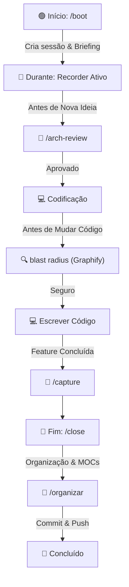

# Guia de Skills do Cérebro — Tila_Brain v2.1

Este guia cataloga e explica o funcionamento de todas as **Skills** (habilidades operacionais) do segundo cérebro do projeto TILA. Ele funciona como o manual operacional para a Inteligência Artificial e para os desenvolvedores do time.

---

## 🛠️ O que são as Skills?

As **Skills** são arquivos de instrução estruturados em Markdown localizados na pasta [05-Skills_Agentes/](file:///c:/Projetos/Tila/Tila_Brain/05-Skills_Agentes/). Elas ensinam o agente de IA a executar tarefas específicas de forma repetível, segura e consistente.

Cada skill possui:
1. **Frontmatter (YAML)**: Metadados contendo nome, gatilho (trigger), descrição, versão e integrações.
2. **Context**: O motivo da existência da skill e seu princípio de funcionamento.
3. **Steps**: O passo a passo exato que a IA deve seguir.
4. **Rules**: As restrições e regras inquebráveis de execução.
5. **Integrations & Backlinks**: Como ela se conecta com o restante do ecossistema do cérebro.

---

## 📂 Organização das Skills

As 18 skills do cérebro estão divididas em **5 categorias** funcionais:

1. **Pipeline de Sessão (Fluxo do Programador)**: Gerencia o ciclo de vida de uma sessão de codificação.
2. **Governança de Código & Arquitetura**: Garante a segurança, padrões de código e análise de impacto.
3. **Ingestão & Qualidade de Conhecimento**: Controla a entrada de informações na base permanente.
4. **Operações & Domínio Médico**: Automatiza geração de laudos, consultas e revisões clínicas.
5. **Base & Templates**: Modelos para expansão futura.

---

## 🔄 O Pipeline de Sessão (Fluxo do Programador)

Toda sessão de desenvolvimento com a IA deve seguir rigorosamente o pipeline abaixo para garantir que o contexto nunca se perca e que todas as modificações sejam registradas.

### O ritmo de trabalho obrigatório:
1. **`/boot`**: Carrega o estado atual, roadmap, gaps de segurança, pendências e cria o arquivo de sessão.
2. **Recorder Ativo (Automático)**: Grava em background todas as ideias, alterações, decisões e bugs discutidos.
3. **`/arch-review`**: Executa uma análise profunda de arquitetura antes de implementar qualquer ideia média/grande.
4. **Blast Radius (Automático)**: Roda o `graphify-query` antes de modificar qualquer classe para entender dependentes.
5. **`/capture`**: Roda ao finalizar uma feature para extrair padrões e salvar no changelog.
6. **`/close`**: Consolida a timeline, fecha o log da sessão, executa testes e prepara o commit.
7. **`/organizar`**: Corrige links, promove rascunhos validados, reconstrói MOCs e indexa tudo.

---

## 📖 Catálogo Detalhado das Skills

### 1. Pipeline de Sessão

#### 🟢 [skill-session-boot.md](file:///c:/Projetos/Tila/Tila_Brain/05-Skills_Agentes/skill-session-boot.md)
*   **Gatilho (Trigger)**: `/boot`, "session start" ou início automático de sessão.
*   **Propósito**: Carregar o estado completo do cérebro ao iniciar os trabalhos. Analisa roadmaps, logs, snapshots e sessões anteriores.
*   **Output**: Um **Session Briefing** contendo métricas do cérebro, status atual da aplicação, gaps de segurança abertos, pendências e prioridades sugeridas. Cria o arquivo de sessão em `07-Raw/sessions/`.
*   **Regra de Ouro**: Se o programador começar a codificar sem `/boot`, a IA deve executar o boot silenciosamente antes de qualquer ação.

#### 🔵 [skill-session-recorder.md](file:///c:/Projetos/Tila/Tila_Brain/05-Skills_Agentes/skill-session-recorder.md)
*   **Gatilho (Trigger)**: Automático (ativo durante toda a sessão).
*   **Propósito**: Gravar tudo que acontece na interação. Mapeia ideias, bugs encontrados, UI/UX alterada, código escrito, refatorações e decisões.
*   **Output**: Histórico em tempo real na timeline do arquivo de sessão ativo e criação de rascunhos (drafts) na `inbox/`.
*   **Regra de Ouro**: O recorder nunca pergunta "devo registrar?". Ele registra absolutamente tudo; a filtragem ocorre no fechamento da sessão.

#### 🧠 [skill-arch-review.md](file:///c:/Projetos/Tila/Tila_Brain/05-Skills_Agentes/skill-arch-review.md)
*   **Gatilho (Trigger)**: `/arch-review`, antes de implementar qualquer ideia ou refatoração estrutural.
*   **Propósito**: Avaliar se a ideia proposta fere alguma ADR (Architecture Decision Record) ou convenção estabelecida no cérebro.
*   **Output**: Um parecer detalhado com o veredito: `APPROVE` (seguir em frente), `ADJUST` (fazer ajustes arquiteturais) ou `REJECT` (ideia descartada por violar padrões).

#### 🔴 [skill-session-close.md](file:///c:/Projetos/Tila/Tila_Brain/05-Skills_Agentes/skill-session-close.md)
*   **Gatilho (Trigger)**: `/close`, `/salve` ou encerramento manual da sessão.
*   **Propósito**: Finalizar a sessão ativa de forma organizada. Consolida a timeline, verifica arquivos modificados, executa testes de integridade e prepara a mensagem de commit semântico.
*   **Regra de Ouro**: Exige que o programador confirme se deseja commitar e rodar o organizador antes.

#### 🧹 [skill-brain-organizer.md](file:///c:/Projetos/Tila/Tila_Brain/05-Skills_Agentes/skill-brain-organizer.md)
*   **Gatilho (Trigger)**: `/organizar` ou acionamento antes do commit.
*   **Propósito**: Manter a saúde estrutural do cérebro. Varre links quebrados, reorganiza a inbox, atualiza `index.md` e regenera os MOCs.
*   **Regra de Ouro**: Nenhuma sessão pode ser commitada sem rodar o organizador para garantir que a base de conhecimento continue consistente.

---

### 2. Governança de Código & Arquitetura

#### 🔍 [skill-graphify-query.md](file:///c:/Projetos/Tila/Tila_Brain/05-Skills_Agentes/skill-graphify-query.md)
*   **Gatilho (Trigger)**: Automático antes de QUALQUER alteração ou sugestão em código existente.
*   **Propósito**: Analisar a árvore de dependências do codebase (usando a ferramenta Graphify) para mapear o raio de impacto ("blast radius").
*   **Regra de Ouro**: Em uma aplicação médica, uma dependência quebrada coloca a vida do paciente em risco. É proibido alterar código sem mapear seus dependentes diretos e indiretos antes.

#### 🛡️ [skill-dev-assistant.md](file:///c:/Projetos/Tila/Tila_Brain/05-Skills_Agentes/skill-dev-assistant.md)
*   **Gatilho (Trigger)**: Automático quando trabalhando nos repositórios TILA.
*   **Propósito**: Funciona como um par de programação sempre alerta. Aplica checklists de backend (ex: `ResponseEntity<GenericResult>`, injeção de construtor) e frontend (ex: Angular Standalone, Signals) e previne falhas de LGPD e segurança.
*   **Regra de Ouro**: A IA está proibida de gerar código que viole as convenções estabelecidas, mesmo que o programador insista.

#### 📋 [skill-adr.md](file:///c:/Projetos/Tila/Tila_Brain/05-Skills_Agentes/skill-adr.md)
*   **Gatilho (Trigger)**: `/adr` ou tomada de decisão arquitetural significativa.
*   **Propósito**: Auxiliar na criação e documentação de ADRs (Architecture Decision Records) em [02-Arquitetura_ADRs/](file:///c:/Projetos/Tila/Tila_Brain/02-Arquitetura_ADRs/).
*   **Output**: Registro técnico formal do contexto, opções consideradas, decisão tomada e consequências futuras.

#### 🚨 [skill-lint.md](file:///c:/Projetos/Tila/Tila_Brain/05-Skills_Agentes/skill-lint.md)
*   **Gatilho (Trigger)**: `/lint` ou rotina de automação dominical.
*   **Propósito**: Verificar o estilo de formatação do cérebro: integridade dos frontmatters, links quebrados e nomes de arquivos fora do padrão CamelCase.

---

### 3. Ingestão & Qualidade de Conhecimento

#### ⚖️ [skill-gate-validacao.md](file:///c:/Projetos/Tila/Tila_Brain/05-Skills_Agentes/skill-gate-validacao.md)
*   **Gatilho (Trigger)**: Automático antes de mover qualquer nota temporária da inbox para `permanent/`.
*   **Propósito**: Garantir que as notas do cérebro sejam de alta qualidade seguindo 6 perguntas:
    1.  *Atomic?* (Ideia única?)
    2.  *Authored?* (Palavras próprias do autor?)
    3.  *Title is Thesis?* (Título é uma afirmação, não um rótulo?)
    4.  *Connects?* (Conecta a outra nota permanente?)
    5.  *Unique?* (Não é duplicada?)
    6.  *Has Metadata?* (Possui YAML frontmatter correto?)
*   **Regra de Ouro**: Nenhum conhecimento entra na base permanente sem passar no Gate com 6/6 de aprovação.

#### 🗺️ [skill-moc-update.md](file:///c:/Projetos/Tila/Tila_Brain/05-Skills_Agentes/skill-moc-update.md)
*   **Gatilho (Trigger)**: Automático após a promoção de notas para `permanent/`.
*   **Propósito**: Reconstruir e atualizar as conexões dos MOCs (Maps of Content) afetados pelas novas notas permanentes.

#### 📸 [skill-capture-feature.md](file:///c:/Projetos/Tila/Tila_Brain/05-Skills_Agentes/skill-capture-feature.md)
*   **Gatilho (Trigger)**: `/capture` ao término de uma funcionalidade.
*   **Propósito**: Capturar a implementação técnica da feature. Atualiza o changelog do codebase e extrai lições aprendidas ou padrões novos para a wiki.

#### 📥 [skill-ingest.md](file:///c:/Projetos/Tila/Tila_Brain/05-Skills_Agentes/skill-ingest.md)
*   **Gatilho (Trigger)**: `/ingest [source]`.
*   **Propósito**: Ingerir novos materiais de estudo (artigos de medicina, transcrições de vídeos, etc.) localizados na pasta [07-Raw/](file:///c:/Projetos/Tila/Tila_Brain/07-Raw/) e transformá-los em rascunhos inteligentes na `inbox/`.

---

### 4. Operações & Domínio Médico

#### 📄 [skill-generate-laudo.md](file:///c:/Projetos/Tila/Tila_Brain/05-Skills_Agentes/skill-generate-laudo.md)
*   **Gatilho (Trigger)**: Automático na geração de laudos ou integração.
*   **Propósito**: Estruturar e orquestrar o pipeline de IA para geração de pré-laudos a partir dos dados do exame, seguindo o padrão de 5 seções obrigatórias exigidas pela medicina brasileira.
*   **Regra de Ouro**: Sempre incluir o aviso de obrigatoriedade de revisão médica humana e assinatura digital.

#### 🩺 [skill-review-exame.md](file:///c:/Projetos/Tila/Tila_Brain/05-Skills_Agentes/skill-review-exame.md)
*   **Gatilho (Trigger)**: `/review-exame`.
*   **Propósito**: Revisar dados de exames estruturados ou imagens clínicas em busca de inconsistências e desvios antes do envio para a IA de laudo.

#### ❓ [skill-query.md](file:///c:/Projetos/Tila/Tila_Brain/05-Skills_Agentes/skill-query.md)
*   **Gatilho (Trigger)**: `/query [pergunta]`.
*   **Propósito**: Efetuar uma busca profunda e semântica no cérebro. Retorna a resposta fundamentada acompanhada de um Score de Confiança.

#### ⚙️ [skill-update-tila-skill.md](file:///c:/Projetos/Tila/Tila_Brain/05-Skills_Agentes/skill-update-tila-skill.md)
*   **Gatilho (Trigger)**: Automático ou manual quando as próprias diretrizes de uma skill são alteradas.
*   **Propósito**: Permite atualizar de maneira consistente e segura as instruções operacionais das skills no cérebro, registrando a mudança.

---

### 5. Base & Templates

#### 📝 [_template.md](file:///c:/Projetos/Tila/Tila_Brain/05-Skills_Agentes/_template.md)
*   **Gatilho (Trigger)**: Apenas para criação de novas skills.
*   **Propósito**: Serve como molde contendo o esqueleto YAML e as seções obrigatórias para que toda nova skill adicionada ao cérebro siga o mesmo padrão de design e usabilidade.

---

## 🔌 Skills Externas Integradas

Para tarefas específicas de análise de código e engenharia de software avançada, o agente Tila integra-se com skills de revisão especializadas localizadas nos repositórios e no diretório global do agente:

*   **`arch-thinker`**: Localizada em `Tila_Frontend/.agent/skills/`. Fornece o framework de raciocínio de arquitetura para a tomada de decisões antes de iniciar implementações.
*   **`java-spring-modern-reviewer`**: Localizada em `.claude/skills/`. Especialista em boas práticas, padrões modernos de Spring Boot, segurança de REST APIs e otimização de queries JPA.
*   **`angular-modern-reviewer`**: Localizada em `.claude/skills/`. Especialista em arquiteturas modernas do Angular, Signals, e estilização flexível em CSS Vanilla.

---

## ⚠️ Linhas Vermelhas Operacionais das Skills

1.  **NUNCA burlar o Gate**: Nenhuma nota permanente (`permanent/`) pode ser escrita diretamente. A validação via `skill-gate-validacao` é mandatória.
2.  **Mapeamento de Blast Radius**: É expressamente proibido propor ou aplicar alterações de código em classes sem antes rodar o `skill-graphify-query` para ver quem consome aquela classe.
3.  **Registro Ininterrupto**: O programador não deve desativar ou ignorar o `skill-session-recorder`. Se o recorder registrar algo que deve ser descartado, isso será feito de forma limpa pelo `skill-brain-organizer` na inbox.
4.  **Consistência de Índices**: A cada alteração estrutural nas notas ou skills, a IA deve rodar o organizador para garantir que o arquivo `index.md` e `log.md` estejam 100% atualizados.
