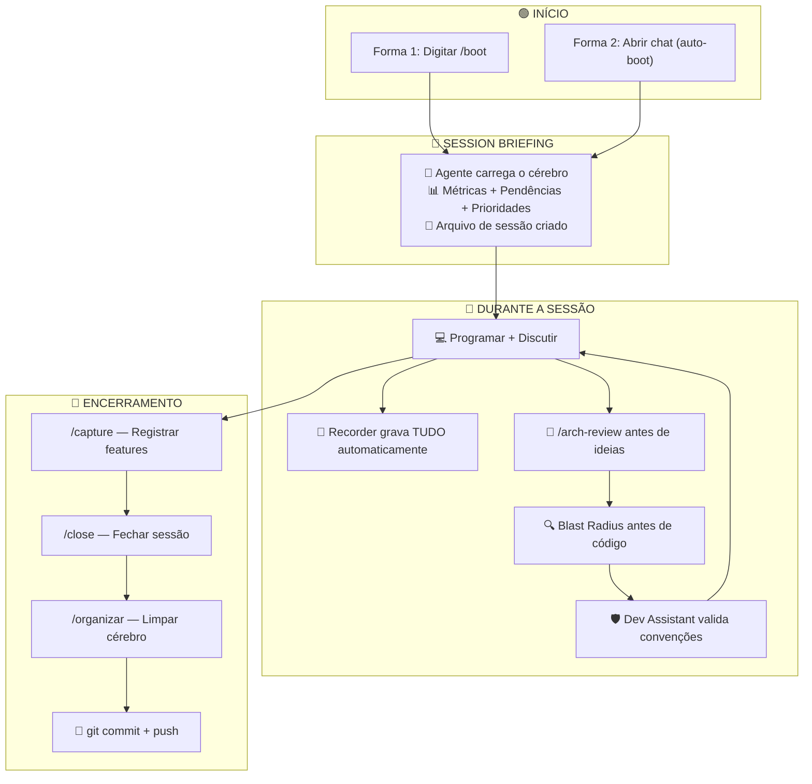

# Guia Prático: Como Usar o Segundo Cérebro com o Agente da IDE

Este guia ensina como você (desenvolvedor do TILA) interage com o **Tila_Brain** através do agente de IA da IDE Antigravity. Existem duas formas de uso, e ambas seguem o mesmo pipeline de sessão — a diferença está em como o cérebro é carregado.

---

## 🧠 Pré-Requisitos

Antes de usar qualquer uma das duas formas, verifique que:

- ✅ O workspace `c:\Projetos\Tila` está aberto na IDE Antigravity
- ✅ O diretório `Tila_Brain/` existe com toda a estrutura de pastas numeradas (00-Index a 07-Raw)
- ✅ Os arquivos-chave existem: `CLAUDE.md`, `index.md`, `log.md`, `00-Index/SOUL.md`
- ✅ A pasta `05-Skills_Agentes/` contém as 18 skills operacionais

---

## 📋 Forma 1: Fluxo Manual (Sem Configuração Prévia)

### Quando usar?
- Quando a User Rule (`tila-brain.md`) **não está instalada** no Antigravity
- Quando você quer controle total sobre o que o agente carrega
- Em sessões rápidas onde não precisa do pipeline completo

### Como iniciar uma sessão:

**Passo 1** — Abra o chat do Antigravity na IDE e digite:

```
/boot
```

O agente vai:
1. Ler o `CLAUDE.md`, `SOUL.md`, `index.md` e `log.md`
2. Verificar o roadmap e a última sessão
3. Criar um arquivo de sessão novo em `07-Raw/sessions/`
4. Te entregar um **Session Briefing** com métricas, pendências e prioridades

**Passo 2** — Trabalhe normalmente. Peça ao agente para codificar, refatorar, debugar, etc.

Durante o trabalho, use os comandos conforme necessário:

| O que você quer fazer | Comando | O que acontece |
|---|---|---|
| Analisar uma ideia antes de implementar | `/arch-review` | O agente avalia se a ideia respeita ADRs e convenções |
| Verificar impacto antes de alterar código | *Automático* | O agente roda blast radius via Graphify |
| Registrar uma feature concluída | `/capture` | Extrai padrões e salva no changelog |
| Buscar algo no cérebro | `/query como funciona o JWT?` | Busca semântica com score de confiança |
| Ingerir um artigo ou vídeo novo | `/ingest artigo-sobre-dicom.md` | Lê da pasta `07-Raw/` e cria drafts |
| Documentar uma decisão arquitetural | `/adr` | Cria ADR formal em `02-Arquitetura_ADRs/` |
| Verificar saúde do cérebro | `/lint` | Verifica links, frontmatters e nomenclatura |

**Passo 3** — Ao terminar o trabalho, **sempre** feche a sessão:

```
/close
```

ou

```
/salve
```

O agente vai:
1. Consolidar todos os eventos registrados na sessão
2. Rodar `/capture` nas features implementadas
3. Verificar links e integridade
4. Gerar relatório da sessão
5. Sugerir mensagem de commit semântico

**Passo 4** — Organize o cérebro antes de commitar:

```
/organizar
```

O agente vai:
1. Verificar links quebrados
2. Promover drafts validados
3. Atualizar `index.md` e MOCs
4. Confirmar que tudo está consistente

**Passo 5** — Faça o commit e push no Git.

### ⚠️ Atenção no Fluxo Manual
- Se você esquecer de rodar `/boot`, o agente **não terá contexto** do cérebro e pode gerar respostas sem seguir as convenções do TILA
- Se você esquecer de rodar `/close`, os eventos da sessão **não serão consolidados** e podem se perder
- Cada novo chat na IDE é uma sessão nova — o agente não lembra do chat anterior

---

## ⚡ Forma 2: Fluxo Automático (Com User Rule Instalada) — RECOMENDADO

### Quando usar?
- É a forma **recomendada** para o dia a dia
- O cérebro é carregado automaticamente a cada nova conversa
- Não precisa lembrar de digitar `/boot` — o agente já faz sozinho

### Configuração (uma única vez):

A User Rule já foi instalada em:
```
C:\Users\ryanA\.gemini\config\rules\tila-brain.md
```

Uma cópia de referência está salva em:
```
Tila_Brain/06-Automacoes/tila-brain-rule.md
```

> 💡 **Dica**: Se precisar reinstalar, basta copiar o arquivo de `06-Automacoes/` para `~/.gemini/config/rules/`.

### Como funciona na prática:

**Passo 1** — Abra o chat do Antigravity e diga qualquer coisa:

```
Oi, vamos trabalhar no backend hoje
```

O agente **automaticamente** vai:
1. Detectar que está no workspace `c:\Projetos\Tila`
2. Ler o cérebro inteiro (CLAUDE.md, SOUL.md, index.md, log.md, roadmap)
3. Verificar se a última sessão foi fechada
4. Criar o arquivo de sessão em `07-Raw/sessions/`
5. Te entregar um **resumo breve** do estado atual:

```
🧠 Tila_Brain v2.1 carregado.
📊 9 permanent notes | 7 patterns | 6 ADRs | 4 snapshots
📅 Última ação: tila-brain.md instalado como User Rule
⏸️ Pendências: nenhuma
🎯 Próxima prioridade: [do roadmap]
```

**Passo 2** — Trabalhe normalmente. Os mesmos comandos do Fluxo Manual funcionam:

```
/arch-review    → Antes de ideias grandes
/capture        → Após cada feature
/query          → Para buscar no cérebro
/adr            → Para decisões arquiteturais
/ingest         → Para ingerir material novo
```

**Diferença importante**: No fluxo automático, o **Session Recorder** já está ativo desde o primeiro momento. Tudo que você discutir é registrado automaticamente na timeline da sessão.

**Passo 3** — Ao terminar, feche com:

```
/close
```

Se você tentar fechar o chat sem usar `/close`, o agente vai alertar:
```
⚠️ A sessão não foi fechada. Use /close para registrar o que fizemos.
```

**Passo 4** — Organize e commite:

```
/organizar
```

Depois faça o commit normalmente.

---

## 🔄 Comparação Lado a Lado

| Aspecto | Forma 1 (Manual) | Forma 2 (Automático) |
|---|---|---|
| **Configuração** | Nenhuma | User Rule instalada uma vez |
| **Início da sessão** | Precisa digitar `/boot` | Automático ao abrir o chat |
| **Carregamento do cérebro** | Sob demanda (quando pedido) | Automático em toda conversa |
| **Session Recorder** | Ativo após `/boot` | Ativo desde a primeira mensagem |
| **Risco de esquecer** | Alto — pode codar sem contexto | Baixo — sempre carregado |
| **Fechamento** | Precisa digitar `/close` | Precisa digitar `/close` (igual) |
| **Quando usar** | Sessões rápidas, testes | Desenvolvimento diário |

---

## 🎯 Fluxo Visual Completo (Ambas as Formas)



---

## 💡 Dicas e Boas Práticas

### Para sessões produtivas:
- **Comece sempre pelo briefing** — Leia as pendências e prioridades antes de escolher o que fazer
- **Use `/arch-review` antes de começar** — Evita retrabalho ao descobrir que a ideia viola uma ADR
- **Faça `/capture` a cada feature** — Não acumule várias features sem registrar. Capture uma por vez.
- **Feche com `/close` religiosamente** — O fechamento consolida e organiza tudo. Sem ele, a sessão fica "suja"

### Quando algo der errado:
- **O agente não carregou o cérebro?** Provavelmente a User Rule não está instalada. Use `/boot` manualmente.
- **O agente não sabe de uma decisão?** Use `/query [pergunta]` para buscar no cérebro.
- **O agente sugeriu algo que viola um ADR?** A governança falhou — reporte e atualize a skill `skill-dev-assistant.md`.
- **A última sessão ficou com `status: active`?** O agente vai alertar no próximo boot. Revise o arquivo de sessão antigo em `07-Raw/sessions/`.

### Para o time (Ryan e Pedro):
- **Cada desenvolvedor cria sua própria sessão** — Os arquivos de sessão em `07-Raw/sessions/` registram quem está trabalhando
- **O recorder não interfere na velocidade** — Ele registra em background, você não precisa fazer nada
- **O cérebro cresce com o uso** — Quanto mais sessões, mais padrões, mais decisões documentadas, melhor o agente fica

---

## 📚 Referências Rápidas

| Recurso | Localização |
|---|---|
| Manual completo do cérebro | [manual-do-cerebro.md](file:///c:/Projetos/Tila/Tila_Brain/00-Index/manual-do-cerebro.md) |
| Guia de todas as skills | [GuiaSkillsCerebro.md](file:///c:/Projetos/Tila/Tila_Brain/00-Index/GuiaSkillsCerebro.md) |
| Identidade do agente (SOUL) | [SOUL.md](file:///c:/Projetos/Tila/Tila_Brain/00-Index/SOUL.md) |
| Regras operacionais (CLAUDE) | [CLAUDE.md](file:///c:/Projetos/Tila/Tila_Brain/CLAUDE.md) |
| User Rule do Antigravity | [tila-brain-rule.md](file:///c:/Projetos/Tila/Tila_Brain/06-Automacoes/tila-brain-rule.md) |
| Índice do cérebro | [index.md](file:///c:/Projetos/Tila/Tila_Brain/index.md) |
| Log de atividades | [log.md](file:///c:/Projetos/Tila/Tila_Brain/log.md) |
| Sessões de programação | [07-Raw/sessions/](file:///c:/Projetos/Tila/Tila_Brain/07-Raw/sessions/) |
