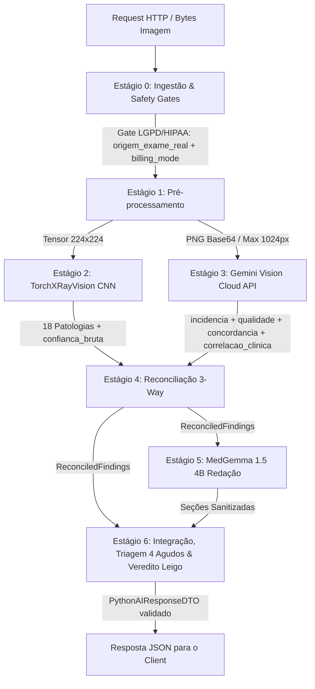

# ADR-017: Pipeline Híbrido de 7 Estágios com Correlação Estruturada Anti-Circunlocução e Triagem dos 4 Agudos

- **Status:** Aceito e Implementado (Verificado por 60 testes unitários em 2026-07-11)
- **Decisores:** Time de Arquitetura IA Tila e Radiologia Clínica
- **Serviço Alvo:** `tila-ai-cloud-service` (Python 3.11 / FastAPI)

---

## 1. Contexto e Declaração do Problema

Durante a validação clínica e de segurança do microsserviço `tila-ai-cloud-service` (Motor Híbrido de IA que combina TorchXRayVision local, MedGemma 1.5 4B local e Gemini Vision na nuvem via LLM Router), foram identificadas quatro vulnerabilidades críticas de segurança, precisão diagnóstica e ergonomia clínica:

1. **Circunlocução Etiológica em Prosa Livre:** O campo `correlacao_clinica: Optional[str]` permitia que o modelo na nuvem (ou local) escrevesse texto livre associando achados visuais a síndromes ou etiologias (ex.: *"infiltrado apical sugerindo quadro infeccioso granulomatoso crônico compatível com tuberculose"*). Isso viola a premissa de que o raio-X é um exame morfológico bidimensional e incorre em exercício ilegal/prematuro de diagnóstico pela IA.
2. **Fadiga de Alarme por Acionamento Genérico de Urgência (`URGENTE`):** A lógica anterior do pipeline promovia qualquer patologia Tier 1 detectada para `criticidade_geral = URGENTE`. Achados não agudos, como *Nódulo* ou *Massa* estáveis, disparavam alertas vermelhos na triagem, enfraquecendo a atenção da equipe médica para emergências respiratórias verdadeiras.
3. **Insegurança e Alucinação Probabilística no `veredito_leigo`:** O gerador de resumo para o paciente (`_gerar_veredito_leigo`) utilizava frases com alegações estatísticas sem lastro clínico (ex.: *"na grande maioria das vezes são apenas cicatrizes benignas"*), além de omitir marcações de incerteza em achados `INDETERMINADOS` e expor escores numéricos internos.
4. **Vazamento de Escores no MedGemma e Duplicação na `secao_conclusao`:** A injeção de `Score=0.95` no prompt do MedGemma fazia o modelo vazar decimais no texto técnico, que, ao serem apagados pelo guardrail regex `sanitize_text()`, resultavam no erro tipográfico `Score=.`. Além disso, o modelo duplicava a introdução técnica ("Radiografia de tórax incidência PA...") na conclusão.
5. **Auditoria de Faturamento e Conformidade LGPD/HIPAA:** A ausência da gravação explícita do modo de faturamento (`billing_mode_utilizado`) no DTO final dificultava auditorias de conformidade com os termos de uso do Google AI Studio (`free` vs `paid`).

---

## 2. Decisão Arquitetural

Adotamos uma reformulação completa dos contratos, regras de negócio e guardrails no microsserviço `tila-ai-cloud-service`, implementando uma **blindagem estrutural e determinística** em todas as camadas do pipeline:

### 2.1. Substituição da Prosa por Correlação Estruturada (`CloudVisionCorrelacaoItem`)
Eliminamos o campo de string livre em `CloudVisionOutput` e `PythonAIResponseDTO`. A correlação clínico-radiológica agora é obrigatoriamente tipada e atomizada via Pydantic (`list[CloudVisionCorrelacaoItem]`):
```python
class CloudVisionCorrelacaoItem(BaseModel):
    model_config = ConfigDict(extra="forbid")
    sintoma_referido: str
    achado_estrutural_relacionado: str
    pertinencia_visual: Literal["direta", "indireta", "inconclusiva"]
```
O prompt do Estágio 3 (`GeminiVisionProvider`) foi endurecido com ordens imperativas proibindo jargões etiológicos, nomes de doenças clínicas ou frases de transição.

### 2.2. Triagem Determinística dos "4 Agudos" (`CriticidadeGeral.URGENTE`)
Definimos formalmente que o nível máxima de criticidade (`URGENTE`) só pode ser acionado de forma determinística quando o pipeline detectar pelo menos um dos **4 Achados Agudos Cardiorrespiratórios**:
$$\text{Os 4 Agudos} = \{\text{"edema"}, \text{"pneumothorax"}, \text{"consolidation"}, \text{"effusion"}\}$$
Qualquer outro achado patológico (ex.: *Nodule*, *Mass*, *Infiltration*, *Fibrosis*) ou discrepância entre CNN e LLM aciona `CriticidadeGeral.ATENCAO`.

### 2.3. Guardrails e Sanitização do Dicionário de Leigos (`veredito_leigo`)
- **Dicionário Estritamente Estrutural (`_EXPLICACOES_LEIGO`):** Expurgadas todas as menções probabilísticas ("benigno", "leve", "comum"). Cada explicação agora descreve estritamente a alteração física visualizada (ex.: para Nódulo/Massa: *"Formação estrutural focal visualizada no exame. É indispensável o acompanhamento médico e investigação com métodos de imagem tridimensionais (tomografia computadorizada) para definição adequada."*).
- **Tratamento de Incerteza:** Se `status_achado == StatusAchado.INDETERMINADO`, o texto recebe automaticamente o prefixo padronizado: `[Em Avaliação / Indeterminado]`.
- **Dupla Sanitização:** O texto do `veredito_leigo` passa por `validate_and_sanitize()`/`sanitize_text()`, removendo coordenadas `[x,y]`, pontuações duplicadas ou escores decimais alucinados.
- **Aviso Regulatório Obrigatório:** O `veredito_leigo` inicia e termina com a nota: *"AVISO REGULATÓRIO: Este texto é um rascunho de apoio à comunicação médico-paciente e não constitui diagnóstico. Deve ser revisado e validado pelo seu médico radiologista."*

### 2.4. Qualitativização de Qualidade no MedGemma e Fronteiras Estritas
No Estágio 5 (`stage5_medgemma.py`), o escore float de qualidade técnica (`0.85`) é mapeado para um rótulo qualitativo antes de ser enviado ao LLM:
- `score >= 0.8` $\rightarrow$ `"ótima"`
- `score >= 0.5` $\rightarrow$ `"boa"`
- `score < 0.5` $\rightarrow$ `"inadequada/limitada"`

As 3 regras do prompt do MedGemma foram reescritas com proibições de transbordamento de escopo:
1. `secao_tecnica`: SÓ modalidade, incidência e qualidade ("ótima/boa/limitada").
2. `secao_achados`: SÓ a lista de achados estruturais reconciliados (`status_achado == presente`).
3. `secao_conclusao`: SÓ a síntese diagnóstica radiológica, **proibido** repetir cabeçalhos da técnica ou qualidade.

### 2.5. Auditoria Rastreável no DTO (`billing_mode_utilizado`)
O `PythonAIResponseDTO` ganhou o campo nativo `billing_mode_utilizado: str` e a assinatura unificada em `modelo_ia_utilizado`:
```text
txrv:densenet121-res224-all | gemini:gemini-3.5-flash | ollama:medgemma:4b | billing_mode:paid
```

---

## 3. Fluxo Completo dos 7 Estágios (Pipeline de Laudo Híbrido)



---

## 4. Evidência de Validação e Testes (`pytest`)

A arquitetura foi submetida a verificação exaustiva por 60 testes unitários autônomos executados com `pytest -v` em 2026-07-11:
- `tests/test_api.py`: Contrato HTTP e Códigos 200/403.
- `tests/test_cloud_llm_client.py`: Gates de faturamento (`TestBillingModeGate`), parse de schema e retry exponencial.
- `tests/test_guardrails.py`: Deteções de alucinação, contradições ("afirmativo vs indeterminado") e limpeza regex `sanitize_text()`.
- `tests/test_reconciliation.py`: As 6 ramificações de decisão do algoritmo de reconciliação híbrida CNN + LLM.
- `tests/test_stage0_ingest.py`: Descaracterização EXIF, log LGPD e validação de base de dados real vs teste.
- `tests/test_stage1_prep.py`: Letterbox no tensor do TorchXRayVision e redimensionamento no PNG do LLM.
- `tests/test_stage2_txrv.py`: Cálculo de `confianca_bruta` ($\text{conf} = |s - 0.5| \times 2$) e assignment de Tiers.
- `tests/test_stage6_integration.py`: Testes de triagem dos "4 Agudos" (`test_edema_triggers_urgente`, `test_nodule_triggers_atencao_not_urgente`) e blindagem de `veredito_leigo`.

**Resultado Final:**
```text
======================== 60 passed, 1 warning in 7.00s ========================
```
