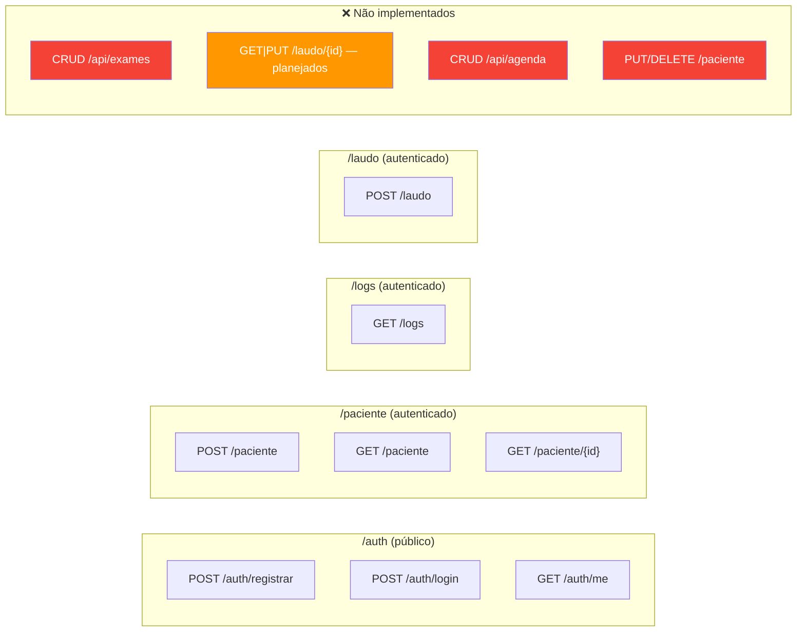
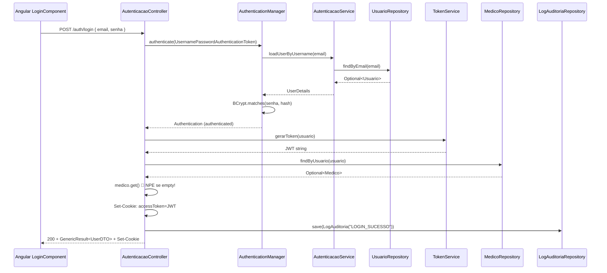
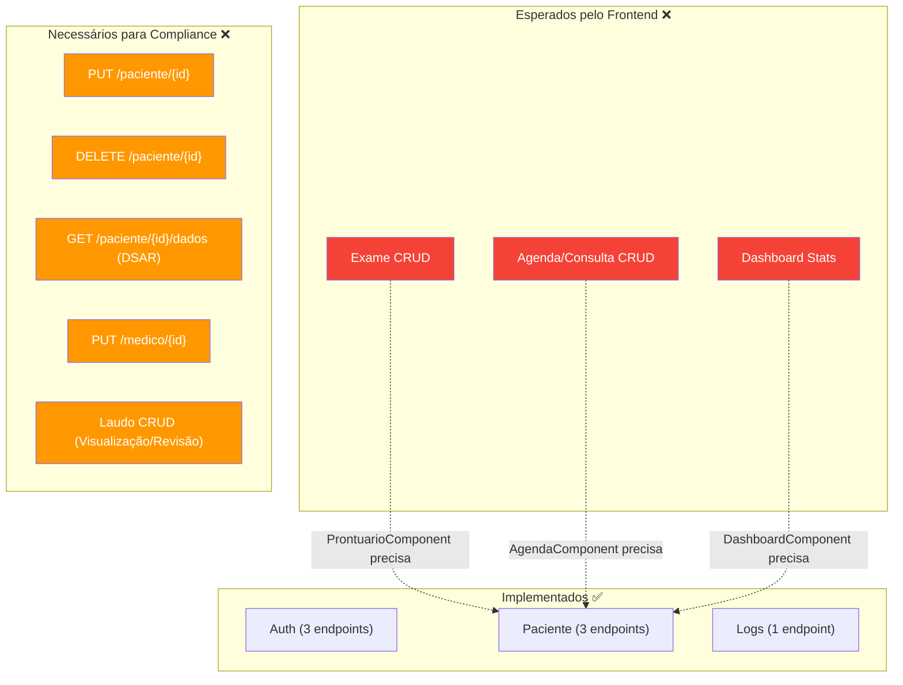
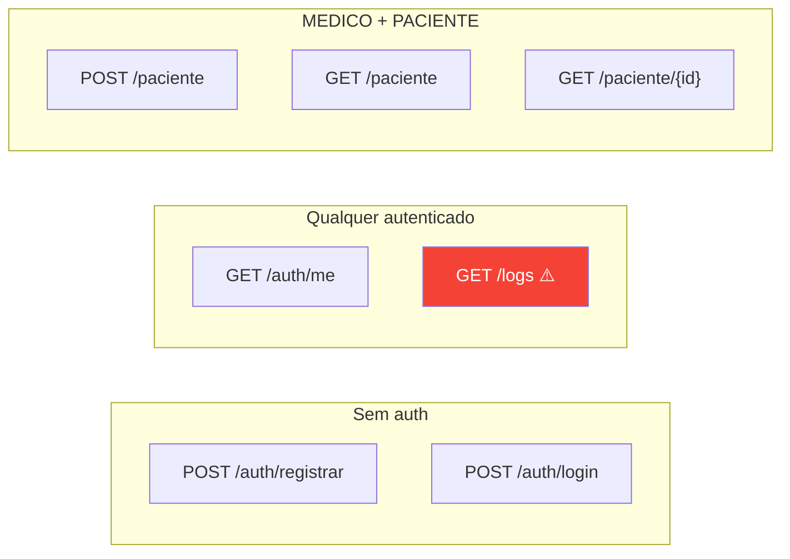

# API Endpoints — TILA (Verificado no Código)

> Auditoria exaustiva dos endpoints reais encontrados nos controllers Java em 2026-05-07.
> Cada endpoint inclui: código real do controller, request/response de exemplo, headers, cookies, e issues encontrados.

---

## Convenção de Respostas

### Formato de Sucesso — GenericResult\<T\>
```json
{
  "success": true,
  "message": "Operação realizada com sucesso !",
  "data": { /* payload tipado */ }
}
```

### Formato de Erro (⚠️ INCONSISTENTE)
```json
// Quando vem do GlobalExceptionHandler (ErrorDetalhe):
{ "mensagem": "Paciente não encontrado pelo CPF" }

// Quando vem do controller (GenericResult):
{ "success": false, "message": "CPF já cadastrado!", "data": null }
```
> ⚠️ O frontend precisa tratar **dois formatos diferentes** dependendo se o erro veio do controller (GenericResult) ou do GlobalExceptionHandler (ErrorDetalhe). Isso é um bug de design.

---

## Mapa de Rotas Visual



---

## 1. Autenticação — AutenticacaoController

**Localização**: `tecnologi.tila.tila.controller.AutenticacaoController`
**Base Path**: `/auth`
**Security**: `permitAll()` (público)

### Código Real do Controller

```java
@RestController
@RequestMapping("/auth")
public class AutenticacaoController {

    @Autowired private AuthenticationManager manager;
    @Autowired private TokenService tokenService;
    @Autowired private UsuarioRepository usuarioRepository;
    @Autowired private MedicoRepository medicoRepository;
    @Autowired private LogAuditoriaRepository logAuditoriaRepository;
    // ⚠️ 5x @Autowired field injection — deveria ser constructor injection
```

---

### POST /auth/registrar — Registrar Médico

**Código real**:
```java
@PostMapping("/registrar")
public ResponseEntity<GenericResult<Boolean>> registrar(
        @RequestBody @Valid DadosCadastroMedico dados) {
    
    var senhaCriptografada = new BCryptPasswordEncoder().encode(dados.senha());
    var novoUsuario = new Usuario(dados.email(), senhaCriptografada, PerfilUser.MEDICO);
    usuarioRepository.save(novoUsuario);

    var novoMedico = new Medico(dados.nome(), dados.crm(), dados.especialidade(), novoUsuario);
    medicoRepository.save(novoMedico);

    LogAuditoria log = new LogAuditoria();
    log.setUsuario(novoUsuario);
    log.setAcao("CADASTRO_NOVO_MEDICO");
    log.setDataHora(LocalDateTime.now());
    logAuditoriaRepository.save(log);

    return ResponseEntity.status(HttpStatus.CREATED)
            .body(GenericResult.success(true, "Cadastro realizado!"));
}
```

**Request**:
```http
POST /auth/registrar HTTP/1.1
Host: localhost:8080
Content-Type: application/json

{
  "nome": "Dr. João Silva",
  "crm": "12345-SP",
  "especialidade": "Radiologia",
  "email": "joao@clinica.com",
  "senha": "MinhaS3nha!"
}
```

**Response (201 Created)**:
```json
{
  "success": true,
  "message": "Cadastro realizado!",
  "data": true
}
```

**DTO de Input**:
```java
public record DadosCadastroMedico(
    @NotBlank(message = "campo email não pode ser nulo.") @Email String email,
    @NotBlank(message = "campo senha não pode ser nulo.") String senha,
    @NotBlank(message = "campo crm não pode ser nulo.") String crm,
    @NotBlank(message = "campo nome não pode ser nulo.") String nome,
    @NotBlank(message = "campo especialidade não pode ser nulo.") String especialidade
) {}
```

**Issues encontrados**:
| # | Issue | Severidade |
|---|---|---|
| 1 | Cria `BCryptPasswordEncoder()` inline ao invés de injetar o `@Bean PasswordEncoder` | 🟡 |
| 2 | Sem verificação se email já existe (depende de DB unique constraint → exceção genérica do DB) | 🟡 |
| 3 | `ipOrigem` não populado no log de auditoria | 🟡 |
| 4 | Hardcoded `PerfilUser.MEDICO` — sem opção de criar ADMIN | 🔵 |
| 5 | Sem @Transactional — se `medicoRepository.save()` falha, o usuario já foi salvo (inconsistência) | 🔴 |

---

### POST /auth/login — Login

**Código real**:
```java
@PostMapping("/login")
public ResponseEntity<GenericResult<UserDTO>> login(
        @RequestBody @Valid DadosAutenticacao dados,
        HttpServletResponse httpServletResponse) {

    var authToken = new UsernamePasswordAuthenticationToken(dados.email(), dados.senha());
    var authentication = manager.authenticate(authToken);
    var usuario = (Usuario) authentication.getPrincipal();

    var tokenJWT = tokenService.gerarToken(usuario);
    var medico = medicoRepository.findByUsuario(usuario);

    Cookie accessToken = new Cookie("accessToken", tokenJWT);
    accessToken.setHttpOnly(true);
    accessToken.setSecure(false);  // ⚠️ false — JWT vai em HTTP sem TLS
    accessToken.setPath("/");
    accessToken.setMaxAge(3600);
    httpServletResponse.addCookie(accessToken);

    var usuarioPerfil = new UserProfileDTO(
            medico.get().getNomeCompleto(),  // 🔴 .get() sem verificação!
            medico.get().getCrm(),           // 🔴 .get() sem verificação!
            medico.get().getEspecialidade()   // 🔴 .get() sem verificação!
    );

    // Log de auditoria
    LogAuditoria log = new LogAuditoria();
    log.setUsuario(usuario);
    log.setAcao("LOGIN_SUCESSO");
    log.setDataHora(LocalDateTime.now());
    logAuditoriaRepository.save(log);

    var userDTO = new UserDTO(tokenJWT, usuarioPerfil);
    return ResponseEntity.ok(GenericResult.success(userDTO));
}
```

**Request**:
```http
POST /auth/login HTTP/1.1
Host: localhost:8080
Content-Type: application/json

{
  "email": "joao@clinica.com",
  "senha": "MinhaS3nha!"
}
```

**Response (200 OK)**:
```json
{
  "success": true,
  "message": "Operação realizada com sucesso !",
  "data": {
    "token": "eyJhbGciOiJIUzI1NiIsInR5cCI6IkpXVCJ9...",
    "usuario": {
      "nomeCompleto": "Dr. João Silva",
      "crm": "12345-SP",
      "especialidade": "Radiologia"
    }
  }
}
```

**Response Headers**:
```http
Set-Cookie: accessToken=eyJhbGci...; Path=/; HttpOnly; Max-Age=3600; SameSite=Lax
```

**Diagrama de Sequência**:


**Issues encontrados**:
| # | Issue | Severidade |
|---|---|---|
| 1 | `medico.get()` sem verificação — se usuário é PACIENTE sem médico associado → `NoSuchElementException` → 500 | 🔴 CRITICAL |
| 2 | `accessToken.setSecure(false)` — JWT trafega via HTTP inseguro | 🟡 |
| 3 | Sem `SameSite` explícito — depende do default do browser (geralmente Lax) | 🔵 |
| 4 | Token JWT também retornado no body (`data.token`) — duplicação com cookie | 🔵 |
| 5 | Sem log de LOGIN_FALHA — apenas sucesso é logado | 🟡 |
| 6 | Sem @Transactional — log pode ser salvo mas resposta falhar | 🔵 |

---

### GET /auth/me — Obter Perfil do Usuário Logado

**Código real**:
```java
@GetMapping("/me")
public ResponseEntity<GenericResult<UserProfileDTO>> obterDadosLogado(
        @AuthenticationPrincipal Usuario usuario) {

    var medico = medicoRepository.findByUsuario(usuario);
    var perfil = new UserProfileDTO(
            medico.get().getNomeCompleto(),  // 🔴 .get() sem verificação!
            medico.get().getCrm(),           // 🔴 .get() sem verificação!
            medico.get().getEspecialidade()   // 🔴 .get() sem verificação!
    );
    return ResponseEntity.ok(GenericResult.success(perfil));
}
```

**Request**:
```http
GET /auth/me HTTP/1.1
Host: localhost:8080
Cookie: accessToken=eyJhbGci...
```

**Response (200 OK)**:
```json
{
  "success": true,
  "message": "Operação realizada com sucesso !",
  "data": {
    "nomeCompleto": "Dr. João Silva",
    "crm": "12345-SP",
    "especialidade": "Radiologia"
  }
}
```

**Issues**: Mesmos que `/auth/login` — `.get()` sem verificação (🔴).

---

## 2. Pacientes — PacienteController

**Localização**: `tecnologi.tila.tila.controller.PacienteController`
**Base Path**: `/paciente`
**Security**: `hasAnyRole("MEDICO", "PACIENTE")`

### Código Real do Controller

```java
@RestController
@RequestMapping("/paciente")
public class PacienteController {

    @Autowired  // ⚠️ field injection
    private PacienteService pacienteService;

    @PostMapping
    public ResponseEntity<GenericResult<PacienteResponseDTO>> cadastrar(
            @RequestBody @Valid PacienteRequestDTO dados,
            @AuthenticationPrincipal Usuario usuario) {
        var response = pacienteService.cadastrar(dados, usuario);
        return ResponseEntity.status(HttpStatus.CREATED).body(GenericResult.success(response));
    }

    @GetMapping
    public ResponseEntity<GenericResult<List<PacienteResponseDTO>>> bucasTodosPacientes(
            @AuthenticationPrincipal Usuario usuario) {  // ⚠️ typo: bucasTodosPacientes
        var response = pacienteService.buscarTodosPacientes(usuario);
        return ResponseEntity.ok(GenericResult.success(response));
    }

    @GetMapping("/{id}")
    public ResponseEntity<GenericResult<PacienteResponseDTO>> buscarPorId(
            @PathVariable Long id,
            @AuthenticationPrincipal Usuario usuario) {
        var response = pacienteService.bucasPorId(id, usuario);  // ⚠️ typo: bucasPorId
        return ResponseEntity.ok(GenericResult.success(response));
    }
}
```

---

### POST /paciente — Cadastrar Paciente

**Request**:
```http
POST /paciente HTTP/1.1
Host: localhost:8080
Content-Type: application/json
Cookie: accessToken=eyJhbGci...

{
  "nomeCompleto": "Maria Santos",
  "cpf": "123.456.789-00",
  "dataNascimento": "1985-03-15",
  "telefone": "(11) 99999-1234"
}
```

**DTO de Input**:
```java
public record PacienteRequestDTO(
    @NotBlank String nomeCompleto,
    @NotBlank @CPF String cpf,      // Validação de CPF brasileiro via Hibernate Validator
    @NotNull LocalDate dataNascimento,
    String telefone                  // Opcional
) {}
```

**Response (201 Created)**:
```json
{
  "success": true,
  "message": "Operação realizada com sucesso !",
  "data": {
    "id": 1,
    "nomeCompleto": "Maria Santos",
    "cpf": "123.456.789-00",
    "dataNascimento": "1985-03-15",
    "exames": []
  }
}
```

**Response (CPF duplicado — via ValidationException)**:
```json
{
  "mensagem": "CPF já cadastrado!"
}
```
> ⚠️ Resposta de erro vem como `ErrorDetalhe` (via GlobalExceptionHandler) ao invés de `GenericResult.error()`.

---

### GET /paciente — Listar Todos

**Request**:
```http
GET /paciente HTTP/1.1
Host: localhost:8080
Cookie: accessToken=eyJhbGci...
```

**Response (200 OK)**:
```json
{
  "success": true,
  "message": "Operação realizada com sucesso !",
  "data": [
    {
      "id": 1,
      "nomeCompleto": "Maria Santos",
      "cpf": "123.456.789-00",
      "dataNascimento": "1985-03-15",
      "exames": [
        {
          "id": 1,
          "tipoExame": "RX_TORAX",
          "dataRealização": "2026-04-20T14:30:00",
          "urlImagem": "./uploads/exames/rx_001.dcm",
          "status": "PENDENTE",
          "paciente": { /* ⚠️ CIRCULAR! paciente dentro de exame */ },
          "medico": { /* ⚠️ CIRCULAR! médico dentro de exame */ }
        }
      ]
    }
  ]
}
```
> 🔴 **`exames` é `List<Exame>` (entity JPA)** — inclui `paciente` (referência circular) e `medico` (exposição de dados). Jackson pode entrar em loop infinito ou serializar dados sensíveis.

---

### GET /paciente/{id} — Buscar por ID

**Request**:
```http
GET /paciente/1 HTTP/1.1
Host: localhost:8080
Cookie: accessToken=eyJhbGci...
```

**Response**: Mesmo formato que o item individual do GET /paciente.

**Error (404)**:
```json
{ "mensagem": "Paciente não encontrado pelo ID" }
```

---

## 2.5 Laudo — LaudoController

**Localização**: `tecnologi.tila.tila.controller.LaudoController.LaudoController`
**Base Path**: `/laudo`
**Security**: `hasRole("MEDICO")`

### POST /laudo — Gerar Pré-Laudo via IA

**Request**:
```http
POST /laudo HTTP/1.1
Host: localhost:8080
Content-Type: application/json
Cookie: accessToken=eyJhbGci...

{
  "exameId": 1
}
```

**Response (201 Created)**:
```json
{
  "success": true,
  "message": "Operação realizada com sucesso !",
  "data": {
    "id": 1,
    "exameId": 1,
    "rascunhoIA": "# PRÉ-LAUDO RADIOLÓGICO...",
    "notaIA": "Nota do modelo",
    "confidenceScore": 85,
    "status": "RASCUNHO"
  }
}
```

---

## 3. Logs de Auditoria — logAuditoriaController

**Localização**: `tecnologi.tila.tila.controller.logAuditoriaController` (⚠️ camelCase)
**Base Path**: `/logs`
**Security**: `anyRequest().authenticated()` (qualquer usuário logado ⚠️)

### Código Real do Controller

```java
@RestController
@RequestMapping("/logs")
public class logAuditoriaController {  // ⚠️ camelCase

    private final logAuditoriaService logService;  // ⚠️ camelCase

    public logAuditoriaController(logAuditoriaService logService) {
        this.logService = logService;
    }

    @GetMapping
    public ResponseEntity<GenericResult<List<LogAuditoria>>> buscarTodosOsLogs() {
        var logs = logService.buscarTodosOsLogs();
        return ResponseEntity.ok(GenericResult.success(logs));  // ⚠️ retorna entity!
    }
}
```

### GET /logs

**Request**:
```http
GET /logs HTTP/1.1
Host: localhost:8080
Cookie: accessToken=eyJhbGci...
```

**Response (200 OK)**:
```json
{
  "success": true,
  "message": "Operação realizada com sucesso !",
  "data": [
    {
      "id": 1,
      "usuario": {
        "id": "550e8400-e29b-41d4-a716-446655440000",
        "email": "joao@clinica.com",
        "senha": "$2a$10$K8f...",
        "perfil": "MEDICO",
        "ativo": true,
        "ultimoAcesso": null
      },
      "acao": "LOGIN_SUCESSO",
      "dataHora": "2026-05-07T14:30:00",
      "ipOrigem": null
    }
  ]
}
```

> 🔴 **Exposição CRÍTICA**: `senha` (hash BCrypt) do `Usuario` é serializada na resposta porque `LogAuditoria` retorna a entity `Usuario` ao invés de um DTO. Qualquer usuário autenticado pode ver o hash das senhas de todos os usuários!

**Issues**:
| # | Issue | Severidade |
|---|---|---|
| 1 | Retorna entity `LogAuditoria` com `Usuario` completo (incluindo hash da senha!) | 🔴 CRITICAL |
| 2 | Qualquer role pode acessar — deveria ser ADMIN only | 🔴 CRITICAL |
| 3 | `findAll()` sem paginação — carrega todos os logs | 🟡 |
| 4 | Lança `RuntimeException` se lista vazia | 🟡 |
| 5 | `ipOrigem` sempre null | 🟡 |

---

## Endpoints NÃO Implementados — Análise de Gap



### Endpoints que o Frontend Espera

| Frontend Component | Endpoint Chamado | Backend Status |
|---|---|---|
| `LoginComponent` | POST /auth/login | ✅ Existe |
| `CadastroComponent` | POST /auth/registrar | ✅ Existe |
| `DashboardComponent` | GET /dashboard/stats | ❌ MOCK — dados hardcoded no componente |
| `PacientesComponent` | GET /paciente | ✅ Existe |
| `CadastroPacienteComponent` | POST /paciente | ✅ Existe |
| `ProntuarioComponent` | GET /paciente/{id} | ✅ Existe |
| `LogsComponent` | GET /logs | ✅ Existe |
| `AgendaComponent` | GET /agenda/appointments | ❌ MOCK — service define interface mas backend não existe |
| `AgendaComponent` | GET /agenda/waiting-room | ❌ MOCK |
| `AgendaComponent` | GET /agenda/stats | ❌ MOCK |
| `LaudoIaComponent` | POST /laudo | ✅ Existe |
| `CentroLaudosComponent` | GET /laudo (listar) | ⚠️ PLANEJADO — não implementado |

---

## Resumo de Security por Endpoint



## Referências
- [[wiki/concepts/backend-services]] — Code de cada service
- [[wiki/concepts/backend-patterns]] — Padrões de resposta
- [[wiki/decisions/ADR-002-api-response-pattern]] — GenericResult compliance
- [[wiki/entities/spring-boot-backend]] — Stack completo
- [[context/security-lgpd]] — Vulnerabilidades
- [[wiki/concepts/frontend-architecture]] — Quem consome esses endpoints

## Backlinks
- [[wiki/overview]]
- [[wiki/entities/angular-frontend]]
