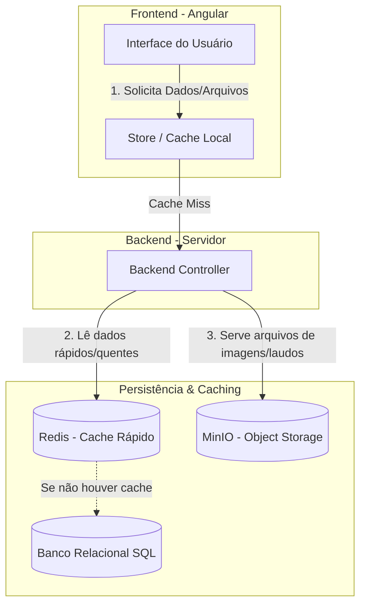

# Infraestrutura de Backend e Estratégia de Cache (Redis & MinIO)

Este documento descreve os papéis de infraestrutura de dados não estruturados (**MinIO**) e cache em memória (**Redis**) no ecossistema da aplicação Tila, detalhando como eles apoiam o Frontend a alcançar alta performance e resiliência.

---

## Estrutura Geral da Infraestrutura de Dados

A arquitetura do Tila utiliza diferentes tecnologias de armazenamento baseadas nos requisitos de velocidade de acesso e tamanho dos arquivos:

---

## 1. MinIO (Armazenamento de Objetos)

O **MinIO** é um servidor de armazenamento de objetos open-source de alta performance compatível com a API do **Amazon S3**. 

### Função no Sistema
Ele é a escolha ideal para guardar arquivos **grandes, estáticos e não estruturados**. No contexto do Tila (uma aplicação médica de radiologia), ele é responsável pelo armazenamento de:
* **Exames de Imagem (DICOM / PNG / JPEG):** Arquivos pesados originados das máquinas de exame de imagem (tomografia, raio-X, ressonância).
* **Documentos e Laudos Clinicos (PDFs):** Os laudos gerados finalizados e assinados digitalmente.
* **Logs Históricos Compactados:** Logs antigos que saíram da tabela ativa de auditoria e foram exportados como CSV/Zip.
* **Mídias Gerais:** Imagens de perfil de usuários, assinaturas digitais escaneadas, etc.

### Por que não usá-lo para estado da aplicação?
O MinIO foi projetado para entrega e persistência de arquivos estáticos de longa duração. Ele opera via protocolo HTTP e possui latência maior do que sistemas em memória, sendo inadequado para o fluxo rápido de variáveis de navegação.

---

## 2. Redis (Cache e Banco de Dados em Memória)

O **Redis** é um armazenamento de estrutura de dados em memória de código aberto, usado principalmente como banco de dados temporário e cache de altíssima velocidade.

### Função no Sistema
Ele opera diretamente no **Backend**, armazenando dados no formato de Chave-Valor com tempo de vida definido (TTL). Suas principais responsabilidades são:
1. **Cache de Consultas de Banco de Dados:** Se a API de prontuário de paciente `GET /pacientes/42` é chamada com frequência, o Backend consulta a base principal (SQL) apenas uma vez, salva no Redis e atende às requisições seguintes em < 1ms diretamente da memória RAM.
2. **Armazenamento de Sessões de Usuário:** Tokens JWT invalidados, sessões ativas de login de médicos e controle de rate-limiting (proteção contra múltiplos cliques ou ataques de força bruta).
3. **Locks Distribuídos:** Garante que dois médicos (ou a IA e um médico) não editem ou emitam laudo para o mesmo exame ao mesmo tempo, criando bloqueios temporários rápidos.

### Por que não acessar o Redis diretamente do Frontend?
1. **Segurança:** O Redis não possui permissões granulares por endpoint como uma API REST. Expor o host e a senha do Redis no navegador do cliente permitiria que usuários maliciosos manipulassem todo o cache do sistema.
2. **Rede:** O protocolo de comunicação do Redis não é HTTP tradicional de navegador, exigindo um intermediário (o Backend) para processar e formatar as respostas de forma segura.

---

## Integração: Aceleração da Resiliência a F5

Mesmo com um sistema de cache no Frontend Angular (via Signals), quando um usuário atualiza a tela (F5) o cache do navegador é perdido. É aí que a infraestrutura se une:

1. O Angular inicia limpo e envia um request `GET /pacientes/42` à API.
2. A API recebe o request e pergunta ao **Redis**: *"Você tem os dados do paciente 42?"*.
3. **Hit de Cache (Sucesso):** O Redis responde imediatamente. A resposta volta para o Angular em milissegundos.
4. O Angular popula seu `PacienteStore` e a interface renderiza instantaneamente.
5. Caso o médico abra o exame de imagem do paciente, a URL do arquivo aponta diretamente para o bucket seguro no **MinIO**, que serve a imagem DICOM de forma otimizada para o visualizador do Frontend.

## Backlinks
- [[wiki/concepts/backend-patterns]]
- [[wiki/concepts/backend-services]]
- [[wiki/concepts/state-sharing-reactivity]]
