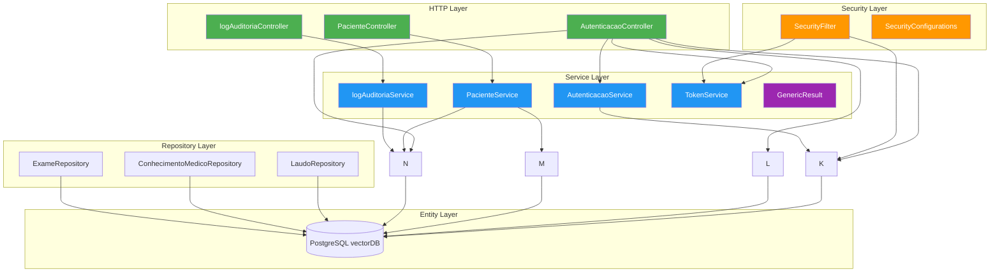
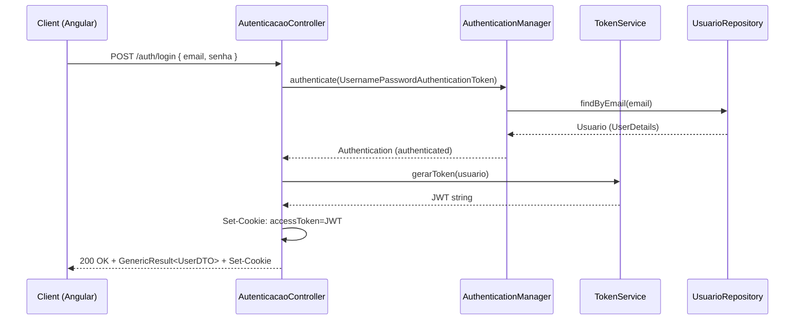
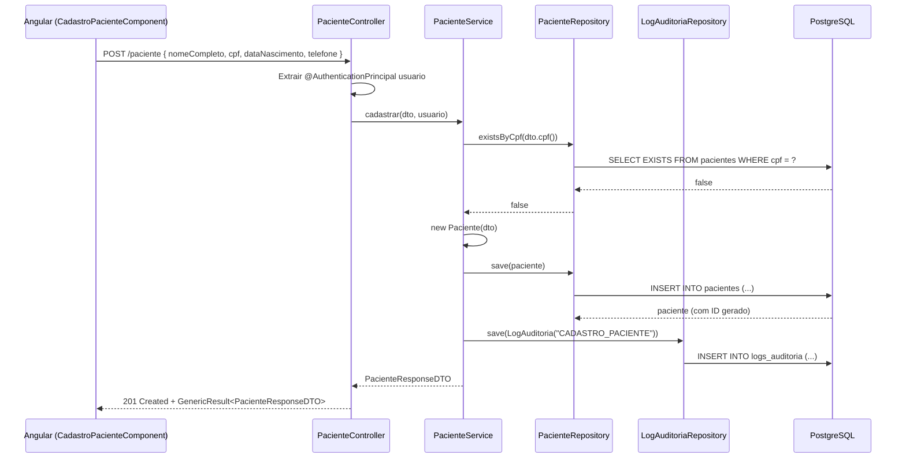
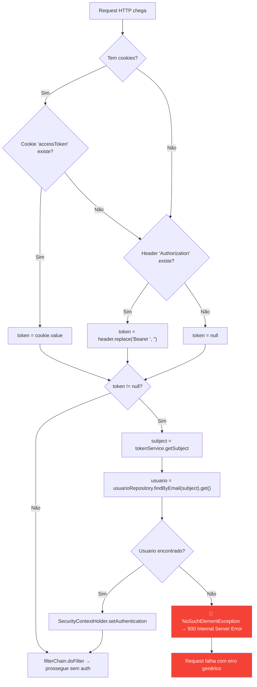
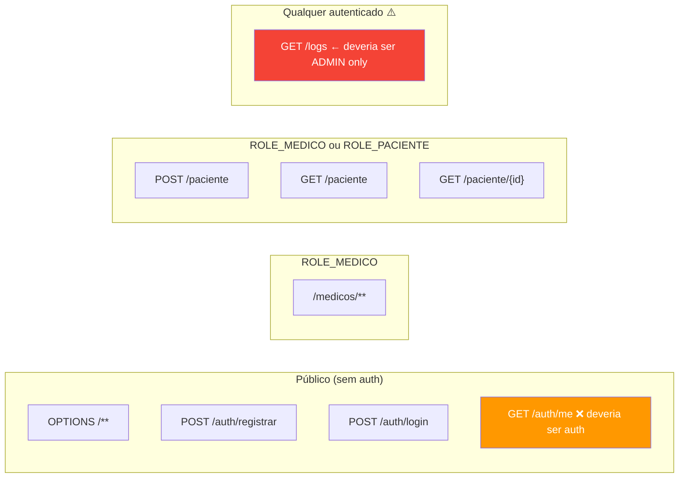
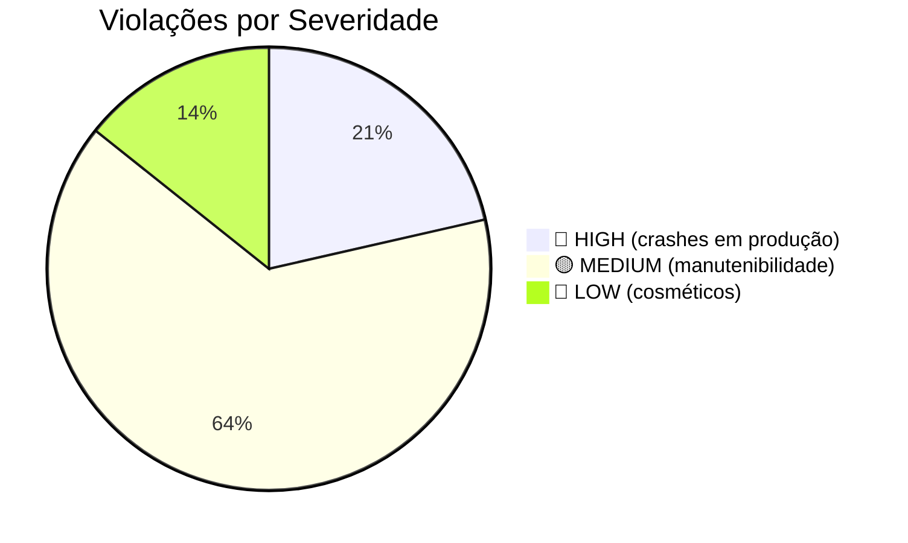

# Backend Services — TILA

> Inventário exaustivo de todos os services, repositories e classes auxiliares do backend.
> Cada método foi lido diretamente do código-fonte em 2026-05-07.

---

## Arquitetura de Camadas



---

## GenericResult\<T\> — Wrapper Universal de Resposta

### Código Real Completo

```java
package tecnologi.tila.tila.service;

import lombok.Getter;

@Getter
public class GenericResult<T> {

    private final boolean success;
    private final String message;
    private final T data;

    protected GenericResult(boolean success, String message, T data) {
        this.success = success;
        this.message = message;
        this.data = data;
    }

    public static <T> GenericResult<T> success(T data){
        return new GenericResult<>(true, "Operação realizada com sucesso !", data);
    }

    public static <T> GenericResult<T> success(T data, String message){
        return new GenericResult<>(true, message, data);
    }

    public static <T> GenericResult<T> error(String message){
        return new GenericResult<>(false, message, null);
    }
}
```

### Análise Detalhada
- **Localização**: `tecnologi.tila.tila.service.GenericResult` — ⚠️ está no pacote `service` ao invés de um pacote `common` ou `dto`
- **Construtor**: `protected` — impede instanciação direta, forçando uso dos static factories
- **Imutabilidade**: ✅ Todos os campos são `final`
- **Factory methods**: `success(data)`, `success(data, message)`, `error(message)`
- **Mensagem default**: `"Operação realizada com sucesso !"` (com espaço antes do `!`)
- **Serialização JSON**: Jackson serializa automaticamente via `@Getter` do Lombok

### Exemplo de Uso no Controller
```java
// Sucesso com mensagem default
return ResponseEntity.ok(GenericResult.success(pacienteDTO));
// → { "success": true, "message": "Operação realizada com sucesso !", "data": { ... } }

// Sucesso com mensagem customizada
return ResponseEntity.status(HttpStatus.CREATED)
    .body(GenericResult.success(true, "Cadastro realizado!"));
// → { "success": true, "message": "Cadastro realizado!", "data": true }

// Erro
return ResponseEntity.badRequest().body(GenericResult.error("CPF já cadastrado!"));
// → { "success": false, "message": "CPF já cadastrado!", "data": null }
```

### Problemas Encontrados
1. ⚠️ `GlobalExceptionHandler` **NÃO USA** `GenericResult.error()` — retorna um `ErrorDetalhe` privado:
```java
// GlobalExceptionHandler.java — formato INCONSISTENTE
private record ErrorDetalhe(String mensagem){}

@ExceptionHandler(EntityNotFoundException.class)
public ResponseEntity handle404(EntityNotFoundException ex){
    return ResponseEntity.status(HttpStatus.NOT_FOUND)
        .body(new ErrorDetalhe(ex.getMessage()));
}
// → { "mensagem": "..." } — DIFERENTE de GenericResult!
```

---

## TokenService — JWT Generation & Validation

### Código Real Completo

```java
@Service
public class TokenService{

    @Value("${api.security.token.secret}")
    private String secret;  // ⚠️ valor: "Cucamole@123" hardcoded no .properties

    public String gerarToken(Usuario usuario){
        Algorithm algoritimo = Algorithm.HMAC256(secret);
        return JWT.create()
                .withIssuer("TILA-APP")
                .withSubject(usuario.getEmail())
                .withClaim("role", usuario.getPerfil().toString())
                .withExpiresAt(dataExpiracao())
                .sign(algoritimo);
    }

    public String getSubject(String tokenJWT){
        Algorithm algoritimo = Algorithm.HMAC256(secret);
        return JWT.require(algoritimo)
                .withIssuer("TILA-APP")
                .build()
                .verify(tokenJWT)
                .getSubject();
    }

    private Instant dataExpiracao(){
        return LocalDateTime.now().plusHours(1).toInstant(ZoneOffset.of("-03:00"));
    }
}
```

### Diagrama de Fluxo do Token



### Análise Detalhada
- **Algoritmo**: HMAC256 — simétrico, mesmo secret para assinar e verificar
- **Issuer**: `"TILA-APP"` — string fixa para identificar o emissor
- **Subject**: `email` do usuário — usado para lookup no SecurityFilter
- **Claims adicionais**: `role` — perfil do usuário (MEDICO, PACIENTE, ADMIN)
- **Expiração**: 1 hora, fixo, offset `-03:00` (Brasília)
- **Typo**: variável `algoritimo` (deveria ser `algoritmo`)
- ⚠️ **Sem refresh token** — usuário precisa re-logar a cada hora
- ⚠️ **Offset hardcoded**: `-03:00` não considera horário de verão (abolido em 2019, mas hardcoding é anti-pattern)
- ⚠️ **Secret hardcoded**: `"Cucamole@123"` no `application.properties` — qualquer pessoa que acesse o repo pode forjar tokens

---

## AutenticacaoService — UserDetailsService Implementation

### Código Real Completo

```java
@Service
public class AutenticacaoService implements UserDetailsService {

    @Autowired  // ⚠️ field injection
    private UsuarioRepository repository;

    @Override
    public UserDetails loadUserByUsername(String username) throws UsernameNotFoundException {
        return repository.findByEmail(username)
                .orElseThrow(() -> new UsernameNotFoundException("Usuário não encontrado"));
    }
}
```

### Análise Detalhada
- **Propósito**: Ponto de integração entre Spring Security e a tabela `usuarios`
- **Localização**: `tecnologi.tila.tila.service.athenticate` — ⚠️ pacote com typo (`athenticate` → deveria ser `authenticate`)
- **Pattern**: Implementa `UserDetailsService` — o Spring Security chama `loadUserByUsername()` automaticamente durante `AuthenticationManager.authenticate()`
- ✅ Usa `orElseThrow()` corretamente (ao contrário do controller que usa `.get()`)
- ❌ Usa `@Autowired` field injection — deveria ser constructor injection
- ❌ Não registra log de tentativa de login falha

---

## PacienteService — Service de Negócio Principal

### Código Real Completo

```java
@Service
public class PacienteService {

    private final PacienteRepository pacienteRepository;
    private final LogAuditoriaRepository logAuditoriaRepository;

    public PacienteService(PacienteRepository pacienteRepository,
                           LogAuditoriaRepository logAuditoriaRepository) {
        this.pacienteRepository = pacienteRepository;
        this.logAuditoriaRepository = logAuditoriaRepository;
    }

    @Transactional
    public PacienteResponseDTO cadastrar(PacienteRequestDTO dto, Usuario usuario){
        if(pacienteRepository.existsByCpf(dto.cpf())){
            throw new ValidationException("CPF já cadastrado!");
        }
        var paciente = new Paciente(dto);  // ⚠️ Entity conhece DTO
        pacienteRepository.save(paciente);
        registrarLog(usuario, "CADASTRO_PACIENTE", LocalDateTime.now());
        return PacienteResponseDTO.fromEntity(paciente);
    }

    @Transactional(readOnly = true)
    public List<PacienteResponseDTO> buscarTodosPacientes(Usuario usuario){
        registrarLog(usuario, "CONSULTA_TODOS_PACIENTES", LocalDateTime.now());
        return pacienteRepository.findAll()   // ⚠️ findAll() sem paginação
                .stream()
                .map(PacienteResponseDTO::fromEntity)
                .toList();
    }

    public PacienteResponseDTO buscarPorCpf(String cpf, Usuario usuario) {
        registrarLog(usuario, "CONSULTA_PACIENTE_CPF", LocalDateTime.now());
        var paciente = pacienteRepository.findByCpf(cpf)
                .orElseThrow(() -> new EntityNotFoundException("Paciente não encontrado pelo CPF"));
        return PacienteResponseDTO.fromEntity(paciente);
    }

    public PacienteResponseDTO bucasPorId(Long id, Usuario usuario) {  // ⚠️ typo: bucasPorId
        registrarLog(usuario, "CONSULTA_PACIENTE_ID", LocalDateTime.now());
        var paciente = pacienteRepository.findById(id)
                .orElseThrow(() -> new EntityNotFoundException("Paciente não encontrado pelo ID"));
        return PacienteResponseDTO.fromEntity(paciente);
    }

    public void registrarLog(Usuario usuario, String acao, LocalDateTime dataHora){
        var log = new LogAuditoria(usuario, acao, dataHora);
        logAuditoriaRepository.save(log);
    }
}
```

### Diagrama de Sequência — Cadastro de Paciente



### Análise Detalhada por Método

| Método | @Transactional | Validação | Auditoria | Paginação | Issues |
|---|---|---|---|---|---|
| `cadastrar` | ✅ | ✅ `existsByCpf` | ✅ Log | N/A | Entity conhece DTO |
| `buscarTodosPacientes` | ✅ readOnly | ❌ | ✅ Log | ❌ `findAll()` sem `Pageable` | N+1 em `getExames()` |
| `buscarPorCpf` | ❌ | ❌ | ✅ Log | N/A | Falta @Transactional(readOnly=true) |
| `bucasPorId` | ❌ | ❌ | ✅ Log | N/A | Typo no nome + falta @Transactional |
| `registrarLog` | ❌ | ❌ | — | N/A | Sem @Transactional (herda do chamador?) |

### Problemas de Performance
```java
// N+1 QUERY PROBLEM
// buscarTodosPacientes() chama findAll() que retorna todos os pacientes,
// depois PacienteResponseDTO.fromEntity() acessa paciente.getExames()
// Para cada paciente, Hibernate faz um SELECT adicional para carregar exames

// Consulta 1: SELECT * FROM pacientes (retorna N pacientes)
// Consulta 2: SELECT * FROM exames WHERE paciente_id = 1
// Consulta 3: SELECT * FROM exames WHERE paciente_id = 2
// ...
// Consulta N+1: SELECT * FROM exames WHERE paciente_id = N

// SOLUÇÃO: Usar @EntityGraph ou JOIN FETCH
@Query("SELECT p FROM Paciente p LEFT JOIN FETCH p.exames")
List<Paciente> findAllWithExames();
```

---

## logAuditoriaService (⚠️ Nome com camelCase)

### Código Real Completo

```java
@Service
public class logAuditoriaService {  // ⚠️ deveria ser LogAuditoriaService

    private final LogAuditoriaRepository logAuditoriaRepository;

    public logAuditoriaService(LogAuditoriaRepository logAuditoriaRepository){
        this.logAuditoriaRepository = logAuditoriaRepository;
    }

    public List<LogAuditoria> buscarTodosOsLogs(){
        List<LogAuditoria> logs = logAuditoriaRepository.findAll();  // ⚠️ sem paginação
        if(logs.isEmpty()){
            throw new RuntimeException("Nenhum log encontrado");  // ⚠️ RuntimeException!
        }
        return logs;  // ⚠️ retorna entity ao invés de DTO
    }
}
```

### Análise Detalhada
- ⚠️ **Nome**: `logAuditoriaService` (camelCase) — viola convenção Java para classes (PascalCase)
- ⚠️ **Exception**: Lança `RuntimeException` quando a lista está vazia — deveria retornar lista vazia ou `GenericResult.error()`
- ⚠️ **Retorno**: Retorna `List<LogAuditoria>` (entity JPA) — expõe campo `senha` do `Usuario` associado via serialização Jackson
- ⚠️ **Paginação**: Usa `findAll()` sem `Pageable` — carrega TODOS os logs de uma vez
- ⚠️ **Sem @Transactional(readOnly=true)** — operação de leitura sem otimização
- ✅ **Constructor injection**: Ao menos usa constructor injection corretamente

---

## LaudoService — Geração de Pré-Laudos IA

### Código Principal (Resumo)

```java
@Service
public class LaudoService {
    private final LaudoRepository laudoRepository;
    private final ExameRepository exameRepository;
    private final ChatModel chatModel;
    
    public LaudoService(LaudoRepository laudoRepository,
                        ExameRepository exameRepository,
                        ChatModel chatModel,
                        ObjectMapper objectMapper) {
        this.laudoRepository = laudoRepository;
        this.exameRepository = exameRepository;
        this.chatModel = chatModel;
    }

    public LaudoResponseDTO gerarPreLaudo(LaudoGeracaoRequestDTO request, Usuario usuarioLogado) {
        var exame = exameRepository.findByIdWithDetails(request.exameId())
            .orElseThrow(() -> new EntityNotFoundException("Exame não encontrado"));

        // Montagem do prompt com imagem Base64
        // Envio via chatModel.chat() 
        // Parsing da GeminiLaudoResponse
        // Persistência da entidade Laudo
        
        return LaudoResponseDTO.fromEntity(laudo);
    }
}
```

### Análise Detalhada
- ✅ Usa constructor injection com campos `final`.
- ✅ Trata erros do `Optional` de `exame` com `.orElseThrow`.
- ✅ Lida com o workaround multimodal do LangChain4j utilizando `ChatModel` direto ao invés de `@AiService`.
- ⚠️ Falta refatorar `carregarSystemPrompt` e `carregarImagemExame` para classes utilitárias ou `StorageService` dedicado caso o projeto cresça.

---

## SecurityFilter — JWT Authentication Filter

### Código Real Completo

```java
@Component
public class SecurityFilter extends OncePerRequestFilter {

    @Autowired   // ⚠️ field injection
    private TokenService tokenService;

    @Autowired   // ⚠️ field injection
    private UsuarioRepository usuarioRepository;

    @Override
    protected void doFilterInternal(HttpServletRequest request,
                                     HttpServletResponse response,
                                     FilterChain filterChain)
            throws ServletException, IOException {

        var tokenJWT = recuperarToken(request);

        if(tokenJWT != null){
            var subject = tokenService.getSubject(tokenJWT);
            var usuario = usuarioRepository.findByEmail(subject).get();  // 🔴 NPE RISK!

            var authentication = new UsernamePasswordAuthenticationToken(
                usuario, null, usuario.getAuthorities()
            );
            SecurityContextHolder.getContext().setAuthentication(authentication);
        }

        filterChain.doFilter(request, response);
    }

    private String recuperarToken(HttpServletRequest request){
        // 1. Tenta extrair do cookie
        if(request.getCookies() != null){
            for(Cookie cookie: request.getCookies()){
                if("accessToken".equals(cookie.getName())){
                    return cookie.getValue();
                }
            }
        }
        // 2. Fallback: header Authorization
        var authorizationHeader = request.getHeader("Authorization");
        if(authorizationHeader != null){
            return authorizationHeader.replace("Bearer ", "");
        }
        return null;
    }
}
```

### Diagrama de Fluxo do Filter



### Problemas Críticos
1. 🔴 **`.get()` sem verificação**: Se o usuário foi deletado do banco mas o token JWT ainda é válido (expira em 1h), o `findByEmail(subject).get()` lança `NoSuchElementException` que não é tratado pelo `GlobalExceptionHandler` — resulta em 500 genérico
2. ⚠️ **Sem tratamento de token expirado/inválido**: Se `tokenService.getSubject()` falha (token malformado, expirado, ou assinatura inválida), lança `JWTVerificationException` que não é capturado — resulta em 500 genérico
3. ⚠️ **Field injection**: `@Autowired` ao invés de constructor injection

### Correção Recomendada
```java
if(tokenJWT != null){
    try {
        var subject = tokenService.getSubject(tokenJWT);
        var usuario = usuarioRepository.findByEmail(subject)
            .orElse(null);  // Não crash se usuário deletado
        if(usuario != null) {
            var authentication = new UsernamePasswordAuthenticationToken(
                usuario, null, usuario.getAuthorities()
            );
            SecurityContextHolder.getContext().setAuthentication(authentication);
        }
    } catch (JWTVerificationException e) {
        // Token inválido/expirado — simplesmente não autentica
        // A request prossegue como anônima
    }
}
```

---

## SecurityConfigurations — Spring Security Config

### Código Real Completo

```java
@Configuration
@EnableWebSecurity
public class SecurityConfigurations {

    @Autowired
    private SecurityFilter securityFilter;

    @Bean
    public SecurityFilterChain securityFilterChain(HttpSecurity http) throws Exception {
        return http
                .cors(Customizer.withDefaults())
                .csrf(csrf -> csrf.disable())
                .sessionManagement(sm -> sm.sessionCreationPolicy(SessionCreationPolicy.STATELESS))
                .authorizeHttpRequests(req -> {
                    req.requestMatchers(HttpMethod.OPTIONS, "/**").permitAll();
                    req.requestMatchers("/auth/**").permitAll();
                    req.requestMatchers("/medicos/**").hasRole("MEDICO");
                    req.requestMatchers("/paciente/**").hasAnyRole("MEDICO", "PACIENTE");
                    req.anyRequest().authenticated();
                })
                .addFilterBefore(securityFilter, UsernamePasswordAuthenticationFilter.class)
                .build();
    }

    @Bean
    public CorsConfigurationSource corsConfigurationSource() {
        CorsConfiguration configuration = new CorsConfiguration();
        configuration.setAllowedOrigins(Arrays.asList("http://localhost:4200"));
        configuration.setAllowedMethods(Arrays.asList("GET", "POST", "PUT", "DELETE", "OPTIONS"));
        configuration.setAllowedHeaders(Arrays.asList("*"));
        configuration.setAllowCredentials(true);
        UrlBasedCorsConfigurationSource source = new UrlBasedCorsConfigurationSource();
        source.registerCorsConfiguration("/**", configuration);
        return source;
    }

    @Bean
    public AuthenticationManager authenticationManager(AuthenticationConfiguration configuration) throws Exception {
        return configuration.getAuthenticationManager();
    }

    @Bean
    public PasswordEncoder passwordEncoder() {
        return new BCryptPasswordEncoder();
    }
}
```

### Mapa de Autorização



> ⚠️ **`/auth/**` é `permitAll()`** — isso inclui `/auth/me` que **deveria** ser autenticado. Na prática funciona porque o controller verifica `@AuthenticationPrincipal`, mas a proteção deveria estar na SecurityFilterChain.

---

## Inventário Completo de Repositories

| Repository | Entity | ID Type | Custom Queries |
|---|---|---|---|
| `UsuarioRepository` | Usuario | UUID | `findByEmail(String): Optional<Usuario>` |
| `MedicoRepository` | Medico | Long | `findByCrm(String): Optional<Medico>`, `findByUsuario(Usuario): Optional<Medico>` |
| `PacienteRepository` | Paciente | Long | `findByCpf(String): Optional<Paciente>`, `findByNomeCompletoContainingIgnoreCase(String): List<Paciente>`, `existsByCpf(String): boolean` |
| `LogAuditoriaRepository` | LogAuditoria | Long | `findByUsuarioIdOrderByDataHoraDesc(UUID): List<LogAuditoria>`, `findByDataHoraBetween(LocalDateTime, LocalDateTime): List<LogAuditoria>` |
| `LaudoRepository` | Laudo | Long | `findByMedicoAndStatus(long, StatusLaudo): List<Laudo>`, `findByExameId(long): List<Laudo>` |
| `ConhecimentoMedicoRepository` | ConhecimentoMedico | Long | Nenhuma (apenas CRUD padrão) |
| `ExameRepository` | Exame | Long | `findByIdWithDetails(Long): Optional<Exame>` (Usa JOIN FETCH) |
| `ConsultaRepository` | — | — | ❌ Interface vazia (nem extends JpaRepository) |

---

## Tabela de Violações de Convenção Consolidada

| # | Arquivo | Tipo de Violação | Esperado | Encontrado | Impacto | Severidade |
|---|---|---|---|---|---|---|
| 1 | `SecurityConfigurations.java` | DI Pattern | Constructor injection | `@Autowired` field injection | Testabilidade reduzida | 🟡 |
| 2 | `SecurityFilter.java` | DI Pattern | Constructor injection | `@Autowired` field injection | Testabilidade reduzida | 🟡 |
| 3 | `AutenticacaoService.java` | DI Pattern | Constructor injection | `@Autowired` field injection | Testabilidade reduzida | 🟡 |
| 4 | `PacienteController.java` | DI Pattern | Constructor injection | `@Autowired` field injection | Testabilidade reduzida | 🟡 |
| 5 | `logAuditoriaService.java` | Class Naming | `LogAuditoriaService` (PascalCase) | `logAuditoriaService` (camelCase) | Confusão, violação de padrão | 🟡 |
| 6 | `logAuditoriaController.java` | Class Naming | `LogAuditoriaController` | `logAuditoriaController` | Confusão, violação de padrão | 🟡 |
| 7 | `service/athenticate/` | Package Naming | `authenticate` | `athenticate` (typo, falta 'u') | Confusão, difícil de encontrar | 🟡 |
| 8 | `PacienteService.java` | Method Naming | `buscarPorId` | `bucasPorId` (typo) | Confusão | 🔵 |
| 9 | `PacienteController.java` | Method Naming | `buscarTodosPacientes` | `bucasTodosPacientes` (typo) | Confusão | 🔵 |
| 10 | `PacienteResponseDTO.java` | DTO Pattern | `List<ExameResponseDTO>` | `List<Exame>` (entity no DTO) | LazyInitException, serialização circular | 🔴 |
| 11 | `GlobalExceptionHandler.java` | Response Pattern | `GenericResult.error()` | `ErrorDetalhe` (record privado) | Frontend precisa tratar 2 formatos | 🟡 |
| 12 | `AutenticacaoController.java` | Optional Safety | `medico.orElseThrow()` | `medico.get()` sem verificação | NPE crash em produção | 🔴 |
| 13 | `SecurityFilter.java` | Optional Safety | `.orElseThrow()` ou `.orElse(null)` | `.get()` sem verificação | NPE crash em produção | 🔴 |
| 14 | `logAuditoriaService.java` | Empty Result | Retornar lista vazia ou GenericResult | `throw RuntimeException` | Exception desnecessária | 🟡 |

### Visualização por Severidade



## Referências
- [[wiki/entities/spring-boot-backend]] — Stack backend completo
- [[wiki/concepts/data-model]] — Modelo ER e LGPD
- [[wiki/concepts/api-endpoints]] — Endpoints REST
- [[wiki/concepts/backend-patterns]] — Padrões de código
- [[context/coding-conventions]] — Convenções verificadas

## Backlinks
- [[wiki/overview]]
- [[context/roadmap]]
