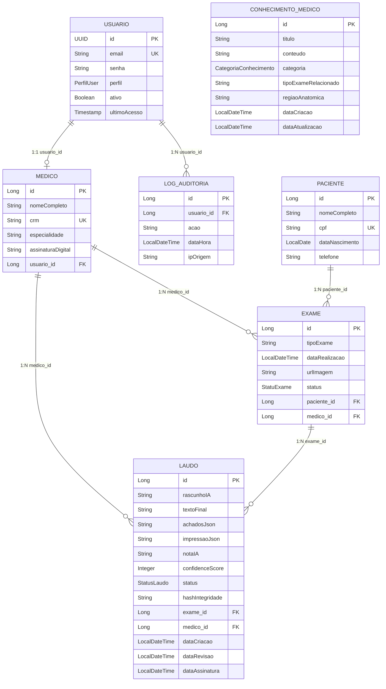
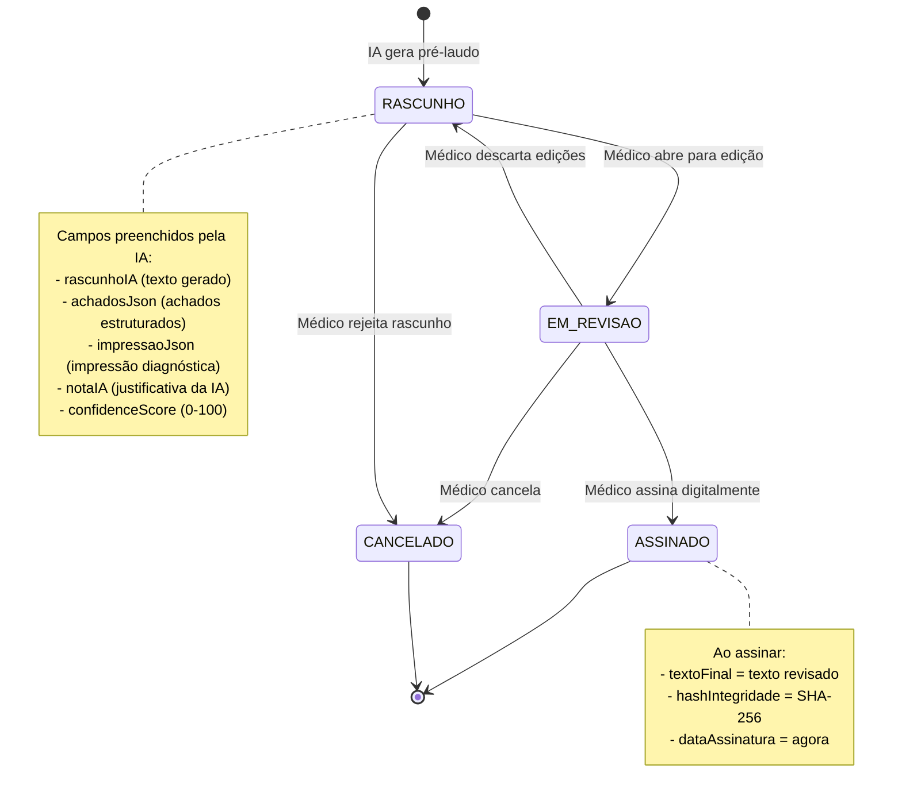
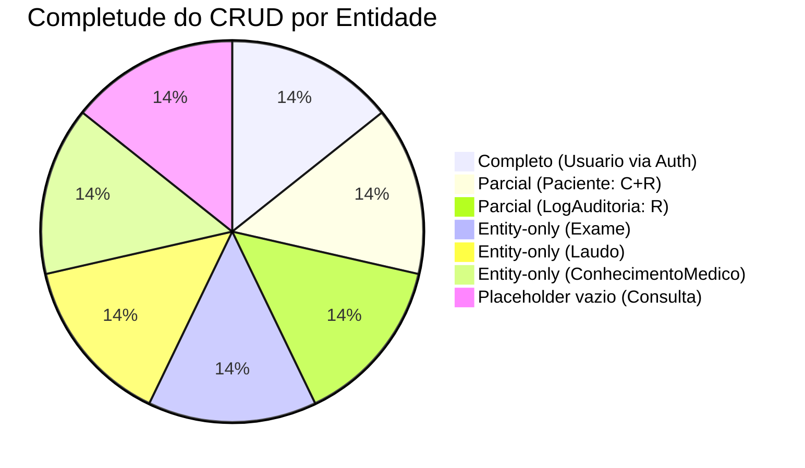
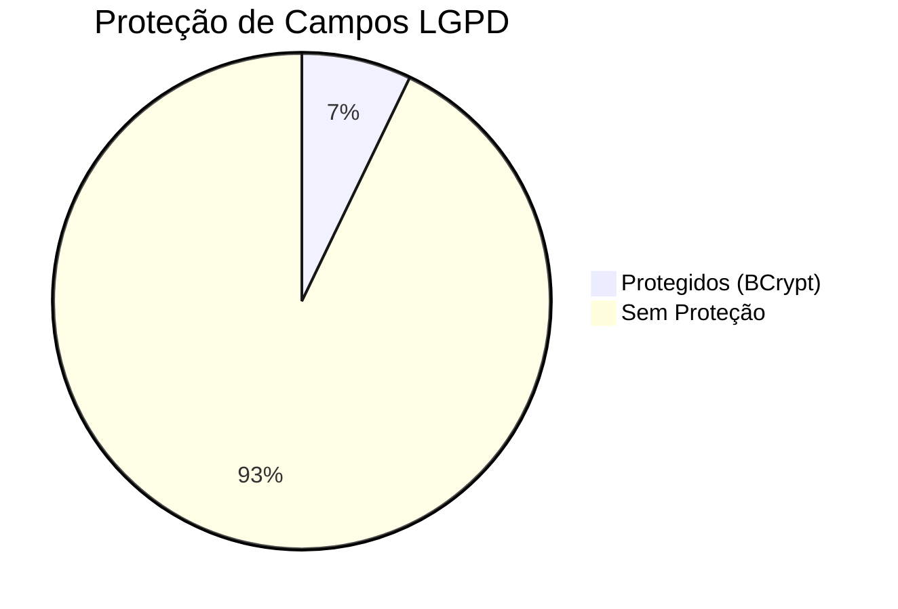

# Modelo de Dados — TILA

> Auditoria arqueológica completa do modelo de dados JPA extraído do código real em 2026-05-07.
> Cada entidade foi lida diretamente dos arquivos `.java` em `Tila_BackEnd/tila/src/main/java/tecnologi/tila/tila/entity/`.

---

## Diagrama ER Completo



---

## Fluxo de Relacionamentos em Prosa

O modelo de dados do TILA é organizado em torno de **quatro domínios**:

### 1. Domínio de Identidade (Usuario + Medico)
O `Usuario` é a raiz de autenticação. Implementa `UserDetails` do Spring Security e usa **UUID** como chave primária (não sequencial, seguro contra enumeração). Cada `Usuario` com perfil `MEDICO` possui exatamente um `Medico` associado via `@OneToOne`. O `Medico` armazena dados profissionais (CRM, especialidade, assinatura digital em Base64).

**Código real — Usuario.java (getAuthorities)**:
```java
@Override
public Collection<? extends GrantedAuthority> getAuthorities() {
    if (this.perfil == PerfilUser.ADMIN) {
        return List.of(
            new SimpleGrantedAuthority("ROLE_ADMIN"),
            new SimpleGrantedAuthority("ROLE_MEDICO")
        );
    } else {
        return List.of(new SimpleGrantedAuthority("ROLE_" + this.perfil.name()));
    }
}
```
> ⚠️ **Observação**: A hierarquia ADMIN→MEDICO está implementada inline. O Spring Security oferece `RoleHierarchy` bean como alternativa mais limpa e configurável.

### 2. Domínio Clínico (Paciente + Exame + Laudo)
O `Paciente` é o sujeito dos exames. Possui **4 campos LGPD** (nomeCompleto, cpf, dataNascimento, telefone) todos armazenados em texto plano sem criptografia. Cada paciente pode ter múltiplos `Exame`s (`@OneToMany`). Cada `Exame` pode gerar múltiplos `Laudo`s — um por tentativa de geração IA, mantendo o histórico de rascunhos.

**Código real — Laudo.java (@PrePersist / @PreUpdate)**:
```java
@PrePersist
protected void onPrePersist(){
    this.dataCriacao = LocalDateTime.now();
}

@PreUpdate
protected void onPreUpdate(){
    if(this.status == StatusLaudo.ASSINADO && this.dataAssinatura == null){
        this.dataAssinatura = LocalDateTime.now();
    }else{
        this.dataAssinatura = LocalDateTime.now(); // ⚠️ BUG: atualiza em AMBOS branches
    }
}
```
> ⚠️ **Bug**: O `@PreUpdate` atualiza `dataAssinatura` independentemente do branch do `if`. O `else` deveria atualizar `dataRevisao`, não `dataAssinatura`.

### 3. Domínio de Auditoria (LogAuditoria)
Registra ações do sistema para compliance LGPD. Associado a `Usuario` via `@ManyToOne`. O campo `ipOrigem` existe mas **nunca é populado** em nenhum ponto do código — é sempre `null`.

**Código real — como o log é criado inline no controller**:
```java
// Em AutenticacaoController.java — criação inline
LogAuditoria log = new LogAuditoria();
log.setUsuario(novoUsuario);
log.setAcao("CADASTRO_NOVO_MEDICO");
log.setDataHora(LocalDateTime.now());
logAuditoriaRepository.save(log);
```

**Código real — como o log é criado via helper no service**:
```java
// Em PacienteService.java — via método helper
public void registrarLog(Usuario usuario, String acao, LocalDateTime dataHora){
    var log = new LogAuditoria(usuario, acao, dataHora);
    logAuditoriaRepository.save(log);
}
```
> ⚠️ **Inconsistência**: Dois patterns diferentes para a mesma operação. Deveria existir um `AuditService` centralizado.

### 4. Domínio de Conhecimento (ConhecimentoMedico)
Entidade **standalone** (sem relações com outras entities) projetada para alimentar o sistema RAG. Armazena conhecimento médico categorizado que seria convertido em embeddings.

**Código real — ConhecimentoMedico.java**:
```java
@Column(columnDefinition = "TEXT", nullable = false)
private String conteudo;

@Enumerated(EnumType.STRING)
@Column(nullable = false)
private CategoriaConhecimento categoriaConhecimento;

private String tipoExameRelacionado; // Ex: RX_TORAX
private String regiaoAnatomica;      // Ex: TORAX, CRANIO
```
> ⚠️ `tipoExameRelacionado` e `regiaoAnatomica` são String livres — deveriam ser enums para consistência e validação.

---

## Enums do Modelo

### PerfilUser
```java
public enum PerfilUser {
    MEDICO,    // Profissional de saúde que gera e assina laudos
    PACIENTE,  // Paciente com acesso limitado (funcionalidade futura)
    ADMIN      // Administrador com acesso total (herda MEDICO)
}
```

### StatuExame
```java
public enum StatuExame {
    PENDENTE,   // Exame registrado, aguardando resultado
    CONCLUIDO   // Exame realizado
}
```
> ⚠️ **Incompleto**: Faltam estados como `CANCELADO`, `EM_ANALISE`, `LAUDADO`. O nome `StatuExame` tem typo (falta 's').

### StatusLaudo
```java
public enum StatusLaudo {
    RASCUNHO,    // Gerado pela IA, aguardando revisão
    EM_REVISAO,  // Médico está editando
    ASSINADO,    // Médico assinou digitalmente
    CANCELADO    // Laudo cancelado
}
```
> ✅ Enum bem definido com workflow claro: RASCUNHO → EM_REVISAO → ASSINADO | CANCELADO

### CategoriaConhecimento
```java
public enum CategoriaConhecimento {
    PROTOCOLO,       // Protocolos de exame
    ANATOMIA,        // Referências anatômicas
    ACR_BIRADS,      // Classificação ACR BI-RADS (mama)
    ATLAS,           // Atlas de referência
    LAUDO_EXEMPLO,   // Exemplos de laudos modelo
    TERMINOLOGIA,    // Terminologia médica padronizada
    DIRETRIZ         // Diretrizes clínicas
}
```
> ✅ Categorias relevantes para radiologia. O ACR BI-RADS indica foco em mamografia.

---

## Diagrama de Lifecycle de um Laudo



---

## Status de Completude por Entidade



| Entidade | CREATE | READ | UPDATE | DELETE | Paginação |
|---|---|---|---|---|---|
| Usuario | ✅ via /auth/registrar | ✅ via /auth/me | ❌ | ❌ | N/A |
| Medico | ✅ via /auth/registrar | ❌ endpoint direto | ❌ | ❌ | N/A |
| Paciente | ✅ POST /paciente | ✅ GET /paciente, /{id} | ❌ | ❌ | ❌ findAll() |
| Exame | ❌ | ❌ | ❌ | ❌ | ❌ |
| Laudo | ❌ | ❌ | ❌ | ❌ | ❌ |
| LogAuditoria | ✅ (inline, automático) | ✅ GET /logs | ❌ | ❌ | ❌ findAll() |
| ConhecimentoMedico | ❌ | ❌ | ❌ | ❌ | ❌ |
| Consulta | ❌ (vazio) | ❌ | ❌ | ❌ | ❌ |

---

## Mapa de Exposição LGPD

### Classificação de Dados por Artigo da LGPD

| Entidade | Campo | Art. LGPD | Categoria | Proteção Atual | Risco |
|---|---|---|---|---|---|
| **Usuario** | email | Art. 5, I | Dado pessoal | ❌ Texto plano | 🟡 |
| **Usuario** | senha | Art. 5, I | Dado pessoal sensível | ✅ BCrypt hash | ✅ |
| **Medico** | nomeCompleto | Art. 5, I | Dado pessoal | ❌ Texto plano | 🟡 |
| **Medico** | crm | Art. 5, I | Dado profissional | ❌ Texto plano | 🔵 |
| **Medico** | assinaturaDigital | Art. 5, II | Dado biométrico | ❌ Base64 sem criptografia | 🔴 |
| **Paciente** | nomeCompleto | Art. 5, I | Dado pessoal | ❌ Texto plano | 🟡 |
| **Paciente** | cpf | Art. 5, I | Dado pessoal sensível | ❌ Texto plano | 🔴 |
| **Paciente** | dataNascimento | Art. 5, I | Dado pessoal | ❌ Texto plano | 🟡 |
| **Paciente** | telefone | Art. 5, I | Dado pessoal | ❌ Texto plano | 🟡 |
| **Laudo** | rascunhoIA | Art. 11 | Dado de saúde | ❌ Texto plano | 🔴 |
| **Laudo** | textoFinal | Art. 11 | Dado de saúde | ❌ Texto plano | 🔴 |
| **Laudo** | achadosJson | Art. 11 | Dado de saúde | ❌ Texto plano | 🔴 |
| **Laudo** | impressaoJson | Art. 11 | Dado de saúde | ❌ Texto plano | 🔴 |
| **Exame** | urlImagem | Art. 11 | Referência a dado de saúde | ❌ URL sem auth | 🟡 |

### Resumo Visual



### Direitos LGPD e Capacidade Atual

| Direito LGPD | Artigo | Implementado? | Detalhes |
|---|---|---|---|
| Acesso aos dados | Art. 18, II | ❌ | Sem endpoint DSAR |
| Retificação | Art. 18, III | ❌ | Sem PUT /paciente/{id} |
| Exclusão | Art. 18, VI | ❌ | Sem DELETE /paciente/{id}, sem soft delete |
| Portabilidade | Art. 18, V | ❌ | Sem export de dados |
| Consentimento | Art. 8 | ❌ | Sem registro de consentimento |
| Anonimização | Art. 18, IV | ❌ | Dados em texto plano |
| Minimização | Art. 6, III | ⚠️ | Coleta apenas o necessário, mas sem criptografia |

---

## Gaps Arquiteturais Encontrados

### 1. Ausência de Audit Fields Padrão
Apenas Laudo e ConhecimentoMedico possuem `@PrePersist`/`@PreUpdate`. As demais entidades (Usuario, Medico, Paciente, Exame, LogAuditoria) não possuem timestamps de criação/atualização.

**Recomendação**: Criar uma `@MappedSuperclass` base:
```java
@MappedSuperclass
@Getter @Setter
public abstract class BaseEntity {
    @CreationTimestamp
    @Column(updatable = false)
    private LocalDateTime createdAt;

    @UpdateTimestamp
    private LocalDateTime updatedAt;

    @Column(updatable = false)
    private String createdBy;

    private String updatedBy;
}
```

### 2. Ausência de Soft Delete
Nenhuma entidade implementa soft delete. Quando a entidade `Paciente` for deletada, os registros são perdidos permanentemente — violando o princípio LGPD de que dados de saúde devem ser mantidos por período mínimo regulamentado.

**Recomendação**: Adicionar campo `deletedAt` e filtro global:
```java
@Column
private LocalDateTime deletedAt;

@Where(clause = "deleted_at IS NULL") // Hibernate filter
```

### 3. Cascade Ausente
Nenhuma relação define `cascade`. Se um `Paciente` for deletado, seus `Exame`s ficam órfãos no banco com `paciente_id` apontando para registro inexistente.

### 4. PacienteResponseDTO Retorna Entity
```java
// PROBLEMA: retorna List<Exame> (entity JPA) no DTO
public record PacienteResponseDTO(
    Long id,
    String nomeCompleto,
    String cpf,
    LocalDate dataNascimento,
    List<Exame> exames  // ⚠️ deveria ser List<ExameResponseDTO>
) {}
```
Isso causa:
- Risco de `LazyInitializationException` se a sessão JPA já fechou
- Serialização circular (Exame → Paciente → Exames → ...)
- Exposição de campos internos do JPA

### 5. DDL Auto Update
```properties
spring.jpa.hibernate.ddl-auto=update
```
Perigoso em produção — o Hibernate pode alterar o schema de formas inesperadas. Deveria ser substituído por Flyway ou Liquibase com migrations versionadas.

---

## Queries Customizadas por Repository

| Repository | Método | Tipo | Uso |
|---|---|---|---|
| UsuarioRepository | `findByEmail(String)` | Derived query | Login / SecurityFilter |
| MedicoRepository | `findByCrm(String)` | Derived query | Busca por CRM |
| MedicoRepository | `findByUsuario(Usuario)` | Derived query | Associar médico ao usuário logado |
| PacienteRepository | `findByCpf(String)` | Derived query | Busca por CPF |
| PacienteRepository | `findByNomeCompletoContainingIgnoreCase(String)` | Derived query | Busca por nome (parcial) |
| PacienteRepository | `existsByCpf(String)` | Derived query | Validação de duplicata |
| LogAuditoriaRepository | `findByUsuarioIdOrderByDataHoraDesc(UUID)` | Derived query | Logs de um usuário específico |
| LogAuditoriaRepository | `findByDataHoraBetween(LocalDateTime, LocalDateTime)` | Derived query | Logs por período |
| LaudoRepository | `findByMedicoAndStatus(long, StatusLaudo)` | Derived query | Laudos de um médico por status |
| LaudoRepository | `findByExameId(long)` | Derived query | Laudos de um exame |

> ⚠️ `LaudoRepository` usa `long` (primitivo) ao invés de `Long` (wrapper) — se receber `null`, causa `NullPointerException`.

---

## Configuração do Banco

```properties
# application.properties (valores reais)
spring.datasource.url=jdbc:postgresql://localhost:5434/vectorDB
spring.datasource.username=postgres
spring.datasource.password=Cucamole@123  # ⚠️ HARDCODED
spring.datasource.driverClassName=org.postgresql.Driver
spring.jpa.hibernate.ddl-auto=update     # ⚠️ PERIGOSO EM PROD
spring.jpa.database-platform=org.hibernate.dialect.PostgreSQLDialect
spring.jpa.show-sql=true
```

> ⚠️ **Divergência do SKILL.md antigo**: DB era `TilaDB` na porta `5433`. Agora é `vectorDB` na porta `5434`. Isso indica que o banco foi migrado para suportar a extensão pgvector necessária para embeddings.

## Referências
- [[wiki/entities/entity-usuario]] — Detalhamento completo da entidade Usuario
- [[wiki/entities/entity-medico]] — Detalhamento da entidade Medico
- [[wiki/entities/entity-paciente]] — Detalhamento da entidade Paciente
- [[wiki/entities/entity-exame]] — Detalhamento da entidade Exame
- [[wiki/entities/entity-laudo]] — Detalhamento da entidade Laudo
- [[wiki/entities/entity-log-auditoria]] — Detalhamento da entidade LogAuditoria
- [[wiki/entities/entity-conhecimento-medico]] — Detalhamento da entidade ConhecimentoMedico
- [[wiki/entities/entity-consulta]] — Placeholder vazio
- [[context/security-lgpd]] — Análise de segurança completa
- [[wiki/concepts/backend-services]] — Services e repositories

## Backlinks
- [[wiki/entities/spring-boot-backend]]
- [[wiki/overview]]
