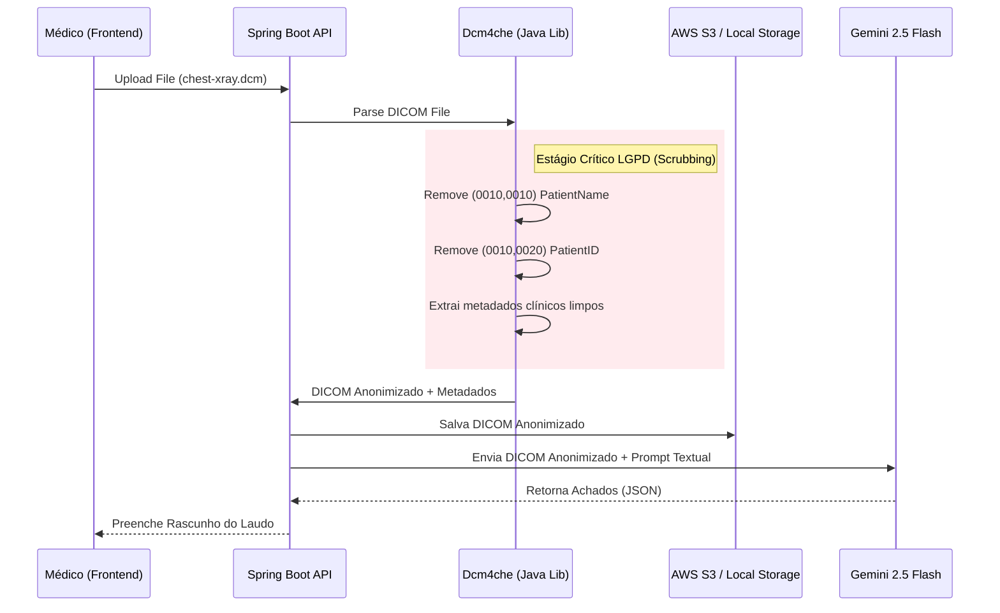

# O Padrão DICOM e Desafios de IA no TILA

> Análise teórica e arquitetural do manuseio de imagens médicas no projeto TILA (Tecnologia Integradora de Laudos Automatizados).

---

## O que é DICOM?

DICOM (*Digital Imaging and Communications in Medicine*) não é apenas um formato de imagem (como JPG ou PNG). É um protocolo completo de comunicação e um formato de arquivo estruturado introduzido em 1993 pelo ACR (American College of Radiology).

Enquanto um JPEG tem apenas pixels e meia dúzia de metadados EXIF, um arquivo `.dcm` é um "banco de dados minúsculo" acoplado à imagem, contendo dezenas de **Tags DICOM** estruturadas que dizem tudo sobre o paciente, o aparelho de raio-x e a clínica.

### A Estrutura de um Arquivo DICOM

```json
{
  "Header": {
    "PatientName (0010,0010)": "João da Silva",
    "PatientID (0010,0020)": "CPF-123456789",
    "PatientBirthDate (0010,0030)": "19800101",
    "StudyDate (0008,0020)": "20260507",
    "Modality (0008,0060)": "CR", // Computed Radiography
    "BodyPartExamined (0018,0015)": "CHEST",
    "Manufacturer (0008,0070)": "GE Healthcare"
  },
  "PixelData (7FE0,0010)": "[Matriz binária da imagem, muitas vezes 16-bit grayscale em vez dos 8-bit tradicionais do JPEG]"
}
```

---

## O Gap Atual no Projeto TILA

Hoje, a entidade `Exame` possui apenas um campo `String urlImagem`. 
Isto sugere que o Frontend faria o upload de um JPEG/PNG ou de um DICOM inteiro direto para a API Spring Boot, e o backend salvaria na pasta local `/uploads/exames`.

**O Problema Arquitetural:**
Se o TILA alimentar o LLM Gemini Multimodal (ou uma CNN especializada) apenas com um `.png` "achatado" (flat image), a IA perderá:
1. **Windowing (Janelamento)**: DICOMs têm muito mais tons de cinza do que um monitor consegue exibir. Médicos manipulam o "W/L" (Window/Level) para focar apenas em osso ou apenas em pulmão usando o mesmo arquivo. O PNG destrói isso.
2. **Escala Espacial**: A tag `PixelSpacing (0028,0030)` diz exatamente quantos milímetros tem um pixel na imagem. Sem isso, a IA não sabe se um nódulo tem 3mm (benigno) ou 3cm (câncer).

### O Risco LGPD (Scrubbing)

Se o TILA mandar o arquivo DICOM cru para a API do Google Gemini (GCP), ele estará cometendo um **vazamento de dados massivo (Breach)**. As tags `(0010,0010)` e `(0010,0020)` contêm o nome e CPF do paciente. Mandar isso para um LLM em nuvem viola a LGPD e o sigilo médico.

---

## Proposta de Arquitetura de Ingestão de Imagens (Futuro)

Para que o pipeline de IA do TILA funcione com segurança jurídica e precisão clínica, o Backend precisará implementar um *DICOM Scrubber* antes de acionar a IA.



### Biblioteca Recomendada
A equipe do TILA deverá adicionar a dependência **`dcm4che`** (A mais poderosa biblioteca Java para manipulação de objetos DICOM e redes PACS) no `pom.xml`.

```xml
<dependency>
    <groupId>org.dcm4che</groupId>
    <artifactId>dcm4che-core</artifactId>
    <version>5.29.0</version>
</dependency>
```

## Backlinks
- [[wiki/entities/entity-exame]]
- [[context/ai-pipeline]]
- [[context/security-lgpd]]
