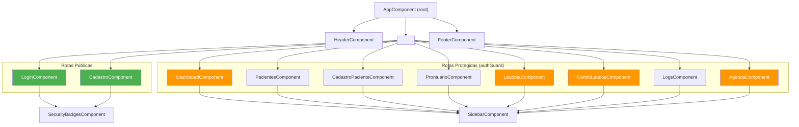
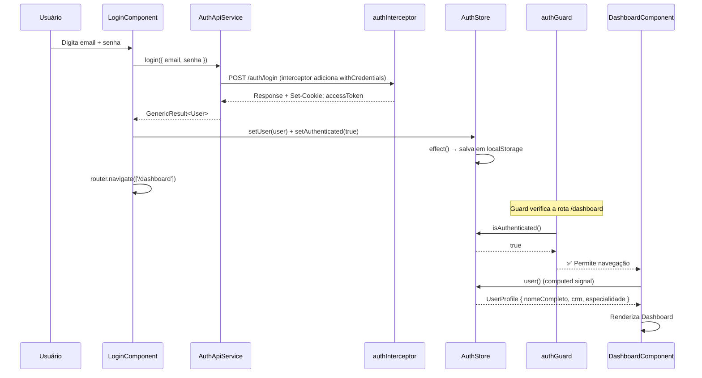
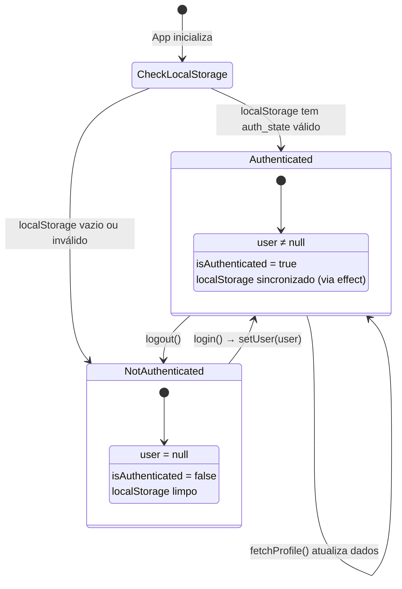
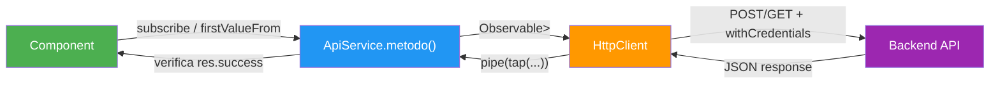
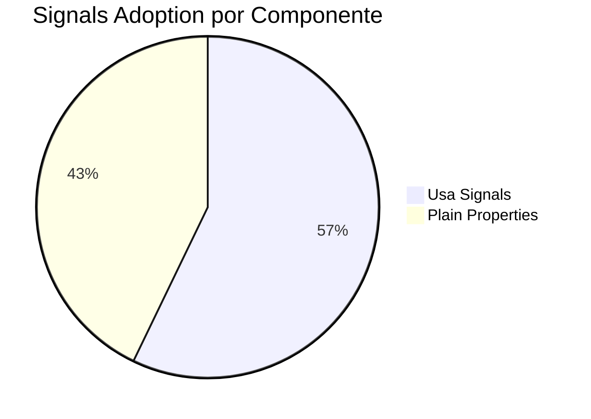

# Frontend Architecture — TILA

> Auditoria exaustiva do frontend Angular extraída diretamente de cada `.ts` em 2026-05-07.
> Inclui código real, árvore de componentes, fluxo de dados, e análise de cada service.

---

## Árvore de Componentes



> **Legenda**: 🟢 Funcional com backend | 🟠 Dados mockados / sem backend

---

## Stack Verificado

```
Angular 19.2.x
├── TypeScript 5.7.2
├── RxJS 7.8.x
├── Zone.js 0.15.x
├── @angular-devkit/build-angular 19.2.23
├── @angular/cli 19.2.23
├── CSS Vanilla (Inter via Google Fonts)
└── ⚠️ "s": "^1.0.0" (dependência desconhecida/acidental)
```

### Configuração do App — app.config.ts

```typescript
import { ApplicationConfig, provideZoneChangeDetection } from '@angular/core';
import { provideRouter } from '@angular/router';
import { provideHttpClient, withInterceptors } from '@angular/common/http';
import { routes } from './app.routes';
import { authInterceptor } from './core/interceptors/auth.interceptor';

export const appConfig: ApplicationConfig = {
  providers: [
    provideZoneChangeDetection({ eventCoalescing: true }),  // ✅ Otimização de change detection
    provideRouter(routes),
    provideHttpClient(withInterceptors([authInterceptor]))  // ✅ Interceptor funcional
  ]
};
```

**Análise**:
- ✅ `eventCoalescing: true` — agrupa eventos múltiplos em um ciclo de change detection (performance)
- ✅ `provideHttpClient` com `withInterceptors` — API funcional do Angular 19
- ⚠️ Sem `provideClientHydration()` — sem SSR
- ⚠️ Sem `provideAnimations()` — animações nativas desabilitadas

---

## Fluxo de Autenticação — Ponta a Ponta



---

## AuthStore — Signal-Based Global State

### Código Real Completo

```typescript
import { Injectable, signal, computed, effect, inject } from '@angular/core';
import { AuthApiService, UserProfile } from '../api/authApi/auth-api.service';
import { firstValueFrom } from 'rxjs';

export interface AuthState {
  user: UserProfile | null;
  isAuthenticated: boolean;
}

@Injectable({
  providedIn: 'root'
})
export class AuthStore {
  private authApi = inject(AuthApiService);
  
  private readonly state = signal<AuthState>({
    user: null,
    isAuthenticated: false
  });

  // Selectors (computed signals)
  readonly user = computed(() => this.state().user);
  readonly isAuthenticated = computed(() => this.state().isAuthenticated);

  constructor() {
    // Efeito: persiste estado em localStorage quando muda
    effect(() => {
      const currentState = this.state();
      if (currentState.isAuthenticated) {
        localStorage.setItem('auth_state', JSON.stringify(currentState));
      }
    });

    // Hidrata estado do localStorage na inicialização
    const saved = localStorage.getItem('auth_state');
    if (saved) {
      try {
        const parsed = JSON.parse(saved);
        this.state.set(parsed);
      } catch (e) {
        localStorage.removeItem('auth_state');
      }
    }
  }

  setUser(user: UserProfile) {
    this.state.update(s => ({ ...s, user, isAuthenticated: true }));
  }

  setAuthenticated(value: boolean) {
    this.state.update(s => ({ ...s, isAuthenticated: value }));
  }

  logout() {
    this.state.set({ user: null, isAuthenticated: false });
    localStorage.removeItem('auth_state');
  }

  async fetchProfile() {
    try {
      const profile$ = this.authApi.getMe().pipe(
        tap({
          next: (res) => {
            if (res.success && res.data) {
              this.setUser(res.data);
            }
          }
        })
      );
      await firstValueFrom(profile$);
    } catch (e) {
      console.error(e);
    }
  }
}
```

### Diagrama de Estado do AuthStore



### Análise Detalhada
- ✅ **Padrão Signal**: Usa `signal()` para estado, `computed()` para selectors, `effect()` para side-effects
- ✅ **Persistência**: `effect()` salva automaticamente em `localStorage` quando estado muda
- ✅ **Hidratação**: Carrega do `localStorage` no constructor
- ✅ **`firstValueFrom()`**: Converte Observable para Promise para uso com `async/await`
- ⚠️ **Token no localStorage**: O hash do estado (que inclui dados do usuário) fica em localStorage — se alguém acessa o computador, pode ver nome e CRM
- ⚠️ **Sem verificação de token expirado**: O `isAuthenticated` persiste em localStorage mesmo após o JWT cookie expirar (1h) — o guard permite navegação mas as chamadas HTTP falham com 403

---

## MedicalStore — Contexto Clínico

### Código Real Completo

```typescript
import { Injectable, signal, computed } from '@angular/core';

export interface MedicoState {
  selectedPacienteCpf: string | null;
  rascunhoLaudo: string;
}

@Injectable({
  providedIn: 'root'
})
export class MedicalStore {
  private readonly state = signal<MedicoState>({
    selectedPacienteCpf: null,
    rascunhoLaudo: ''
  });

  readonly selectedPacienteCpf = computed(() => this.state().selectedPacienteCpf);
  readonly rascunhoLaudo = computed(() => this.state().rascunhoLaudo);

  setSelectedPaciente(cpf: string) {
    this.state.update(state => ({ ...state, selectedPacienteCpf: cpf }));
  }

  setRascunhoLaudo(text: string) {
    this.state.update(state => ({ ...state, rascunhoLaudo: text }));
  }

  limparContexto() {
    this.state.set({ selectedPacienteCpf: null, rascunhoLaudo: '' });
  }
}
```

### Análise
- ✅ Segue o mesmo pattern do `AuthStore` (signal-based)
- ⚠️ **Pouco utilizado** — criado mas sem integração profunda com componentes
- ⚠️ **Sem persistência** — diferente do `AuthStore`, não usa `effect()` para `localStorage`
- 💡 **Propósito futuro**: Manter contexto entre `ProntuarioComponent` e `LaudoIaComponent` (ex: selecionar paciente → gerar laudo)

---

## Auth Interceptor

### Código Real Completo

```typescript
import { HttpInterceptorFn } from '@angular/common/http';

export const authInterceptor: HttpInterceptorFn = (req, next) => {
  const modifiedReq = req.clone({
    withCredentials: true,    // ✅ Envia cookies (accessToken) em toda request
    headers: req.headers.set('Content-Type', 'application/json')
  });
  return next(modifiedReq);
};
```

### Análise Detalhada
- ✅ **Functional interceptor** — padrão Angular 19 (não usa classe)
- ✅ **`withCredentials: true`** — necessário para enviar HttpOnly cookie ao backend
- ⚠️ **`Content-Type: application/json` em TODAS as requests** — pode quebrar upload de arquivos (multipart/form-data)
- ⚠️ **Sem error interceptor** — erros HTTP (401, 403, 500) não são tratados globalmente
- ⚠️ **Sem token refresh** — se o JWT expirar, as requests falham silenciosamente
- ⚠️ **`withCredentials: true` também está em `PacienteApiService`** — redundância

### Correção Recomendada — Error Interceptor

```typescript
export const errorInterceptor: HttpInterceptorFn = (req, next) => {
  return next(req).pipe(
    catchError((error: HttpErrorResponse) => {
      if (error.status === 401) {
        // Token expirado → redirecionar para login
        inject(AuthStore).logout();
        inject(Router).navigate(['/login']);
      }
      return throwError(() => error);
    })
  );
};
```

---

## Auth Guard

### Código Real Completo

```typescript
import { inject } from '@angular/core';
import { CanActivateFn, Router } from '@angular/router';
import { AuthStore } from '../services/store/auth.store';

export const authGuard: CanActivateFn = (route, state) => {
  const authStore = inject(AuthStore);
  const router = inject(Router);

  if (authStore.isAuthenticated()) {
    return true;
  }
  router.navigate(['/login']);
  return false;
};
```

### Análise
- ✅ **Functional guard** — padrão Angular 19
- ✅ `inject()` para DI dentro de função
- ⚠️ **Baseado em localStorage, não em token válido** — se `isAuthenticated` está `true` no localStorage mas o cookie JWT expirou, o guard permite navegação mas as chamadas HTTP falham
- ⚠️ **Sem redirecionamento de retorno** — ao redirecionar para `/login`, não salva a URL de destino original para redirect pós-login

---

## GenericResult — Frontend Model

### Código Real

```typescript
export interface GenericResult<T> {
  success: boolean;
  message: string;
  data: T;
}
```

Todos os API services retornam `Observable<GenericResult<T>>`.

---

## API Services — Padrão Comum

Todos os 4 API services seguem exatamente o mesmo pattern:



### AuthApiService — Código Real

```typescript
@Injectable({ providedIn: 'root' })
export class AuthApiService {
  private http = inject(HttpClient);
  private baseUrl = 'http://localhost:8080/auth';  // ⚠️ URL hardcoded

  login(req: Login): Observable<GenericResult<User>> {
    return this.http.post<GenericResult<User>>(`${this.baseUrl}/login`, req).pipe(
      tap({
        next: (res) => { if (!res.success) throw new Error(res.message); },
        error: (err) => console.error('Erro na autenticação:', err)
      })
    );
  }

  cadastrar(req: Cadastro): Observable<GenericResult<boolean>> {
    return this.http.post<GenericResult<boolean>>(`${this.baseUrl}/registrar`, req).pipe(
      tap({
        next: (res) => { if (!res.success) throw new Error(res.message); },
        error: (err) => console.error('Erro no cadastro:', err)
      })
    );
  }

  getMe(): Observable<GenericResult<UserProfile>> {
    return this.http.get<GenericResult<UserProfile>>(`${this.baseUrl}/me`).pipe(
      tap({
        next: (res) => { if (!res.success) throw new Error(res.message); },
        error: (err) => console.error('Erro ao buscar perfil:', err)
      })
    );
  }
}
```

### PacienteApiService — Código Real

```typescript
@Injectable({ providedIn: 'root' })
export class PacienteApiService {
  private http = inject(HttpClient);
  private baseUrl = 'http://localhost:8080/paciente';

  cadastrarPaciente(dados: Paciente): Observable<GenericResult<Paciente>> {
    return this.http.post<GenericResult<Paciente>>(this.baseUrl, dados,
      { withCredentials: true }).pipe(  // ⚠️ redundante — interceptor já seta withCredentials
      tap({
        next: (res) => { if(!res.success) throw new Error(res.message); },
        error: (err) => console.error('Erro ao cadastrar paciente:', err)
      })
    );
  }

  buscarTodosPacientes(): Observable<GenericResult<Paciente[]>> {
    return this.http.get<GenericResult<Paciente[]>>(this.baseUrl,
      { withCredentials: true }).pipe(
      tap({
        next: (res) => { if(!res.success) throw new Error(res.message); },
        error: (err) => console.error('Erro ao buscar pacientes:', err)
      })
    );
  }

  buscarPacientePorId(id: number): Observable<GenericResult<Paciente>> {
    return this.http.get<GenericResult<Paciente>>(`${this.baseUrl}/${id}`,
      { withCredentials: true }).pipe(
      tap({
        next: (res) => { if (!res.success) throw new Error(res.message); },
        error: (err) => console.error(`Erro ao buscar paciente ${id}:`, err)
      })
    );
  }
}
```

### Interfaces TypeScript dos Services

```typescript
// auth-api.service.ts
export interface Cadastro { nome: string; crm: string; especialidade: string; email: string; senha: string; }
export interface Login { email: string; senha: string; }
export interface User { token: string; usuario: UserProfile; }
export interface UserProfile { nomeCompleto: string; email: string; crm: string; especialidade: string; }

// paciente-api.service.ts
export interface Paciente {
  id?: number; nomeCompleto: string; cpf: string;
  dataNascimento: String;  // ⚠️ String (wrapper) ao invés de string (primitivo)
  telefone: string; exames?: any[]; laudos?: any[];
}

// agenda-api.service.ts
export interface Appointment {
  time: string; statusText: string; patientName: string; procedure: string;
  status: 'COMPLETED' | 'ACTIVE' | 'WAITING' | 'CONFIRMED'; badge?: string;
  details?: { record: string; lastContact: string; };
}
export interface WaitPatient { initials: string; name: string; time: string; }
export interface AgendaStats { occupancy: number; new: number; returns: number; }

// logs-api.service.ts
export interface LogAuditoria {
  usuario: User; acao: string; dataHora: Date; ipOrigem: string;
}
export interface User {
  id: number; email: string; senha: string;  // ⚠️ EXPÕE SENHA!
  perfil: string; ativo: boolean; ultimoAcesso: Date;
}
```

> 🔴 **`logs-api.service.ts` define interface `User` com campo `senha`** — o backend retorna o hash BCrypt da senha no JSON e o TypeScript tipou isso. Isso confirma que o endpoint GET /logs expõe dados sensíveis.

---

## Componentes — Análise por Página

### LoginComponent — Componente de Login

```typescript
@Component({
  selector: 'app-login',
  standalone: true,
  imports: [CommonModule, FormsModule, SecurityBadgesComponent],
  templateUrl: './login.component.html',
  styleUrls: ['./login.component.css']
})
export class LoginComponent {
  private router = inject(Router);
  private authApi = inject(AuthApiService);
  private authStore = inject(AuthStore);

  showPassword = false;         // ⚠️ plain property, não signal
  errorMessage = '';            // ⚠️ plain property, não signal
  email = '';                   // ⚠️ plain property, não signal
  senha = '';                   // ⚠️ plain property, não signal

  togglePasswordVisibility() { this.showPassword = !this.showPassword; }

  async handleLogin(e: Event) {
    e.preventDefault();
    this.errorMessage = "";
    if (!this.email || !this.senha) {
      this.errorMessage = "por favor, preencha todos os campos";
      return;
    }
    try {
      const response = await firstValueFrom(
        this.authApi.login({ email: this.email, senha: this.senha })
      );
      this.authStore.setUser(response.data.usuario);
      this.router.navigate(['/dashboard']);
    } catch (error: any) {
      this.errorMessage = error.message || 'Erro ao realizar login.';
    }
  }
}
```

**Análise**:
- ⚠️ Usa `FormsModule` (template-driven) com `[(ngModel)]` ao invés de ReactiveFormsModule
- ⚠️ 4 properties em plain style — deveria usar `signal()` para consistência
- ✅ Usa `firstValueFrom()` para async/await pattern
- ✅ Trata erro e mostra mensagem ao usuário
- ⚠️ Sem validação de email format (validação é apenas "campo não vazio")

### PacientesComponent — Lista com Signals

```typescript
@Component({
  selector: 'app-pacientes',
  standalone: true,
  imports: [CommonModule, FormsModule, RouterLink, SidebarComponent],
  templateUrl: './pacientes.component.html',
  styleUrls: ['./pacientes.component.css']
})
export class PacientesComponent implements OnInit {
  private router = inject(Router);
  private authStore = inject(AuthStore);
  private pacienteApi = inject(PacienteApiService);

  user = this.authStore.user;
  
  pacientes = signal<Paciente[]>([]);         // ✅ Signal
  loading = signal(false);                     // ✅ Signal
  errorMessage = signal<string | null>(null);  // ✅ Signal
  searchTerm = signal('');                     // ✅ Signal
  
  isSidebarOpen = false;  // ⚠️ plain property (deveria ser signal)

  // Paginação client-side
  currentPage = signal(0);
  itemsPerPage = 10;

  // Computed signals (derivados)
  filteredPacientes = computed(() => {
    const term = this.searchTerm().toLowerCase();
    if (!term) return this.pacientes();
    return this.pacientes().filter(p =>
      p.nomeCompleto.toLowerCase().includes(term) ||
      p.cpf.includes(term)
    );
  });

  totalPages = computed(() => 
    Math.ceil(this.filteredPacientes().length / this.itemsPerPage)
  );

  paginatedPacientes = computed(() => {
    const start = this.currentPage() * this.itemsPerPage;
    return this.filteredPacientes().slice(start, start + this.itemsPerPage);
  });

  ngOnInit() {
    this.carregarPacientes();
  }

  carregarPacientes() {
    this.loading.set(true);
    this.pacienteApi.buscarTodosPacientes().subscribe({
      next: (res) => {
        if (res.success) {
          this.pacientes.set(res.data);
        } else {
          this.errorMessage.set(res.message);
        }
        this.loading.set(false);
      },
      error: (err) => {
        this.errorMessage.set('Erro ao carregar pacientes.');
        this.loading.set(false);
      }
    });
  }
}
```

**Análise**:
- ✅ **Bom uso de Signals**: `signal()` para estado mutável, `computed()` para derivados
- ✅ **Paginação via computed**: `paginatedPacientes` é um `computed()` que deriva da página atual + filtro
- ⚠️ **Paginação 100% client-side**: `buscarTodosPacientes()` carrega TUDO, filtra/pagina localmente
- ⚠️ `isSidebarOpen` é plain property ao invés de signal — inconsistência
- ✅ Loading state gerenciado

---

## Gaps e Recomendações

### 1. Lazy Loading — 0% de Adoção

**Atual**:
```typescript
// app.routes.ts — TODOS os componentes importados eagerly
import { LoginComponent } from './pages/login/login.component';
import { DashboardComponent } from './pages/dashboard/dashboard.component';
// ... mais 8 imports

export const routes: Routes = [
  { path: 'login', component: LoginComponent },
  { path: 'dashboard', component: DashboardComponent, canActivate: [authGuard] },
  // ...
];
```

**Recomendado**:
```typescript
export const routes: Routes = [
  { path: 'login', loadComponent: () => import('./pages/login/login.component').then(m => m.LoginComponent) },
  { path: 'dashboard', loadComponent: () => import('./pages/dashboard/dashboard.component').then(m => m.DashboardComponent), canActivate: [authGuard] },
  // ...
];
```

### 2. URLs Hardcoded

**Atual**: Cada service define `private baseUrl = 'http://localhost:8080/...'`
**Recomendado**: Criar `environment.ts`:
```typescript
// environment.ts
export const environment = {
  production: false,
  apiUrl: 'http://localhost:8080'
};
// environment.prod.ts
export const environment = {
  production: true,
  apiUrl: 'https://api.tila.app'
};
```

### 3. Métricas de Adoção



| Componente | Standalone | Signals | inject() | Template-Driven | CSS Separado |
|---|---|---|---|---|---|
| LoginComponent | ✅ | ❌ | ✅ | ✅ | ✅ |
| CadastroComponent | ✅ | ❌ | ✅ | ✅ | ✅ |
| DashboardComponent | ✅ | ✅ | ✅ | — | ✅ |
| PacientesComponent | ✅ | ✅ | ✅ | ✅ | ✅ |
| CadastroPacienteComponent | ✅ | ❌ | ✅ | ✅ | ✅ |
| ProntuarioComponent | ✅ | ✅ | ✅ | — | ✅ |
| LaudoIaComponent | ✅ | ✅ | ✅ | — | ✅ |
| CentroLaudosComponent | ✅ | ✅ | ✅ | — | ✅ |
| LogsComponent | ✅ | ✅ | ✅ | — | ✅ |
| AgendaComponent | ✅ | ✅ | ✅ | — | ✅ |
| HeaderComponent | ✅ | ❌ | — | — | ✅ |
| FooterComponent | ✅ | ❌ | — | — | ✅ |
| SidebarComponent | ✅ | ❌ | ✅ | — | ✅ |
| SecurityBadgesComponent | ✅ | ❌ | — | — | ✅ |

## Referências
- [[wiki/concepts/angular-patterns]] — Padrões de código detalhados
- [[wiki/concepts/api-endpoints]] — Endpoints consumidos
- [[wiki/entities/angular-frontend]] — Summary page

## Backlinks
- [[wiki/overview]]
- [[context/coding-conventions]]
