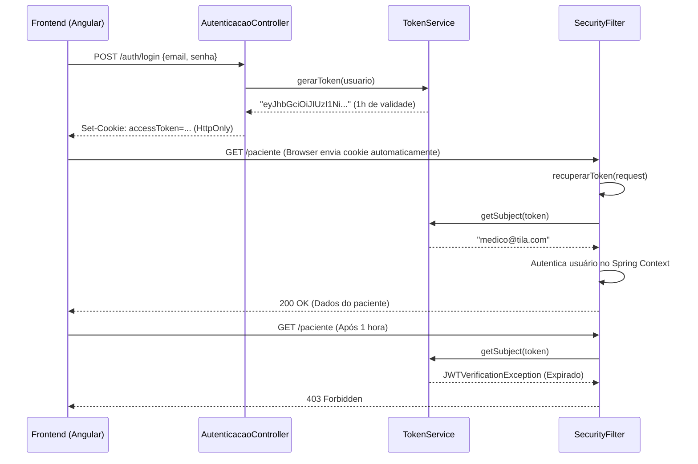

# JWT Authentication — TILA

> Auditoria técnica do mecanismo de autenticação baseado em JSON Web Tokens (JWT) extraída em 2026-05-07.
> Esta página detalha como a criptografia, transporte e validação dos tokens funcionam na prática no projeto.

---

## O Ciclo de Vida do Token

A autenticação do TILA é **stateless** (sem estado). O servidor não guarda sessão na memória; toda a prova de identidade viaja junto com a requisição dentro do token.



---

## Engenharia do Token (TokenService)

O pacote usado é o `com.auth0:java-jwt:4.4.0`.

### 1. Assinatura (HMAC256)
O token é assinado usando HMAC com SHA-256 (Algoritmo Simétrico). Isso significa que a *mesma* chave (`secret`) usada para criar o token é usada para verificá-lo.

```java
// O SEGREDO ESTÁ EXPOSTO NO CÓDIGO (Vulnerabilidade Crítica OWASP)
@Value("${api.security.token.secret}")
private String secret; // "Cucamole@123"

Algorithm algoritimo = Algorithm.HMAC256(secret); // typo: "algoritimo"
```

### 2. Estrutura do Payload (Claims)
Quando decodificamos um JWT do TILA (usando jwt.io, por exemplo), o payload (corpo base64) revela os seguintes campos:

```json
{
  "iss": "TILA-APP",                     // Emissor do token
  "sub": "dr.joao@clinica.com",          // Assunto (Subject = Email)
  "role": "MEDICO",                      // Perfil (Claim customizada)
  "exp": 1715104800                      // Timestamp UNIX (Válido por 1 hora)
}
```
**Código gerador:**
```java
return JWT.create()
    .withIssuer("TILA-APP")
    .withSubject(usuario.getEmail())
    .withClaim("role", usuario.getPerfil().toString())
    .withExpiresAt(dataExpiracao()) // Instant + 1 hora
    .sign(algoritimo);
```

---

## Transporte: O Padrão HttpOnly Cookie

O TILA adota um padrão arquitetural robusto ao trafegar o JWT em um **HttpOnly Cookie**, e não armazená-lo em LocalStorage no frontend.

### O Controller Emitindo o Cookie:
```java
Cookie accessToken = new Cookie("accessToken", tokenJWT);
accessToken.setHttpOnly(true);  // Protege contra XSS (JavaScript não lê o cookie)
accessToken.setSecure(false);   // 🔴 Falha de Segurança: Deveria ser true para rodar só em HTTPS
accessToken.setPath("/");       // O cookie vale para todo o site
accessToken.setMaxAge(3600);    // Morre em 1 hora, junto com a expiração do JWT no Backend
httpServletResponse.addCookie(accessToken);
```

### Por que isso é bom?
Se um invasor injetar um script malicioso no frontend do TILA (XSS - Cross-Site Scripting), esse script tentará ler o `localStorage` para roubar tokens. Como o token está num cookie `HttpOnly`, o navegador proíbe o JavaScript de lê-lo.

---

## Extração: O SecurityFilter

Como o JWT viaja num Cookie, a API precisa saber procurá-lo lá (já que o padrão REST tradicional espera um header `Authorization: Bearer <token>`).

O desenvolvedor inteligentemente implementou um "fallback" duplo:

```java
private String recuperarToken(HttpServletRequest request){
    // 1. TENTA O COOKIE PRIMEIRO (Prioridade 1)
    if(request.getCookies() != null){
        for(Cookie cookie: request.getCookies()){
            if("accessToken".equals(cookie.getName())){
                return cookie.getValue(); // ✅ Achou!
            }
        }
    }
    // 2. FALLBACK PARA O HEADER (Prioridade 2)
    var authorizationHeader = request.getHeader("Authorization");
    if(authorizationHeader != null){
        return authorizationHeader.replace("Bearer ", "");
    }
    return null;
}
```
Isso permite que o Frontend Angular comunique-se via cookies, mas se precisarmos testar a API no Postman ou em aplicações Mobile, podemos enviar o header `Authorization` clássico.

---

## Deficiências e Falhas Críticas do Sistema Atual

Apesar da boa arquitetura conceitual, a implementação técnica possui três "furos" severos na blindagem.

### Falha 1: Secret Exposto (`Cucamole@123`)
Se o secret vaza (e ele vazou no github), qualquer um pode programar um script Python que gere um JWT válido:
```python
import jwt
# Ataque gerando um token de Admin eterno
token = jwt.encode(
    {"iss": "TILA-APP", "sub": "admin@banco.com", "role": "ADMIN", "exp": 9999999999}, 
    "Cucamole@123", algorithm="HS256"
)
```

### Falha 2: Invalidação Prematura do Usuário (NPE Crash)
Se o token dura 1 hora, mas o banco deleta o usuário no minuto 30, o filtro quebra ao tentar extrair a entidade e a API dá um Crash HTTP 500 para qualquer requisição que esse cliente faça nos próximos 30 minutos.
```java
// SecurityFilter.java
var usuario = usuarioRepository.findByEmail(subject).get(); // 🔴 Exception se usuário deletado!
```

### Falha 3: Ausência de Refresh Token
A aplicação concede 1 hora de vida. Após essa 1 hora, o Angular é bloqueado (403), mas não existe a rota `/auth/refresh`. O coitado do médico, no meio da digitação de um Laudo gigantesco, perderá todo o texto e será ejetado de volta para a tela de login.

## Backlinks
- [[context/security-lgpd]]
- [[wiki/decisions/ADR-001-jwt-cookie-transport]]
- [[wiki/decisions/ADR-003-security-architecture]]
