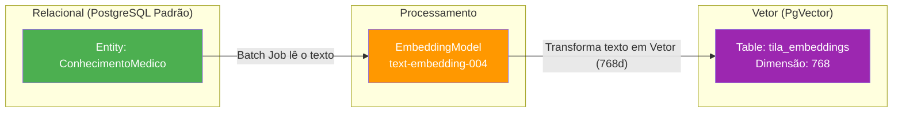

# Entity: ConhecimentoMedico (Base de Conhecimento RAG)

> Arquivo: `Tila_BackEnd/tila/src/main/java/tecnologi/tila/tila/entity/ConhecimentoMedico.java`
> Tabela: `conhecimento_medico`
> ID Type: `Long` (GenerationType.IDENTITY)
> Status no Sistema: ⚠️ **Implementação Pendente** (Entidade Existe, Repositório Existe, Pipeline RAG não consome a tabela).

---

## O Cérebro do TILA

A IA de base (Gemini 2.5) tem conhecimento genérico sobre o mundo. Para que ela consiga laudar exames com o nível de especialização que um Radiologista exige (usando vocabulário ACR BI-RADS, protocolos de metástase de Fleischner, etc.), ela precisa de **contexto**.
A entidade `ConhecimentoMedico` é a origem deste contexto. É a tabela relacional onde os administradores do sistema vão cadastrar livros-texto, consensos médicos e templates de laudo. A partir daqui, um Job em Background pegará esses textos, converterá em vetores matemáticos (Embeddings) e jogará para a extensão `pgvector`.



---

## Código Real Completo

```java
@Entity
@Table(name = "conhecimento_medico")
@Getter
@Setter
@NoArgsConstructor
@AllArgsConstructor
public class ConhecimentoMedico {

    @Id
    @GeneratedValue(strategy = GenerationType.IDENTITY)
    private Long id;

    @Column(nullable = false)
    private String titulo;

    // Aqui fica o texto bruto do protocolo ou artigo
    @Column(columnDefinition = "TEXT", nullable = false)
    private String conteudo;

    // Filtro essencial para o ContentRetriever do RAG
    @Enumerated(EnumType.STRING)
    @Column(nullable = false)
    private CategoriaConhecimento categoriaConhecimento;

    private String tipoExameRelacionado; // Ex: "RX_TORAX"
    private String regiaoAnatomica;      // Ex: "TORAX"

    @Column(nullable = false, updatable = false)
    private LocalDateTime dataCriacao;

    private LocalDateTime dataAtualizacao;

    // --- Lifecycle JPA ---
    @PrePersist
    protected void onPrePersist(){
        this.dataCriacao = LocalDateTime.now();
    }

    @PreUpdate
    protected void onPreUpdate(){
        this.dataAtualizacao = LocalDateTime.now();
    }
}
```

---

## O Enum CategoriaConhecimento

O TILA não trata toda a literatura médica de forma igual. Ele categorizou inteligentemente o tipo de injeção que a IA precisa.

```java
public enum CategoriaConhecimento {
    PROTOCOLO,       // Regras de como medir algo (Ex: Fleischner para nódulos)
    ANATOMIA,        // Referências sobre a normalidade anatômica do paciente
    ACR_BIRADS,      // Foco forte em Mamografia/USG Mamária e padronização
    ATLAS,           // Atlas de referência
    LAUDO_EXEMPLO,   // Injeção de "Few-Shot Prompting" (Exemplos de como um médico bom escreve)
    TERMINOLOGIA,    // Dicionário de sinônimos radiológicos
    DIRETRIZ         // Diretrizes do Colégio Brasileiro de Radiologia (CBR)
}
```

## Como o LangChain4j deve consumir isso

Atualmente a entidade existe no mundo Relacional, e o Bean do `PgVectorEmbeddingStore` foi configurado na classe `TilaRagConfig.java`. **Falta a ponte.**

A arquitetura do TILA precisará implementar um *Data Ingestion Service* que realize os seguintes passos toda vez que o Administrador inserir ou editar um `ConhecimentoMedico`:

```java
// Exemplo de como a ponte deve ser arquitetada no futuro:
@Service
public class IngestaoBaseConhecimentoService {

    @Autowired private EmbeddingModel embeddingModel;
    @Autowired private EmbeddingStore<TextSegment> embeddingStore;

    @Async
    public void indexarConhecimentoParaIA(ConhecimentoMedico cm) {
        // 1. Opcional: Splitter (Quebrar texto longo em parágrafos para o LLM não se perder)
        DocumentSplitter splitter = DocumentSplitters.recursive(500, 50);
        Document document = Document.from(cm.getConteudo());
        
        // 2. Montar Metadados (Fundamental para o RAG não buscar coisa de Joelho num RX de Pulmão)
        Metadata metadata = new Metadata()
            .put("id_original", cm.getId().toString())
            .put("categoria", cm.getCategoriaConhecimento().name())
            .put("regiao", cm.getRegiaoAnatomica());
            
        document.metadata().mergeFrom(metadata);

        // 3. Vetorizar e Salvar no PgVector
        List<TextSegment> segments = splitter.split(document);
        List<Embedding> embeddings = embeddingModel.embedAll(segments).content();
        embeddingStore.addAll(embeddings, segments);
    }
}
```

## Backlinks
- [[context/ai-pipeline]]
- [[wiki/concepts/rag-vs-llm-wiki]]
- [[wiki/entities/entity-laudo]]
