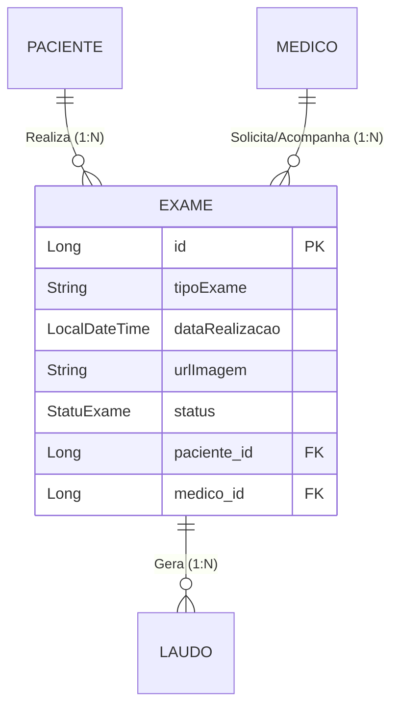
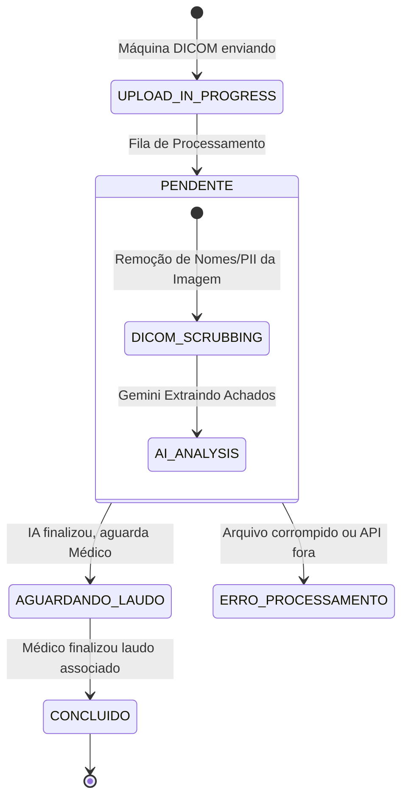

# Entity: Exame

> Arquivo: `Tila_BackEnd/tila/src/main/java/tecnologi/tila/tila/entity/Exame.java`
> Tabela: `exames`
> ID Type: `Long` (GenerationType.IDENTITY)
> Status no Sistema: ⚠️ **Implementação Pendente** (Entidade Existe, Repositório Existe, Falta Service/Controller).

---

## O Elemento de Origem

Se o `Laudo` é o cérebro da plataforma TILA (onde a IA raciocina) e o `Paciente` é o sujeito dos direitos LGPD, a entidade `Exame` é o **Insumo Primário**. Ela representa o evento médico e o repositório de imagens (Radiografias, Tomografias, Ressonâncias) que disparam toda a engine de processamento do LLM e de Visão Computacional.



---

## Código Real Completo

```java
@Table(name = "exames")
@Entity(name = "Exame")
@Getter
@Setter
@NoArgsConstructor
@AllArgsConstructor
@EqualsAndHashCode(of = "id")
public class Exame {

    @Id
    @GeneratedValue(strategy = GenerationType.IDENTITY)
    private Long id;

    @Column(nullable = false)
    private String tipoExame; // Ex: "RAIO-X TORAX", "TOMOGRAFIA ABDOMEN"

    @Column(nullable = false)
    private LocalDateTime dataRealizacao;

    private String urlImagem; // Path para a imagem no servidor ou Cloud Bucket

    @Enumerated(EnumType.STRING)
    @Column(nullable = false)
    private StatuExame status = StatuExame.PENDENTE; // ⚠️ Typo no nome do Enum

    // Relações Obrigatórias
    @ManyToOne(fetch = FetchType.LAZY)
    @JoinColumn(name = "paciente_id", nullable = false)
    private Paciente paciente;

    @ManyToOne(fetch = FetchType.LAZY)
    @JoinColumn(name = "medico_id", nullable = false)
    private Medico medico;
    
    // Relação 1:N com Laudos (histórico de tentativas de geração de IA)
    @OneToMany(mappedBy = "exame", cascade = CascadeType.ALL)
    private List<Laudo> laudos;
}
```

---

## Campo a Campo — Análise e Gaps Arquiteturais

| Campo | Tipo Java | Objetivo | Análise e Gaps |
|---|---|---|---|
| `tipoExame` | `String` | Define a modalidade radiológica. | 🟡 Atualmente uma string solta. Deveria ser um Enum (Ex: `ModalidadeDICOM.CR`, `CT`, `MR`) para guiar a IA na formatação do prompt correto (ex: Prompt de Tomografia é diferente do Prompt de Raio-X). |
| `urlImagem` | `String` | Aponta para onde o arquivo DICOM real repousa. | 🟡 O `application.properties` tem a chave `tila.upload.path=./uploads/exames`. Imagens médicas guardadas direto no FileSystem local sem proxy assinado (Signed URLs) ou ACL abrem brecha de acesso não autorizado e limitam o Deploy em containers efêmeros como Docker. |
| `status` | `StatuExame` | Gerencia o pipeline de análise. | 🔴 1. Erro de sintaxe (Statu vs Status). 2. A máquina de estados (`PENDENTE` -> `CONCLUIDO`) é muito pobre para um processo de IA. |

---

## A Máquina de Estados Ideal (Para Implementação Futura)

Se o TILA visa ser uma pipeline robusta de IA, o Enum de status do exame precisa refletir os estágios de ingestão e inferência. O enum atual de apenas "PENDENTE" e "CONCLUIDO" é insuficiente.



## A Armadilha de Upload e DICOM

Atualmente a entidade presume um único campo `urlImagem`.
Em arquiteturas radiológicas reais (PACS/DICOM), um único exame de Tomografia produz facilmente **300 a 1000 imagens/fatias** (slices).

**Recomendação de Arquitetura Futura:**
Se o projeto acadêmico focar apenas em Raio-X simples (1 imagem), o campo `urlImagem` é suficiente.
Se tentar abranger Tomografias, a entidade precisará mudar o `urlImagem` para `folderPath` ou referenciar uma entidade-filha `SerieExame`.

## Backlinks
- [[wiki/concepts/dicom]]
- [[wiki/entities/entity-laudo]]
- [[wiki/concepts/data-model]]
