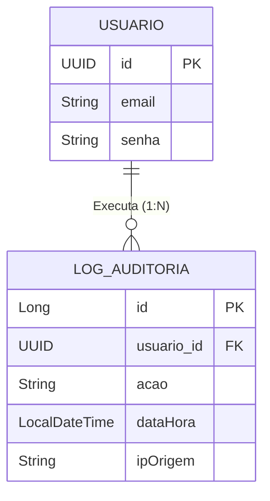

# Entity: LogAuditoria

> Arquivo: `Tila_BackEnd/tila/src/main/java/tecnologi/tila/tila/entity/LogAuditoria.java`
> Tabela: `logs_auditoria`
> ID Type: `Long` (GenerationType.IDENTITY)
> Status no Sistema: ✅ **Implementado Parcialmente** (Falta gravação do IP).

---

## O Guardião da Conformidade

A entidade `LogAuditoria` é a espinha dorsal de conformidade regulatória do TILA. Em ambientes de saúde digital, o Rastreamento de Ações (Audit Trail) é uma exigência inegociável da LGPD e do Conselho Federal de Medicina (CFM). Esta entidade tem como objetivo garantir que seja impossível um paciente ou médico ter dados acessados/adulterados sem que o autor seja matematicamente rastreado.

---

## Código Real Completo

```java
@Table(name = "logs_auditoria")
@Entity
@Getter
@Setter
@NoArgsConstructor
@AllArgsConstructor
public class LogAuditoria {

    @Id
    @GeneratedValue(strategy = GenerationType.IDENTITY)
    private Long id;

    // Relação Fortemente Tipada com o Autor da Ação
    @ManyToOne(fetch = FetchType.EAGER)
    @JoinColumn(name = "usuario_id", nullable = false)
    private Usuario usuario;

    @Column(nullable = false)
    private String acao; // Ex: "LOGIN_SUCESSO", "CADASTRO_PACIENTE"

    @Column(nullable = false)
    private LocalDateTime dataHora;

    private String ipOrigem;

    // Constructor Auxiliar
    public LogAuditoria(Usuario usuario, String acao, LocalDateTime dataHora) {
        this.usuario = usuario;
        this.acao = acao;
        this.dataHora = dataHora;
    }
}
```

---

## Diagrama de Relacionamentos e Fluxo de Auditoria



---

## Campo a Campo — Análise e Gaps Mapeados

| Campo | Tipo Java | Objetivo | Status Prático da Implementação |
|---|---|---|---|
| `usuario` | `Usuario` | Identifica univocamente quem executou a ação. | ✅ Excelente. Usa chave estrangeira forte. Porém o `@ManyToOne` usa `FetchType.EAGER` (default), o que gera N+1 nas listagens de logs. |
| `acao` | `String` | Texto curto categorizando o evento. | 🟡 Funcional, mas são `Strings` livres espalhadas no código. Deveria ser um Enum (`TipoAcaoAudit`). |
| `dataHora` | `LocalDateTime` | Carimbo de tempo do servidor. | ✅ Funciona, mas não captura Fuso Horário de forma explícita (ZonedDateTime). |
| `ipOrigem` | `String` | Prova jurídica forense de onde o request partiu. | 🔴 **CRÍTICO**. O campo existe na tabela, mas o Backend sempre grava `null`. A aplicação não sabe de onde vêm os ataques. |

---

## Inventário de Ações Logadas Atualmente no Sistema

Vasculhando os Controllers e Services, encontrei exatamente estas **5 Ações** hardcoded que populam a tabela hoje:

1. `CADASTRO_NOVO_MEDICO` (Em *AutenticacaoController.registrar()*)
2. `LOGIN_SUCESSO` (Em *AutenticacaoController.login()*)
3. `CADASTRO_PACIENTE` (Em *PacienteService.cadastrar()*)
4. `CONSULTA_TODOS_PACIENTES` (Em *PacienteService.buscarTodosPacientes()*)
5. `CONSULTA_PACIENTE_CPF` e `CONSULTA_PACIENTE_ID` (Em *PacienteService.buscarPorCpf() e bucasPorId()*)

⚠️ **Furos Gigantes na Auditoria**:
* Não há log para tentativas de `LOGIN_FALHO` (Blindspot para ataques de Força Bruta).
* Não há log de quem tentou acessar uma rota e foi bloqueado por ter Role insuficiente (`FORBIDDEN`).

---

## Vulnerabilidade na Serialização JSON (Data Exposure)

Quando o Frontend chama a rota `GET /logs`, o Spring/Jackson serializa a entidade `LogAuditoria` em JSON. Devido à ausência de um DTO e à relação `EAGER`, o backend joga a entidade inteira do `Usuario` junto na resposta da API.

```json
{
  "id": 1,
  "acao": "LOGIN_SUCESSO",
  "dataHora": "2026-05-07T10:00:00",
  "usuario": {
    "id": "e43b-...",
    "email": "dr.joao@banco.com",
    "senha": "$2a$10$wK8fD...",  // 🔴 O HASH BCRYPT É EXPOSTO!
    "perfil": "MEDICO"
  }
}
```
**O Problema**: A rota `/logs` deveria ser exclusiva para `ADMINS`, mas no SecurityFilterChain foi configurada como `anyRequest().authenticated()`.
**O Resultado Prático**: Qualquer Paciente ou Médico logado pode puxar a base inteira de Senhas Hashadas de todos os usuários do sistema.

## Refatorações Mandatórias

1. **Blindar a Rota**: `req.requestMatchers("/logs/**").hasRole("ADMIN");`
2. **Criar o DTO**: Nunca retornar o objeto LogAuditoria cru na controller.
   ```java
   public record LogAuditoriaResponseDTO(
       Long id,
       String acao,
       LocalDateTime dataHora,
       String emailUsuario // Apenas o email, jamais a entidade.
   ) {}
   ```
3. **Injetar o IP no Helper Method do Service**:
   ```java
   // Modificar de:
   public void registrarLog(Usuario usuario, String acao, LocalDateTime dataHora)
   // Para:
   public void registrarLog(Usuario usuario, String acao, HttpServletRequest request) {
       LogAuditoria log = new LogAuditoria(usuario, acao, LocalDateTime.now());
       log.setIpOrigem(request.getRemoteAddr());
       logAuditoriaRepository.save(log);
   }
   ```

## Backlinks
- [[wiki/decisions/ADR-003-security-architecture]]
- [[context/security-lgpd]]
- [[wiki/concepts/api-endpoints]]
