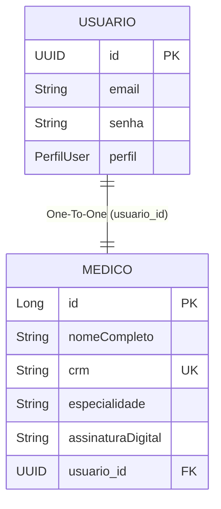

# Entity: Medico

> Arquivo: `Tila_BackEnd/tila/src/main/java/tecnologi/tila/tila/entity/Medico.java`
> Tabela: `medicos`
> ID Type: `Long` (GenerationType.IDENTITY)
> Status no Sistema: ✅ **Implementado e Funcional**

---

## O Vínculo de Identidade

No TILA, a identidade de um profissional é dividida em duas tabelas para separar as responsabilidades arquiteturais:
1. `Usuario` cuida puramente do Login, Senha, Token e bloqueios de acesso.
2. `Medico` cuida da existência física da pessoa como profissional do conselho médico (CRM, Nome, Assinatura legal).



---

## Código Real Completo

```java
@Table(name = "medicos")
@Entity(name = "Medico")
@Getter
@Setter
@NoArgsConstructor
@AllArgsConstructor
@EqualsAndHashCode(of = "id")
public class Medico {

    @Id
    @GeneratedValue(strategy = GenerationType.IDENTITY)
    private Long id;

    @Column(nullable = false)
    private String nomeCompleto;

    @Column(nullable = false, unique = true)
    private String crm;

    @Column(nullable = false)
    private String especialidade;

    @Column(columnDefinition = "TEXT")
    private String assinaturaDigital;

    // Relação 1:1 Direta com a Identidade de Login
    @OneToOne
    @JoinColumn(name = "usuario_id", nullable = false)
    private Usuario usuario;

    // Construtor auxiliar usado no fluxo de registro
    public Medico(String nomeCompleto, String crm, String especialidade, Usuario usuario){
        this.nomeCompleto = nomeCompleto;
        this.crm = crm;
        this.especialidade = especialidade;
        this.usuario = usuario;
    }
}
```

---

## Campo a Campo — Análise

| Campo | Tipo Java | Restrições | Análise / Gaps |
|---|---|---|---|
| `id` | `Long` | PK, Auto-increment | Padrão convencional do Hibernate. |
| `nomeCompleto` | `String` | `nullable = false` | Dado pessoal. Guardado em texto-plano, passível de criptografia para compliance rigoroso LGPD. |
| `crm` | `String` | `unique = true`, `nullable = false` | Chave de negócio forte. Faltou anotação de Bean Validation Customizada (ex: `@Pattern(regexp = "^\\d{4,6}-[A-Z]{2}$")`) para garantir que ninguém registre "CRM-FALSO". |
| `especialidade` | `String` | `nullable = false` | Atualmente uma `String` livre. Um médico pode se registrar como "Cardiologista" ou "Cardiologia". Deveria ser um Enum ou Entidade Domínio para relatórios consistentes. |
| `assinaturaDigital` | `String` | `TEXT` | Preparado para guardar uma imagem em Base64 (carimbo/assinatura). 🔴 **Risco**: Se Base64 não for sanitizado, pode ser vetor de Stored XSS caso o Frontend renderize a imagem em tags `` mal formadas. |
| `usuario` | `Usuario` | FK obrigatória | Correto. O `cascade` não foi definido, o que significa que deletar um Médico não deleta o Usuário (e vice-versa), exigindo exclusão manual em duas etapas na base. |

---

## Geração Simultânea (Transaction Risk)

A criação do Médico ocorre junto com o Usuário na rota pública `POST /auth/registrar`.

**Trecho real em AutenticacaoController.java**:
```java
// Passo 1: Salva o Usuário Base
var novoUsuario = new Usuario(dados.email(), senhaCriptografada, PerfilUser.MEDICO);
usuarioRepository.save(novoUsuario);

// Passo 2: Salva os Dados do Médico com o Usuário atrelado
var novoMedico = new Medico(dados.nome(), dados.crm(), dados.especialidade(), novoUsuario);
medicoRepository.save(novoMedico);
```

🔴 **Vulnerabilidade de Transação (Transaction Leak)**:
O método do Controller não possui a anotação `@Transactional` (e mesmo se tivesse, Controllers não devem gerenciar transações no Spring proxy-based).
**O que acontece se der erro?**
Se o email inserido for único (Passo 1 passa), mas o CRM fornecido já existir no banco (Passo 2 quebra com `DataIntegrityViolationException`), a aplicação capota, mas o registro do Usuário **não sofre Rollback**.
A partir daquele momento, existirá um "Usuário Médico" no banco que consegue fazer Login (pois a senha está salva), mas que não tem Entidade Médico correspondente. E na hora do Login, o código fará `.get()` no Médico, derrubando a API (NPE).

**Como deveria ser:**
A lógica de criação deve migrar inteiramente para o `AutenticacaoService` e ser envelopada numa única transação atômica.

```java
@Service
public class AutenticacaoService {
    
    @Transactional
    public void registrarMedicoCompleto(DadosCadastroMedico dados) {
        // Agora, se o passo 2 falhar, o Hibernate apaga magicamente o passo 1.
        Usuario u = usuarioRepository.save(new Usuario(...));
        medicoRepository.save(new Medico(..., u));
    }
}
```

## Backlinks
- [[wiki/entities/entity-usuario]]
- [[context/coding-conventions]]
- [[wiki/concepts/api-endpoints]]
