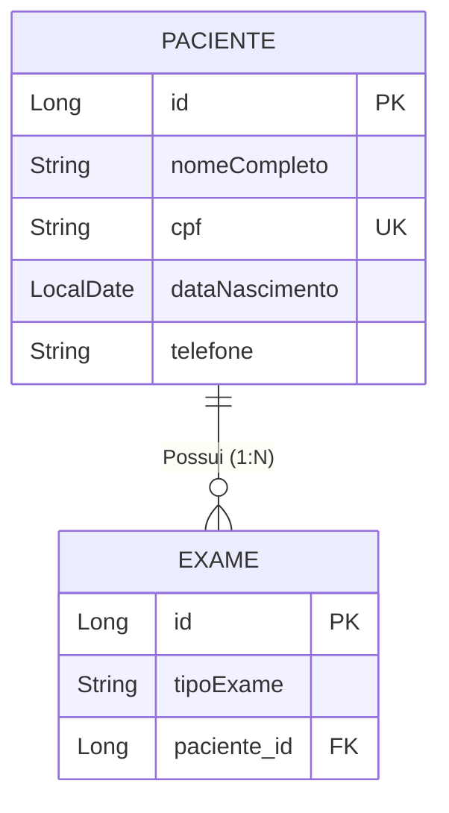

# Entity: Paciente

> Arquivo: `Tila_BackEnd/tila/src/main/java/tecnologi/tila/tila/entity/Paciente.java`
> Tabela: `pacientes`
> ID Type: `Long` (GenerationType.IDENTITY)
> Status no Sistema: ✅ **Implementado** (Apenas CREATE e READ).

---

## O Epicentro dos Dados Sensíveis

No TILA, a entidade `Paciente` carrega o maior peso regulatório sob a lente da LGPD (Lei Geral de Proteção de Dados). É esta entidade que ancora as informações civilmente identificáveis dos indivíduos cujos exames e imagens médicas serão processados pela inteligência artificial.



---

## Código Real Completo

```java
@Table(name = "pacientes")
@Entity(name = "Paciente")
@Getter
@Setter
@NoArgsConstructor
@AllArgsConstructor
@EqualsAndHashCode(of = "id")
public class Paciente {

    @Id
    @GeneratedValue(strategy = GenerationType.IDENTITY)
    private Long id;

    @Column(nullable = false)
    private String nomeCompleto;

    @Column(nullable = false, unique = true)
    private String cpf;

    @Column(nullable = false)
    private LocalDate dataNascimento;

    private String telefone;

    @OneToMany(mappedBy = "paciente", cascade = CascadeType.ALL)
    private List<Exame> exames;

    // Construtor utilitário usando DTO Record
    public Paciente(PacienteRequestDTO dados) {
        this.nomeCompleto = dados.nomeCompleto();
        this.cpf = dados.cpf();
        this.dataNascimento = dados.dataNascimento();
        this.telefone = dados.telefone();
    }
}
```

---

## Campo a Campo — Análise de Risco LGPD

| Campo | Tipo Java | Status de Proteção (LGPD) | Análise Técnica |
|---|---|---|---|
| `nomeCompleto` | `String` | 🔴 **Texto Plano** | PII Clássica. Se a base vazar, o nome vaza legível. |
| `cpf` | `String` | 🔴 **Texto Plano** | PII Crítica (Única). A controller valida o formato (`@CPF`), mas ele descansa cru no banco. Criptografia transparente (`@Convert`) é fortemente indicada. |
| `dataNascimento` | `LocalDate` | 🔴 **Texto Plano** | Quando combinada com Nome, serve para quebras de sigilo em sistemas federais de saúde. |
| `telefone` | `String` | 🔴 **Texto Plano** | Opcional no DTO, mas salvo cru no banco. Permite ataques de Engenharia Social. |

### Relação com Exames (`@OneToMany`)
```java
@OneToMany(mappedBy = "paciente", cascade = CascadeType.ALL)
private List<Exame> exames;
```
- ✅ **CascadeType.ALL**: Se deletarmos o Paciente, os Exames serão limpos automaticamente. Isto está aderente ao "Direito de Esquecimento" da LGPD.
- 🔴 **Vazamento via DTO**: No `PacienteResponseDTO.java`, a lista crua de exames é exportada diretamente. Quando o frontend pedir a lista de Pacientes, o Jackson serializará a árvore gigante de `Paciente -> N Exames -> N Laudos`. É mandatório trocar a tipagem para `List<ExameResponseDTO>`.

---

## Gaps de Arquitetura no Domínio de Pacientes

1. **Retificação de Dados (Falta do PUT)**:
   A LGPD Art. 18, inciso III exige a "Correção de dados incompletos, inexatos ou desatualizados". O TILA hoje não possui a rota `PUT /paciente/{id}` nem no backend nem no frontend.

2. **Exclusão de Dados (Falta do DELETE)**:
   Não há endpoint `DELETE /paciente/{id}`. Como não há *Soft Delete* configurado (`@Where("deleted = false")`), se fosse implementado agora, seria uma deleção destrutiva.

3. **Carga Massiva O(1) (O *findAll* Inseguro)**:
   Na rota de listagem (`GET /paciente`), o service executa um simples `pacienteRepository.findAll()`. Sem paginação (`Pageable`), se o hospital tiver 50.000 pacientes, a aplicação retornará 50 mil JSONs na mesma requisição, causando um *Out Of Memory* no Java e congelando a aba do navegador Angular.

## Backlinks
- [[wiki/concepts/data-model]]
- [[context/security-lgpd]]
- [[wiki/concepts/backend-services]]
