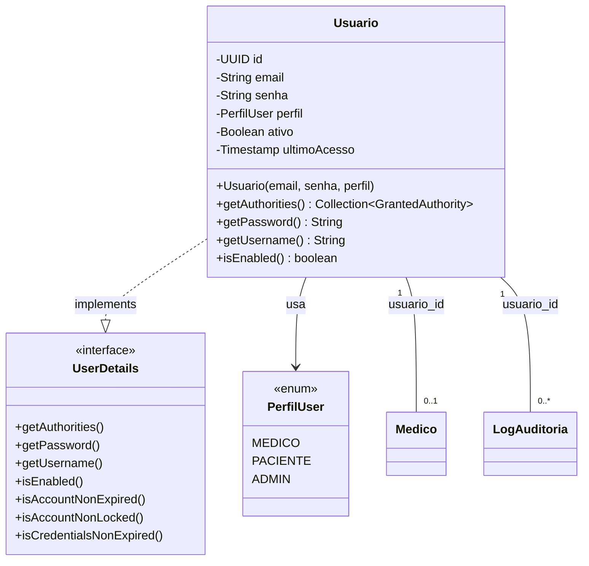

# Entity: Usuario

> Arquivo: `Tila_BackEnd/tila/src/main/java/tecnologi/tila/tila/entity/Usuario.java`
> Tabela: `usuarios`
> ID Type: UUID (não sequencial, seguro contra enumeração)
> Implementa: `UserDetails` (Spring Security)

---

## Código Real Completo

```java
@Table(name = "usuarios")
@Entity(name = "Usuario")
@Getter
@Setter
@NoArgsConstructor
@AllArgsConstructor
@EqualsAndHashCode(of = "id")
public class Usuario implements UserDetails {

    @Id
    @GeneratedValue(strategy = GenerationType.UUID)
    private UUID id;

    @Email
    @Column(unique = true, nullable = false)
    private String email;

    @Column(nullable = false)
    private String senha;

    @Enumerated(EnumType.STRING)
    private PerfilUser perfil;

    private Boolean ativo = true;

    private Timestamp ultimoAcesso;

    // Constructor usado pelo AutenticacaoController.registrar()
    public Usuario(String email, String senha, PerfilUser perfil){
        this.email = email;
        this.senha = senha;
        this.perfil = perfil;
    }

    @Override
    public Collection<? extends GrantedAuthority> getAuthorities() {
        if (this.perfil == PerfilUser.ADMIN) {
            return List.of(
                new SimpleGrantedAuthority("ROLE_ADMIN"),
                new SimpleGrantedAuthority("ROLE_MEDICO")
            );
        } else {
            return List.of(new SimpleGrantedAuthority("ROLE_" + this.perfil.name()));
        }
    }

    @Override
    public String getPassword() { return this.senha; }

    @Override
    public String getUsername() { return this.email; }

    @Override
    public boolean isEnabled() { return this.ativo; }
}
```

---

## Diagrama de Classe UML



---

## Campo a Campo — Análise Detalhada

| Campo | Tipo Java | Tipo SQL (inferido) | Annotations | Nullable | Unique | Default | LGPD |
|---|---|---|---|---|---|---|---|
| `id` | `UUID` | `uuid` | `@Id @GeneratedValue(UUID)` | ❌ (PK) | ✅ (PK) | Auto-gerado | — |
| `email` | `String` | `varchar(255)` | `@Email @Column(unique=true, nullable=false)` | ❌ | ✅ | — | ✅ Dado pessoal |
| `senha` | `String` | `varchar(255)` | `@Column(nullable=false)` | ❌ | ❌ | — | ✅ Dado sensível (BCrypt) |
| `perfil` | `PerfilUser` | `varchar(255)` | `@Enumerated(STRING)` | ✅ (sem nullable=false) | ❌ | — | — |
| `ativo` | `Boolean` | `boolean` | — | ✅ | ❌ | `true` (Java default) | — |
| `ultimoAcesso` | `Timestamp` | `timestamp` | — | ✅ | ❌ | `null` | — |

---

## Análise de Segurança

### Geração de ID — UUID
```java
@GeneratedValue(strategy = GenerationType.UUID)
```
- ✅ UUIDs são **não sequenciais** — impossível enumerar IDs
- ✅ Mais seguro que `IDENTITY` (Long auto-increment)
- ⚠️ UUID v4 (random) padrão — UUID v7 (time-ordered) seria melhor para performance de índice B-tree

### Hierarquia de Roles
```java
if (this.perfil == PerfilUser.ADMIN) {
    return List.of(
        new SimpleGrantedAuthority("ROLE_ADMIN"),
        new SimpleGrantedAuthority("ROLE_MEDICO")
    );
} else {
    return List.of(new SimpleGrantedAuthority("ROLE_" + this.perfil.name()));
}
```

**Resultado por perfil**:
| PerfilUser | Authorities Geradas | Pode acessar /medicos/** | Pode acessar /paciente/** |
|---|---|---|---|
| ADMIN | `ROLE_ADMIN`, `ROLE_MEDICO` | ✅ (MEDICO herdado) | ✅ (MEDICO herdado) |
| MEDICO | `ROLE_MEDICO` | ✅ | ✅ |
| PACIENTE | `ROLE_PACIENTE` | ❌ | ✅ |

⚠️ **Problema**: A hierarquia está implementada inline em `getAuthorities()`. O Spring Security oferece `RoleHierarchy` como alternativa mais configurável:
```java
// Alternativa recomendada — Bean em SecurityConfigurations
@Bean
public RoleHierarchy roleHierarchy() {
    return RoleHierarchyImpl.withDefaultRolePrefix()
        .role("ADMIN").implies("MEDICO")
        .role("MEDICO").implies("PACIENTE")
        .build();
}
```

### Campo `ativo`
- Existe com default `true`, mas **nenhum endpoint** permite desativar um usuário
- `isEnabled()` retorna `ativo` — se `false`, o Spring Security bloqueia login automaticamente
- ⚠️ Sem soft delete — `ativo = false` deveria ser usado para "deletar" sem perder dados (LGPD)

### Campo `ultimoAcesso`
- Existe como `Timestamp`, mas **nunca é atualizado** em nenhum lugar do código
- Deveria ser atualizado no `AutenticacaoController.login()` a cada login bem-sucedido:
```java
// Correção recomendada — no login
usuario.setUltimoAcesso(Timestamp.from(Instant.now()));
usuarioRepository.save(usuario);
```

---

## Repository

```java
public interface UsuarioRepository extends JpaRepository<Usuario, UUID> {
    Optional<Usuario> findByEmail(String email);
}
```

**Análise**:
- ✅ Retorna `Optional<Usuario>` — tipo seguro
- ✅ Derived query simples e eficiente (Spring Data gera `SELECT * FROM usuarios WHERE email = ?`)
- ⚠️ O `AutenticacaoService.loadUserByUsername()` usa `orElseThrow()` corretamente
- 🔴 O `SecurityFilter` usa `.get()` sem verificação — NPE risk

---

## Onde é Usado

| Classe | Como | Método |
|---|---|---|
| `AutenticacaoService` | `loadUserByUsername(email)` → `findByEmail(email).orElseThrow()` | ✅ Seguro |
| `SecurityFilter` | `findByEmail(subject).get()` | 🔴 NPE risk |
| `AutenticacaoController` | `new Usuario(email, senha, perfil)` → `save()` | Criação |
| `PacienteController` | `@AuthenticationPrincipal Usuario usuario` | Injection via Security |
| `PacienteService` | Recebe como parâmetro para audit log | Auditoria |

## Backlinks
- [[wiki/entities/entity-medico]] — Relação 1:1
- [[wiki/entities/entity-log-auditoria]] — Relação 1:N
- [[wiki/concepts/data-model]] — ER completo
- [[context/security-lgpd]] — Análise de segurança
