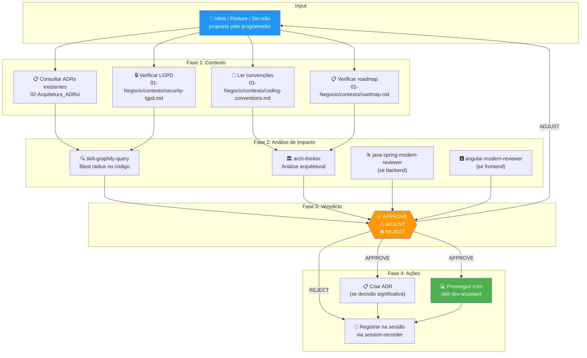

<!--
Esta modificação na skill `skill-arch-review` foi feita **apenas para o agente Hermes**.
Ela remove a verificação de cobertura de testes durante a revisão arquitetural, mantendo todas as demais checagens (ADRs, LGPD, blast radius, etc.).
A política de revisão da equipe permanece inalterada.
-->
# Skill: Arch Review

## Context

Esta skill é a **guardiã do antes**. Nenhuma ideia, feature, refatoração ou decisão de implementação deve ser codificada sem antes passar por esta análise. Ela combina múltiplas perspectivas — arquitetura de sistema, blast radius no código, conformidade com ADRs, e boas práticas modernas — para produzir um veredicto fundamentado.

O Arch Review não é um bloqueador burocrático. É um **filtro inteligente** que previne horas de retrabalho ao identificar problemas ANTES de escrever código. Em um sistema médico como o TILA, uma decisão arquitetural ruim pode ter consequências sérias (dados de paciente expostos, laudos incorretos, violação de LGPD).

> 🎯 **Princípio**: Melhor 15 minutos pensando do que 3 horas refatorando.

> ⚠️ **Regra**: Se o programador ou agente quer pular a análise e codificar direto, o agente DEVE alertar: "Esta mudança afeta [N] dependentes. Recomendo análise antes de prosseguir." Se o programador insistir, registrar a exceção no arquivo de sessão.

---

## Arquitetura do Review



---

## Steps

### Fase 1: Receber e Entender a Proposta

1. **Capturar a proposta** — O que o programador quer fazer? Identificar:
   - **Tipo**: Feature nova | Refatoração | Bug fix | Mudança de infra | Mudança de UI
   - **Escopo**: Qual camada do sistema (backend, frontend, ambos, infra)
   - **Motivação**: Por que isso está sendo feito (resolver bug, nova funcionalidade, melhoria de performance, etc.)

2. **Formular a pergunta central**: "Qual é a mudança específica que vamos fazer no código?"

### Fase 2: Consultar o Estado Atual

3. **Verificar ADRs existentes** — Ler TODOS os ADRs em `02-Arquitetura_ADRs/` e verificar:
   - A proposta **contradiz** algum ADR existente?
   - A proposta é **complementar** a algum ADR existente?
   - A proposta requer um **novo ADR**?
   
   Se contradiz ADR:
   ```
   ⚠️ CONFLITO COM ADR EXISTENTE
   A proposta "[descrição]" contradiz o ADR-[NNN]: "[título]".
   O ADR atual diz: "[trecho relevante]".
   
   Opções:
   1. Ajustar a proposta para se alinhar com o ADR
   2. Revisar o ADR (criar ADR substituto com justificativa)
   3. Registrar exceção explícita
   ```

4. **Ler convenções de código** — `01-Negocio/contexto/coding-conventions.md`:
   - A proposta segue as convenções atuais?
   - Se não, qual convenção seria violada?

5. **Verificar segurança e LGPD** — `01-Negocio/contexto/security-lgpd.md`:
   - A proposta introduz algum risco de segurança?
   - A proposta toca em dados sensíveis (CPF, laudos, dados de paciente)?
   - Se sim, qual o gap de segurança potencial?

6. **Verificar roadmap** — `01-Negocio/contexto/roadmap.md`:
   - A proposta está alinhada com as prioridades atuais?
   - A proposta desvia da rota planejada?
   - Se desvia, é justificável?

### Fase 3: Análise de Impacto no Código (Graphify Omnipresente)

7. **Executar `skill-graphify-query`** — Análise obrigatória via Graphify conforme o tipo de proposta:

   **A) Se é uma NOVA FEATURE:**
   - Consultar o grafo para identificar a comunidade com maior coesão para inserção
   - Verificar se existem DTOs, Repositories ou Services reutilizáveis
   - Estimar o novo acoplamento que será adicionado ao sistema
   ```
   🏗️ PONTO DE ACOPLAMENTO VIA GRAPHIFY
   - Feature: [descrição]
   - Comunidade ideal: Community [N] (coesão: [X])
   - Classes reutilizáveis: [lista]
   - Novo acoplamento estimado: [N] conexões
   ```

   **B) Se é uma ALTERAÇÃO ou REFATORAÇÃO:**
   - Calcular blast radius: quais classes dependem do alvo?
   - Identificar se o alvo é um God Node e sugerir desacoplamento se necessário
   ```
   🔍 BLAST RADIUS
   - Alvo: [classe/componente a ser alterado]
   - Dependentes diretos: [N] ([lista])
   - Dependentes indiretos: [N] ([lista])
   - Risco de regressão: [alto/médio/baixo]
   ```

   **C) Se é uma MIGRAÇÃO:**
   - Mapear todos os componentes no padrão legado vs. já migrados
   - Traçar ordem de migração por menor dependência
   ```
   🔄 MAPA DE MIGRAÇÃO VIA GRAPHIFY
   - Componentes legados: [N] — [lista]
   - Ordem sugerida: [lista ordenada por menor dependência]
   - Dependências circulares: [sim/não]
   ```

   **D) Se é um DIAGNÓSTICO de bug:**
   - Rastrear o fluxo de dados ponta a ponta
   - Identificar o ponto provável da falha
   ```
   🔍 DIAGNÓSTICO VIA GRAPHIFY
   - Fluxo rastreado: [Frontend → Controller → Service → Entity]
   - Ponto provável da falha: [arquivo:método]
   - Regras de negócio vigentes: [validações encontradas]
   ```

8. **Aplicar o framework do Arch-Thinker** (da skill externa `arch-thinker`):
   
   **UNDERSTAND**: A mudança resolve o problema correto?
   - Qual problema estamos resolvendo?
   - Existe uma solução mais simples?
   
   **DECOMPOSE**: Como a mudança se encaixa na arquitetura?
   - Em qual camada a mudança vive?
   - Quais fronteiras são cruzadas?
   - Há acoplamento desnecessário sendo introduzido?
   
   **CHALLENGE**: Esta é a melhor abordagem?
   - What-if test: E se o tráfego 10x? E se a DB cair? E se um novo dev olhar isso?
   - YAGNI check: Estamos over-engineering?
   - Simplicity test: Poderia ser mais simples?
   
   **DECIDE**: Qual é o veredicto?

9. **Se backend (Java/Spring)** — Aplicar `java-spring-modern-reviewer`:
   - A mudança segue os padrões Spring Boot 4 / Java 21?
   - Constructor injection? GenericResult? Records para DTOs?
   - Padrões de repository, service, controller corretos?
   - @Transactional correto?

10. **Se frontend (Angular)** — Aplicar `angular-modern-reviewer`:
    - A mudança segue os padrões Angular 19?
    - Standalone components? Signals? Modern control flow?
    - inject() ao invés de constructor injection?
    - CSS vanilla?

### Fase 4: Produzir Veredicto

11. **Compilar análise** e produzir um dos três veredictos:

#### ✅ APPROVE — Implementar como proposto

Significa que:
- Nenhum conflito com ADRs
- Blast radius aceitável
- Segurança e LGPD preservados
- Arquitetura sólida
- Padrões seguidos

#### ⚠️ ADJUST — Implementar com modificações

Significa que:
- A ideia é boa, MAS precisa de ajustes
- Listar as modificações necessárias com justificativa
- Pedir confirmação do programador antes de prosseguir

#### ❌ REJECT — Não implementar

Significa que:
- Viola ADR existente sem justificativa
- Introduz risco de segurança/LGPD
- Over-engineering para o estágio atual
- Blast radius perigoso sem cobertura de testes

12. **Registrar resultado** no arquivo de sessão via `skill-session-recorder`.

13. **Se APPROVE e decisão significativa** — Acionar `skill-adr` para criar ADR.

14. **Se APPROVE** — Prosseguir com `skill-dev-assistant` para implementação.

---

## Output Format

```markdown
## 🏗️ Arch Review — [Título da Proposta]

### Proposta
[Descrição em 2-3 linhas do que está sendo proposto]

### Análise de Contexto
| Verificação | Resultado |
|---|---|
| Conflito com ADRs | ✅ Nenhum / ⚠️ ADR-[N] — [detalhe] |
| Convenções de código | ✅ Seguidas / ⚠️ Desvio em [detalhe] |
| Segurança / LGPD | ✅ OK / ⚠️ Risco: [detalhe] / ❌ Violação: [detalhe] |
| Alinhamento com roadmap | ✅ Alinhado / 🔵 Desvio justificável / ⚠️ Desvio |

### Blast Radius
- **Alvo**: [classe/componente]
- **Dependentes diretos**: [N] — [lista]
- **Dependentes indiretos**: [N] — [lista]
- **Risco de regressão**: [alto/médio/baixo]

### Análise Arquitetural (Arch-Thinker)
- **Problema resolvido**: [sim/não — qual]
- **Simplicidade**: [score 1-5]
- **YAGNI**: [passa/não passa]
- **Escalabilidade**: [consideração]

### Veredicto: [✅ APPROVE / ⚠️ ADJUST / ❌ REJECT]

**Justificativa**: [2-3 linhas explicando o porquê]

**Ajustes necessários** (se ADJUST):
1. [Ajuste 1 — justificativa]
2. [Ajuste 2 — justificativa]

**Próximos passos**:
- [ ] [Passo 1]
- [ ] [Passo 2]
```

---

## Rules

### Obrigatoriedade
- Esta skill é **OBRIGATÓRIA** antes de qualquer implementação não-trivial.
- "Não-trivial" = qualquer coisa que cria, modifica ou deleta mais de 1 arquivo, ou que toca em segurança, LGPD, ou autenticação.
- Para mudanças triviais (fix typo, ajuste de cor, comentário), o review pode ser skippado com registro no log.

### Conflitos com ADRs
- Se a proposta contradiz um ADR, o agente DEVE alertar ANTES de qualquer código.
- O programador pode overrulear o ADR, mas isso DEVE ser registrado como exceção explícita no código e no cérebro.
- Se o ADR for overruleado 2+ vezes, sugerir criar um novo ADR que substitui o antigo.

### Segurança — Zero Tolerância
- Se a proposta viola LGPD ou expõe dados sensíveis → **REJECT automático**.
- Sem exceção. Sem overrule.
- Citar `01-Negocio/contexto/security-lgpd.md` como referência.

### Tempo
- O arch review não deve levar mais de 5 minutos para análises simples.
- Para análises complexas (nova feature, refatoração grande), pode levar até 15 minutos.
- Se a análise está demorando mais que isso, a proposta provavelmente é grande demais e deve ser dividida.

---

## Referências

### Skills Internas Integradas
- [[05-Skills_Agentes/skill-graphify-query]] — Blast radius obrigatório
- [[05-Skills_Agentes/skill-adr]] — Criar ADR se decisão significativa
- [[05-Skills_Agentes/skill-session-recorder]] — Registrar resultado
- [[05-Skills_Agentes/skill-dev-assistant]] — Implementar após aprovação

### Skills Externas
- `arch-thinker` — Framework de análise arquitetural (UNDERSTAND → DECOMPOSE → CHALLENGE → DECIDE → VALIDATE)
- `java-spring-modern-reviewer` — Review de código Java/Spring Boot
- `angular-modern-reviewer` — Review de código Angular

### Context Files
- [[02-Arquitetura_ADRs/]] — Decisões arquiteturais existentes
- [[01-Negocio/contexto/coding-conventions.md]] — Convenções de código
- [[01-Negocio/contexto/security-lgpd.md]] — Segurança e LGPD
- [[01-Negocio/contexto/roadmap.md]] — Prioridades do projeto

## Backlinks
- [[CLAUDE.md]] — Fluxo do programador (§4)
- [[05-Skills_Agentes/skill-session-recorder]] — Registra resultado
- [[05-Skills_Agentes/skill-dev-assistant]] — Pós-aprovação
