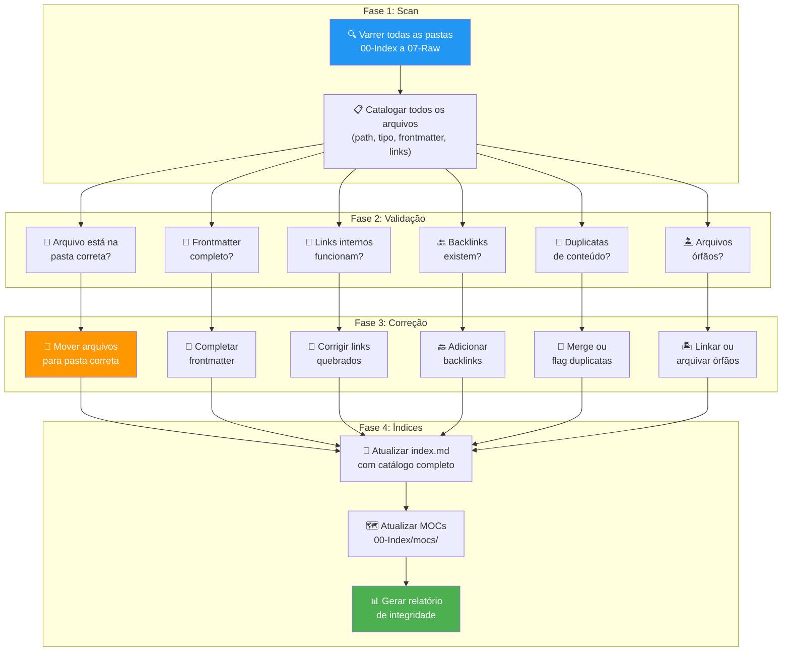

# Skill: Brain Organizer

## Context

O Brain Organizer é o **arquivista e faxineiro** do Tila_Brain. Durante uma sessão de programação, o `skill-session-recorder` cria e modifica muitos arquivos em tempo real — drafts, notas de conceitos, registros de bugs, changelogs. Nem sempre esses arquivos são criados na pasta perfeita ou com todos os metadados completos. O Organizer é quem garante que, antes de persistir (commit), TUDO está no lugar certo, com links funcionando e metadados completos.

Sem este skill, o cérebro acumula "dívida organizacional" — links quebrados, arquivos soltos, índices desatualizados. Com o tempo, isso degrada a confiabilidade do brain e a eficiência de todas as outras skills que dependem dele.

> 🎯 **Princípio**: O cérebro é tão bom quanto sua organização. Um arquivo sem link é um arquivo invisível. Um link quebrado é pior que nenhum link.

> ⚠️ **Regra**: O Brain Organizer NUNCA deleta conteúdo. Se um arquivo parece desnecessário, ele é movido para `07-Raw/archive/` — nunca apagado.

---

## Arquitetura do Organizer



---

## Mapeamento de Pastas — Onde Cada Tipo Pertence

O Organizer usa esta tabela como referência para determinar se um arquivo está na pasta correta:

| Tipo de Arquivo | Pasta Correta | Identificação |
|---|---|---|
| Identidade do agente (SOUL, CLAUDE) | Raiz ou `00-Index/` | type: soul, operacional |
| Index, log, manual | Raiz ou `00-Index/` | type: index, log, manual |
| MOCs (Maps of Content) | `00-Index/mocs/` | nome: `moc-*.md` |
| Notas permanentes de produto | `01-Negocio/produto/` | type: permanent, domain: produto |
| Notas permanentes médicas | `01-Negocio/medico/` | type: permanent, domain: medico |
| Contexto mutável (roadmap, pipeline, etc.) | `01-Negocio/contexto/` | type: context |
| Inbox / Drafts | `01-Negocio/inbox/` | nome: `*-DRAFT.md`, status: pending |
| ADRs (decisões arquiteturais) | `02-Arquitetura_ADRs/` | nome: `ADR-*.md`, type: decision |
| Patterns de código | `03-Codebase/patterns/` | nome: `padrão-*.md`, type: pattern |
| Snapshots de código | `03-Codebase/snapshots/` | type: snapshot |
| Changelogs | `03-Codebase/changelog/` | nome: `YYYY-MM-DD-*.md` em changelog |
| Conceitos técnicos | `04-Wiki_Conceitos/conceitos/` | type: concept |
| Entidades (classes, frameworks) | `04-Wiki_Conceitos/entidades/` | nome: `entity-*.md`, type: entity |
| Skills do agente | `05-Skills_Agentes/` | nome: `skill-*.md` |
| Scripts de automação | `06-Automacoes/scripts/` | extensão: `.ps1`, `.sh` |
| Crons e registros de cron | `06-Automacoes/crons/` | nome: `cron-*.md`, `_cron-*` |
| Artigos raw | `07-Raw/articles/` | type: source, subtipo: article |
| Vídeos raw | `07-Raw/videos/` | type: source, subtipo: video |
| Laudos raw | `07-Raw/laudos/` | type: source, subtipo: laudo |
| Snapshots de codebase raw | `07-Raw/codebase/` | raw codebase snapshots |
| Source records | `07-Raw/sources/` | type: source |
| Sessões de programação | `07-Raw/sessions/` | type: session |
| Clippings | `07-Raw/clippings/` | clips web |
| Outputs da wiki | `07-Raw/outputs/` | type: output |
| Arquivos arquivados | `07-Raw/archive/` | arquivos que não pertencem a nenhum lugar |

---

## Steps

### Fase 1: Scan — Varrer o Cérebro

1. **Listar TODOS os arquivos `.md`** em todas as pastas de `00-Index` a `07-Raw` (recursivamente).

2. **Para cada arquivo**, extrair:
   - Path completo
   - Frontmatter (se existe): title, type, tags, sources, last_updated
   - Links internos (`[[...]]` ou `[texto](file:///...)`)
   - Backlinks (quem aponta para este arquivo)
   - Tamanho em bytes
   - Data de última modificação

3. **Construir um mapa do cérebro**:
   ```
   Total de arquivos: [N]
   Por pasta:
     00-Index: [N]
     01-Negocio: [N]
     02-Arquitetura_ADRs: [N]
     03-Codebase: [N]
     04-Wiki_Conceitos: [N]
     05-Skills_Agentes: [N]
     06-Automacoes: [N]
     07-Raw: [N]
     Raiz: [N]
   ```

### Fase 2: Validação — Verificar Cada Arquivo

4. **Verificação de Pasta** — Para cada arquivo, verificar se está na pasta correta conforme a tabela de mapeamento:
   - Se arquivo está na pasta errada → Marcar para mover
   - Se arquivo não tem tipo identificável → Marcar para classificação manual

5. **Verificação de Frontmatter** — Para cada arquivo `.md`:
   - Tem `title`? Se não → Gerar a partir do nome do arquivo
   - Tem `type`? Se não → Inferir a partir da pasta
   - Tem `tags`? Se não → Sugerir tags baseadas no conteúdo
   - Tem `last_updated`? Se não → Usar a data de modificação do arquivo
   - Tem `sources`? Se aplicável → Verificar se aponta para raw/ existente

6. **Verificação de Links Internos** — Para cada `[[link]]` ou `[texto](path)`:
   - O arquivo de destino existe? Se não → Link quebrado
   - O path está correto (reflete a nova estrutura de pastas numeradas)? Se não → Link desatualizado
   - Há links usando paths antigos (ex: `wiki/concepts/` em vez de `04-Wiki_Conceitos/conceitos/`)? Se sim → Atualizar

7. **Verificação de Backlinks** — Para cada arquivo:
   - Pelo menos 1 outro arquivo aponta para ele? Se não → Arquivo órfão
   - O `index.md` o referencia (se é uma nota permanente, pattern, ADR, ou skill)? Se não → Adicionar ao index

8. **Verificação de Duplicatas** — Buscar:
   - Arquivos com mesmo título em pastas diferentes
   - Arquivos com conteúdo muito similar (>80% overlap)
   - ADRs sobre o mesmo tema (ex: ADR-001 em `02-Arquitetura_ADRs/` com duplicata)
   - Se duplicatas encontradas → Flaggar para merge manual

9. **Verificação de Órfãos** — Arquivos sem links de entrada NEM saída:
   - Se é um draft em inbox → OK, é esperado
   - Se é um source em raw → OK, é imutável
   - Se é qualquer outro → Marcar para linkar ou arquivar

### Fase 3: Correção — Aplicar Correções

10. **Mover arquivos** para pastas corretas:
    - ANTES de mover, verificar que não vai quebrar links existentes
    - APÓS mover, atualizar TODOS os links que apontavam para o path antigo

11. **Completar frontmatter** dos arquivos que precisam:
    ```yaml
    ---
    title: "[título inferido ou gerado]"
    type: [tipo inferido]
    tags: [tags sugeridas]
    last_updated: YYYY-MM-DD
    ---
    ```

12. **Corrigir links quebrados**:
    - Se o destino existe em outro path → Atualizar o link
    - Se o destino não existe em nenhum lugar → Marcar como `⚠️ link morto` e alertar
    - Se o link usa path antigo → Atualizar para o novo (ex: `wiki/concepts/` → `04-Wiki_Conceitos/conceitos/`)

13. **Adicionar backlinks** em arquivos que são referenciados mas não têm seção `## Backlinks`:
    - Criar a seção `## Backlinks` no final do arquivo
    - Listar todos os arquivos que apontam para ele

14. **Resolver duplicatas**:
    - Se duplicata é exata → Manter o mais recente, arquivar o antigo em `07-Raw/archive/`
    - Se duplicata é parcial → Flaggar para o programador decidir

15. **Resolver órfãos**:
    - Tentar linkar a uma nota existente que seja relevante
    - Se não for possível linkar → Mover para `07-Raw/archive/` com nota de motivo

### Fase 4: Índices — Atualizar Catálogos

16. **Atualizar `index.md`**:
    - Verificar que TODAS as permanent notes estão listadas
    - Verificar que TODOS os patterns estão listados
    - Verificar que TODOS os ADRs estão listados
    - Verificar que TODOS os snapshots estão listados
    - Verificar que TODAS as skills estão listadas
    - Atualizar contadores na seção Stats
    - Garantir que todos os links usam paths corretos

17. **Atualizar MOCs** em `00-Index/mocs/`:
    - Para cada MOC, verificar que todos os conceitos do cluster estão linkados
    - Adicionar novos conceitos que foram criados durante a sessão
    - Remover referências a conceitos que foram movidos ou arquivados

18. **Gerar Relatório de Integridade** (ver formato abaixo).

---

## Output Format — Relatório de Organização

```markdown
## 🧹 Relatório de Organização — YYYY-MM-DD

### Scan
- Total de arquivos verificados: [N]
- Distribuição por pasta:
  | Pasta | Arquivos | % |
  |---|---|---|
  | 00-Index | [N] | [N]% |
  | 01-Negocio | [N] | [N]% |
  | 02-Arquitetura_ADRs | [N] | [N]% |
  | 03-Codebase | [N] | [N]% |
  | 04-Wiki_Conceitos | [N] | [N]% |
  | 05-Skills_Agentes | [N] | [N]% |
  | 06-Automacoes | [N] | [N]% |
  | 07-Raw | [N] | [N]% |

### Correções Aplicadas
| Tipo | Quantidade | Detalhes |
|---|---|---|
| Arquivos movidos | [N] | [lista: de → para] |
| Frontmatter completado | [N] | [lista de arquivos] |
| Links corrigidos | [N] | [lista: link antigo → novo] |
| Backlinks adicionados | [N] | [lista de arquivos] |
| Duplicatas resolvidas | [N] | [ação tomada] |
| Órfãos resolvidos | [N] | [linkado ou arquivado] |

### Integridade Pós-Organização
| Check | Status |
|---|---|
| Todos os arquivos na pasta correta | ✅ / ⚠️ [N] pendentes |
| Todos os frontmatters completos | ✅ / ⚠️ [N] incompletos |
| Todos os links funcionando | ✅ / ⚠️ [N] quebrados |
| Todos os arquivos com backlinks | ✅ / ⚠️ [N] órfãos |
| Index.md atualizado | ✅ |
| MOCs atualizados | ✅ |
| Nenhuma duplicata | ✅ / ⚠️ [N] para review manual |

### ✅ Cérebro organizado e pronto para commit.
```

---

## Rules

### Execução
- Esta skill é executada **ANTES de todo commit** no Tila_Brain — obrigatório.
- Pode ser executada sob demanda com `/organizar` a qualquer momento.
- Não requer confirmação do programador para correções automáticas (mover, corrigir links, completar frontmatter).
- REQUER confirmação para: merge de duplicatas, arquivamento de órfãos.

### Imutabilidade do Raw
- NUNCA modificar arquivos em `07-Raw/` (exceto adicionar novos).
- Se um arquivo em `07-Raw/` tem link quebrado, corrigir o link MAS não mover o arquivo.

### Não Deletar
- NUNCA deletar um arquivo do cérebro.
- Arquivos "desnecessários" são movidos para `07-Raw/archive/`, nunca apagados.
- O archive tem retenção infinita — é o "lixo reciclável" do brain.

### Performance
- Para cérebros com menos de 200 arquivos, fazer scan completo.
- Para cérebros maiores, focar nos arquivos modificados desde a última organização.

### Conflitos
- Se dois arquivos devem existir na mesma pasta com o mesmo nome → Renomear com sufixo de data.
- Se um arquivo não se encaixa em nenhuma categoria → Mover para `07-Raw/archive/` e criar issue no relatório.

---

## Referências

### Skills Relacionadas
- [[05-Skills_Agentes/skill-session-close]] — Aciona o organizer antes do commit
- [[05-Skills_Agentes/skill-lint]] — Verifica saúde do brain (complementar)
- [[05-Skills_Agentes/skill-moc-update]] — Atualiza MOCs

### Arquivos de Referência
- [[index.md]] — Catálogo principal (atualizado pelo organizer)
- [[00-Index/mocs/]] — MOCs (atualizados pelo organizer)
- [[CLAUDE.md]] — Regras operacionais

## Backlinks
- [[CLAUDE.md]] — Fluxo do programador (§4)
- [[05-Skills_Agentes/skill-session-close]] — Pipeline de encerramento
