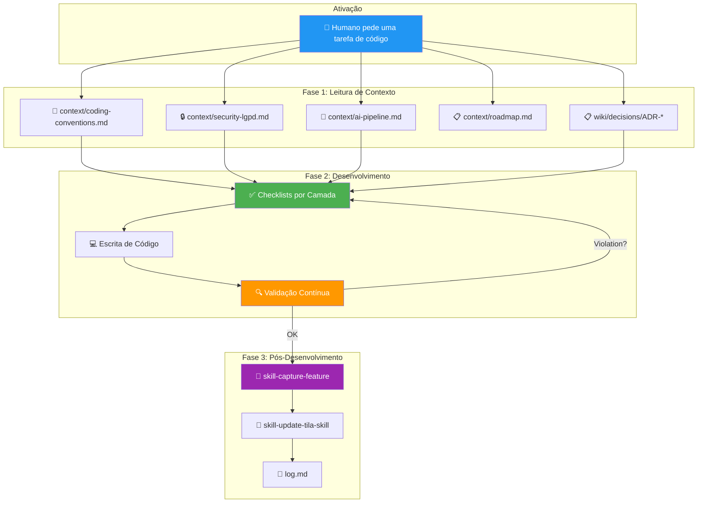
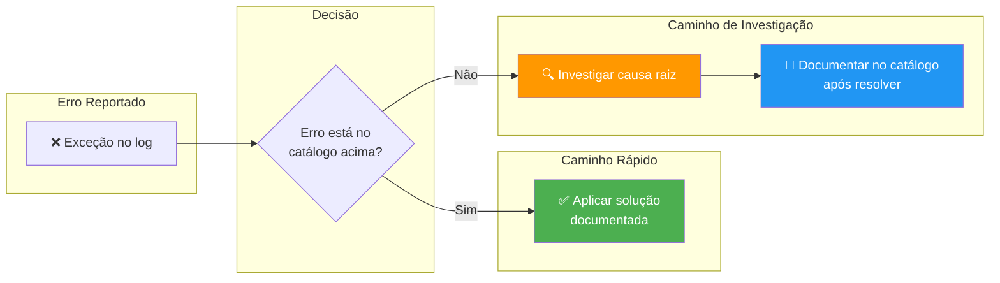

# Skill: Dev Assistant

## Context

Esta skill **ativa automaticamente** sempre que o agente está trabalhando em código dos repositórios TILA. Ela funciona como uma **camada de governança** que previne desvios de convenção, garante que o conhecimento da wiki seja aplicado, e assegura que bugs resolvidos anteriormente não se repitam.

O Dev Assistant não é um linter passivo — ele é um **par de programação informado** que conhece todas as decisões passadas, todos os bugs resolvidos, todos os padrões aprovados, e todas as armadilhas já descobertas pelo time.

> 🎯 **Princípio Central**: O agente NUNCA deve escrever código que contradiga o que o Tila_Brain já sabe. Se o brain diz que `@Autowired` é um anti-pattern, o agente jamais deve usá-lo — mesmo que o humano peça.

---

## Arquitetura da Skill



---

## Fase 1: Ativação — Leitura de Contexto

Antes de escrever qualquer linha de código, o agente DEVE ler os arquivos de contexto relevantes. **Nem sempre é necessário ler todos** — use a tabela de decisão abaixo.

### Tabela de Decisão: O Que Ler

| Se a tarefa envolve... | Ler OBRIGATORIAMENTE | Ler OPCIONALMENTE |
|---|---|---|
| Qualquer código backend | [[context/coding-conventions]], [[context/security-lgpd]] | [[wiki/concepts/backend-patterns]], [[wiki/concepts/backend-services]] |
| Qualquer código frontend | [[context/coding-conventions]] | [[wiki/concepts/angular-patterns]], [[wiki/concepts/frontend-architecture]] |
| Endpoint REST novo/alterado | [[wiki/concepts/api-endpoints]], [[context/security-lgpd]] | [[wiki/decisions/ADR-002-api-response-pattern]] |
| Entidade JPA nova/alterada | [[wiki/concepts/data-model]], [[context/security-lgpd]] | entity pages em `wiki/entities/` |
| Pipeline de IA / LangChain4j | [[context/ai-pipeline]], [[wiki/concepts/langchain4j-multimodal-workaround]] | [[wiki/decisions/ADR-004-langchain4j-multimodal]] |
| Laudo / análise de imagem | [[context/ai-pipeline]], [[wiki/concepts/laudo-patterns]], [[wiki/concepts/laudo-medico]] | [[wiki/entities/entity-laudo]] |
| Autenticação / JWT | [[wiki/concepts/jwt-authentication]], [[wiki/decisions/ADR-001-jwt-cookie-transport]] | [[context/security-lgpd]] |
| Estilo CSS / UI | [[context/coding-conventions]] (seção CSS) | [[wiki/concepts/angular-patterns]] |
| Refatoração / cleanup | [[context/roadmap]] (Phase 1 Consolidation) | [[context/coding-conventions]] inteiro |

### Anúncio de Contexto Carregado

Após ler os arquivos relevantes, o agente deve silenciosamente carregar o contexto — não é necessário anunciar ao humano quais arquivos foram lidos, a menos que encontre uma contradição.

---

## Fase 2: Desenvolvimento — Checklists por Camada

### Camada 1: Backend — Spring Boot 4 / Java 21

Antes de sugerir QUALQUER código backend, verificar TODOS os itens aplicáveis:

#### Injeção de Dependências
- [ ] Services usam **constructor injection** com campos `final`?
- [ ] **NENHUM** uso de `@Autowired` em field injection?
- [ ] Se existe um único construtor, o `@Autowired` é omitido (Spring o resolve automaticamente)?

**✅ Padrão Correto**:
```java
@Service
public class LaudoService {
    private final ChatModel chatModel;           // final = imutável
    private final LaudoRepository laudoRepository;
    private final ExameRepository exameRepository;

    // Spring resolve automaticamente — sem @Autowired
    public LaudoService(ChatModel chatModel, LaudoRepository laudoRepository,
                        ExameRepository exameRepository) {
        this.chatModel = chatModel;
        this.laudoRepository = laudoRepository;
        this.exameRepository = exameRepository;
    }
}
```

**❌ Anti-pattern (NUNCA usar)**:
```java
@Service
public class LaudoService {
    @Autowired private ChatModel chatModel;        // ❌ field injection
    @Autowired private LaudoRepository laudoRepo;  // ❌ não é final
}
```

> 📖 Referência: [[context/coding-conventions]] §1 — Dependency Injection

---

#### API Response
- [ ] Toda resposta REST usa `ResponseEntity<GenericResult<T>>`?
- [ ] Erros usam `GenericResult.error("mensagem")` e NÃO `new ErrorDetalhe(...)`?
- [ ] HTTP status codes estão corretos (201 para criação, 404 para não encontrado, etc.)?

**✅ Padrão Correto**:
```java
@PostMapping("/gerar")
public ResponseEntity<GenericResult<LaudoResponseDTO>> gerar(@RequestBody @Valid LaudoGeracaoRequestDTO dto) {
    var resultado = laudoService.gerarPreLaudo(dto, usuarioLogado);
    return ResponseEntity.status(HttpStatus.CREATED)
        .body(GenericResult.success(resultado));
}
```

**❌ Anti-pattern (não retornar entidade diretamente)**:
```java
@GetMapping("/{id}")
public Laudo get(@PathVariable Long id) {  // ❌ retorna Entity sem wrapper
    return laudoRepository.findById(id).get();  // ❌ .get() sem check
}
```

> 📖 Referência: [[wiki/decisions/ADR-002-api-response-pattern]]

---

#### DTOs e Records
- [ ] DTOs são Java **records** (não classes)?
- [ ] Bean Validation annotations (`@NotBlank`, `@NotNull`, `@CPF`, etc.) estão presentes?
- [ ] **NENHUMA entidade JPA** dentro de um DTO (usar DTOs aninhados)?

**✅ Padrão Correto**:
```java
public record PacienteResponseDTO(
    Long id,
    String nomeCompleto,
    String cpf,
    LocalDate dataNascimento,
    List<ExameResponseDTO> exames  // ✅ DTO aninhado, NÃO entidade
) {
    public static PacienteResponseDTO fromEntity(Paciente paciente) {
        return new PacienteResponseDTO(
            paciente.getId(),
            paciente.getNomeCompleto(),
            paciente.getCpf(),
            paciente.getDataNascimento(),
            paciente.getExames().stream()
                .map(ExameResponseDTO::fromEntity)
                .collect(Collectors.toList())
        );
    }
}
```

**❌ Anti-pattern (causa recursão JSON infinita)**:
```java
public record PacienteResponseDTO(
    Long id,
    String nomeCompleto,
    List<Exame> exames  // ❌ ENTIDADE JPA — Jackson serializa recursivamente!
) {}
```

> 📖 Lição aprendida: Sessão 2026-06-03 — `PacienteResponseDTO` com `List<Exame>` causava `StackOverflowError` por referência circular Paciente↔Exame.

---

#### Optional Handling
- [ ] Todo `Optional.get()` foi substituído por `.orElseThrow()`?
- [ ] Mensagens de erro em `orElseThrow` são descritivas e em português?

**✅ Padrão Correto**:
```java
var medico = medicoRepository.findByUsuario(usuarioLogado)
    .orElseThrow(() -> new EntityNotFoundException("Médico não cadastrado para este usuário"));
```

**❌ Anti-pattern (crash sem mensagem útil)**:
```java
var medico = medicoRepository.findByUsuario(usuario).get();  // ❌ NoSuchElementException
```

---

#### Segurança
- [ ] **NENHUM secret hardcoded** em código ou properties (usar `${ENV_VAR}`)?
- [ ] Novo endpoint tem controle de acesso (`@PreAuthorize` ou verificação de role)?
- [ ] Dados sensíveis (CPF, laudos) NÃO estão sendo logados em console?
- [ ] Upload de arquivos valida extensão e tamanho?

> 📖 Referência: [[context/security-lgpd]] — Vulnerabilidades Críticas

---

#### Pipeline de IA (LangChain4j)
- [ ] Se envia imagem ao Gemini: usar `ChatModel` diretamente com `TextContent` + `ImageContent`?
- [ ] **NÃO** usar `@UserMessage` em parâmetros `Image` de interfaces `@AiService`?
- [ ] Embedding model é `gemini-embedding-001` (NÃO `text-embedding-004` que foi depreciado)?
- [ ] System prompt está em `src/main/resources/prompts/` (classpath)?

**✅ Padrão Correto (Multimodal)**:
```java
// Construir mensagem multimodal manualmente
SystemMessage sys = SystemMessage.from(systemPrompt);
UserMessage user = UserMessage.from(
    TextContent.from(textoContexto),
    ImageContent.from(base64Image, "image/png")
);
ChatResponse response = chatModel.chat(
    ChatRequest.builder().messages(List.of(sys, user)).build()
);
```

**❌ Anti-pattern (conflito de anotações)**:
```java
// NUNCA usar Image com @UserMessage em AiService — causa conflito
String gerarLaudo(@UserMessage("template...") @V("tipo") String tipo,
                  @UserMessage Image imagem);  // ❌ Substitui o template!
```

> 📖 Referência: [[wiki/decisions/ADR-004-langchain4j-multimodal]], [[wiki/concepts/langchain4j-multimodal-workaround]]

---

### Camada 2: Frontend — Angular 19

Antes de sugerir QUALQUER código frontend, verificar:

#### Componentes
- [ ] Componente é **standalone** (`standalone: true` no decorator)?
- [ ] Imports são declarados no array `imports` do componente (não em module)?
- [ ] Template usa modern control flow (`@if`, `@for`, `@switch` — NÃO `*ngIf`, `*ngFor`)?

#### State Management
- [ ] State usa **Angular Signals** (`signal()`, `computed()`, `effect()`)?
- [ ] **NENHUMA** propriedade plain (`email = ''`) para estado reativo?

**✅ Padrão Correto**:
```typescript
@Component({ standalone: true, imports: [...] })
export class PacientesComponent {
    pacientes = signal<Paciente[]>([]);
    searchTerm = signal('');
    filteredPacientes = computed(() =>
        this.pacientes().filter(p => p.nome.includes(this.searchTerm()))
    );
}
```

**❌ Anti-pattern**:
```typescript
export class LoginComponent {
    email = '';        // ❌ Não-reativo no Angular 19
    senha = '';
    errorMessage = '';
}
```

#### Services
- [ ] Service usa `inject()` inline (NÃO constructor injection)?
- [ ] HTTP calls usam `firstValueFrom()` para conversão a Promise quando necessário?
- [ ] URLs de API NÃO estão hardcoded (usar `environment.ts`)?

#### CSS
- [ ] CSS é **vanilla** (NUNCA Tailwind, a menos que o humano peça explicitamente)?
- [ ] Font é Inter (conforme template original do projeto)?

> 📖 Referência: [[context/coding-conventions]] §6, [[wiki/concepts/angular-patterns]]

---

### Camada 3: Database / JPA

- [ ] Entidade JPA segue naming conventions: `@Table(name = "snake_case_plural")`?
- [ ] Campos de data usam `LocalDateTime` com `@PrePersist` / `@PreUpdate`?
- [ ] Lazy loading é padrão (`FetchType.LAZY`) em `@ManyToOne` e `@OneToMany`?
- [ ] Se precisa carregar relações: usar `JOIN FETCH` em query personalizada?

**✅ Padrão Correto (JOIN FETCH)**:
```java
@Query("SELECT e FROM Exame e JOIN FETCH e.paciente JOIN FETCH e.medico WHERE e.id = :id")
Optional<Exame> findByIdWithDetails(@Param("id") Long id);
```

---

## Fase 2.5: Troubleshooting — Lições Aprendidas

O Dev Assistant mantém uma base de erros já resolvidos. Antes de investigar um bug, **consultar esta lista**.

### Catálogo de Erros Conhecidos e Soluções

| Erro / Exceção | Causa Raiz | Solução | Referência |
|---|---|---|---|
| `StackOverflowError` na serialização JSON | Entidade JPA dentro de DTO (referência circular) | Usar DTOs aninhados (`ExameResponseDTO` em vez de `Exame`) | Sessão 2026-06-03 |
| `IllegalConfigurationException: Parameter should be annotated` | LangChain4j 1.0.1 exige anotação em todos os params de `@AiService` | Usar `ChatModel` diretamente para multimodal | [[wiki/decisions/ADR-004-langchain4j-multimodal]] |
| `NoSuchFileException` em imagem de exame | Path relativo não resolve a partir do diretório de trabalho do JVM | Usar `@Value("${tila.upload.path}")` e `Path.of(uploadPath, filename)` | Sessão 2026-06-03 |
| `HTTP 404: text-embedding-004 not found` | Modelo depreciado na API v1beta do Gemini | Trocar para `gemini-embedding-001` com `outputDimensionality(768)` | Sessão 2026-06-03 |
| `EntityNotFoundException: Usuário não encontrado` | JWT token válido mas usuário deletado do banco | Usar `orElseThrow()` com mensagem clara no `SecurityFilter` | [[context/security-lgpd]] §5 |
| `LazyInitializationException` | Acessar relação Lazy fora do contexto transacional | Usar `JOIN FETCH` na query ou `@Transactional` no service | [[wiki/concepts/backend-patterns]] |
| Jackson recursão infinita | Entity A referencia B que referencia A | Nunca expor Entity em API response — sempre mapear para DTO | [[context/coding-conventions]] §3 |



---

## Fase 3: Pós-Desenvolvimento

Após completar a tarefa de código, o agente DEVE seguir esta sequência:

### Step 1: Verificação Final
```
- [ ] Código compila sem erros?
- [ ] Convenções foram respeitadas (rodar checklists mentalmente)?
- [ ] Nenhuma vulnerabilidade de segurança foi introduzida?
- [ ] Nenhum secret hardcoded apareceu no código?
- [ ] Dados sensíveis não são logados em console?
```

### Step 2: Captura de Feature
Acionar [[skills/skill-capture-feature]] para registrar a feature/fix no brain:
- Changelog em `raw/codebase/changelog/`
- Atualização das páginas da wiki afetadas
- ADR se decisão arquitetural foi tomada

### Step 3: Atualização do Skill File
Acionar [[skills/skill-update-tila-skill]] para garantir que a documentação do projeto reflete o novo estado.

### Step 4: Log
Verificar se o `log.md` foi atualizado pela skill de captura. Se não, registrar manualmente.

---

## Regras de Governança

### Hierarquia de Prioridades
Quando dois requisitos conflitam, seguir esta ordem:

```
1. 🔒 Segurança / LGPD      (NUNCA comprometer)
2. 📋 Convenções Documentadas (ADRs, coding-conventions)
3. ✨ Funcionalidade          (o que o humano pediu)
4. ⚡ Performance             (otimizações)
5. 🎨 Estilo / Limpeza        (cosmético)
```

### Regras de Conflito
- Se o humano pedir algo que **contradiz uma ADR** → ALERTAR antes de prosseguir, citar a ADR específica.
- Se o humano pedir algo que **viola LGPD** (expor CPF, logar dados de saúde, etc.) → **RECUSAR** e explicar o porquê com referência a [[context/security-lgpd]].
- Se uma **nova convenção** é introduzida (padrão não documentado) → Perguntar: *"Isto deve ser registrado como uma nova convenção em [[context/coding-conventions]]?"*
- Se o humano **insistir** em violar uma convenção → Registrar a exceção explicitamente no código como comentário (`// EXCEÇÃO: [justificativa] — aprovado em [data]`) e criar nota de desvio em `wiki/decisions/`.

### Regras Proativas
- Se encontrar **bugs ou code smells** durante o desenvolvimento (mesmo que não relacionados à tarefa atual) → Reportar proativamente ao humano.
- Se perceber que um item do [[context/roadmap]] foi completado pela tarefa atual → Sugerir marcar como `[x]`.
- Se a tarefa cria ou modifica algo que impacta o [[context/ai-pipeline]] → Verificar se os diagramas do pipeline estão atualizados.

---

## Referências Internas

### Skills Integradas
- [[skills/skill-capture-feature]] — Acionada após completar feature
- [[skills/skill-update-tila-skill]] — Acionada após captura para atualizar documentação
- [[skills/skill-adr]] — Acionada se decisão arquitetural foi tomada
- [[skills/skill-ingest]] — Para quando o dev gera novo conhecimento durante o trabalho
- [[skills/skill-lint]] — Para verificar saúde do brain periodicamente

### Context Files (Leitura Obrigatória)
- [[context/coding-conventions]] — Convenções de código verificadas
- [[context/security-lgpd]] — Requisitos de segurança e LGPD
- [[context/ai-pipeline]] — Pipeline de IA e beans configurados
- [[context/roadmap]] — Prioridades e tasks pendentes
- [[context/project-identity]] — Identidade e stack do projeto

### Wiki Pages Referenciadas nos Checklists
- [[wiki/concepts/api-endpoints]] — Inventário de endpoints
- [[wiki/concepts/backend-patterns]] — Padrões de código backend
- [[wiki/concepts/backend-services]] — Inventário de services
- [[wiki/concepts/angular-patterns]] — Padrões de código frontend
- [[wiki/concepts/frontend-architecture]] — Arquitetura frontend
- [[wiki/concepts/data-model]] — Modelo ER
- [[wiki/concepts/jwt-authentication]] — Autenticação JWT
- [[wiki/concepts/laudo-patterns]] — Padrões de laudos
- [[wiki/concepts/langchain4j-multimodal-workaround]] — Workaround multimodal

### Decisões Arquiteturais
- [[wiki/decisions/ADR-001-jwt-cookie-transport]] — JWT via HttpOnly cookie
- [[wiki/decisions/ADR-002-api-response-pattern]] — GenericResult<T> envelope
- [[wiki/decisions/ADR-003-security-architecture]] — Arquitetura de segurança
- [[wiki/decisions/ADR-004-langchain4j-multimodal]] — ChatModel direto para imagens

## Backlinks
- [[CLAUDE.md]] — Operating manual (seção Operations)
- [[skills/skill-capture-feature]] — Pós-desenvolvimento
- [[skills/skill-update-tila-skill]] — Sincronização com skill file
- [[context/coding-conventions]] — Fonte dos checklists
