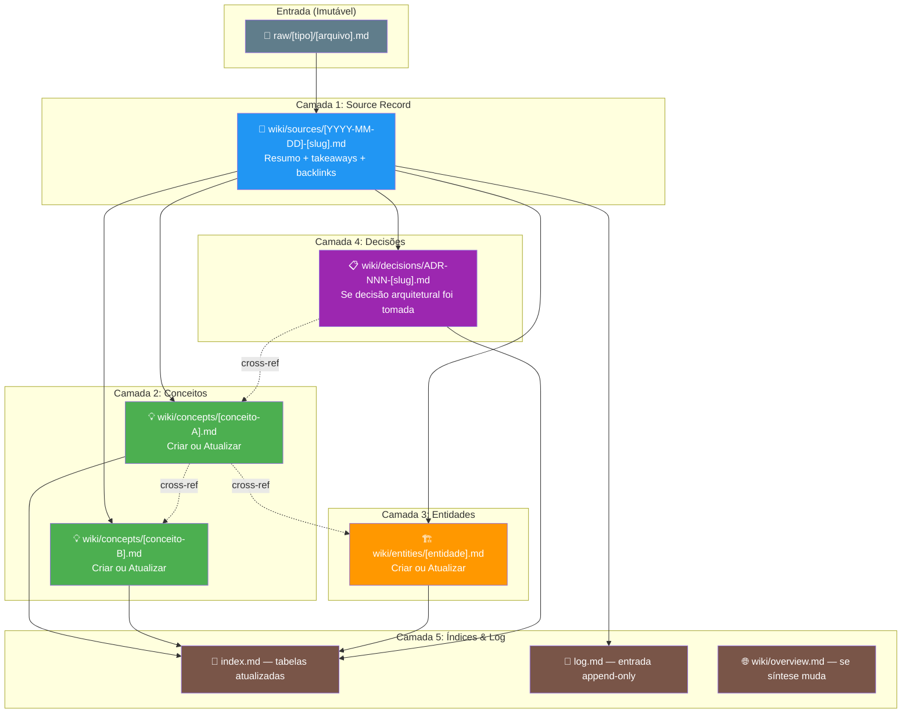
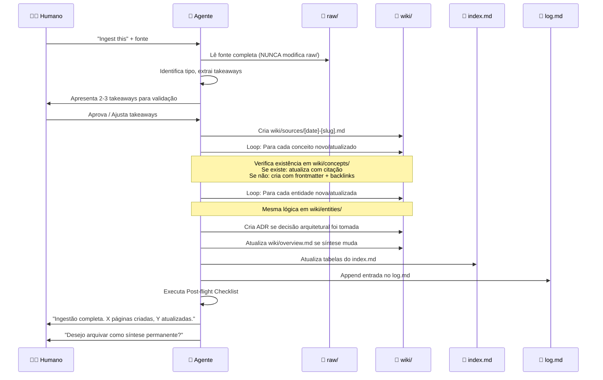
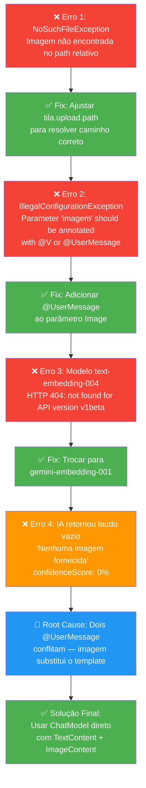
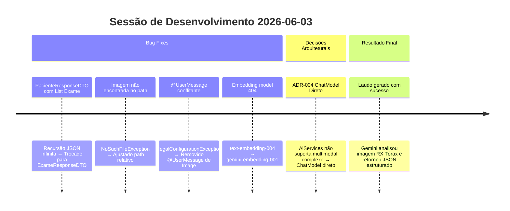
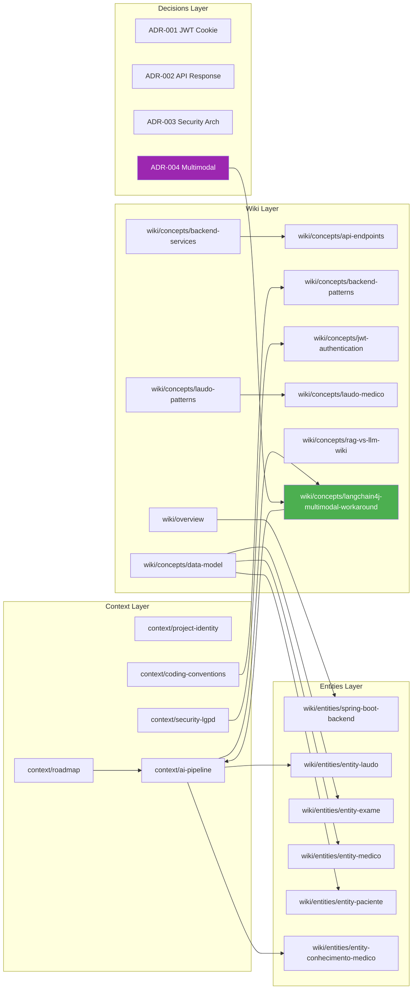

# Skill: Ingest

## Context

Quando o humano adiciona uma nova fonte de conhecimento — um artigo, transcrição de vídeo, snapshot de código, laudo anonimizado, **sessão de debug resolvida**, ou **conversa de desenvolvimento** — esta skill processa a fonte, extrai os insights principais, e os materializa como páginas permanentes na wiki.

A ingestão é o **ato fundacional** do Tila_Brain. Cada pedaço de conhecimento que entra pela porta de `raw/` e é processado por esta skill se transforma em nós conectados na rede de conhecimento. O objetivo é nunca perder contexto: se um bug foi resolvido, o porquê e como deve sobreviver para sempre no cérebro.

> ⚠️ **Regra de Ouro**: A ingestão não é copiar-e-colar. É **destilação**. O raw é imutável e literal. A wiki é interpretada, estruturada, e interconectada.

---

## Anatomia de uma Ingestão

Toda ingestão produz artefatos em até 5 camadas. Nem toda ingestão produz todos — mas o agente deve **avaliar cada camada** e justificar se pulou alguma.



---

## Pre-flight Checklist

Antes de executar qualquer passo, o agente DEVE completar esta checklist mental:

### Identificação da Fonte
- [ ] **Localização**: A fonte está em `raw/` ou é uma URL/clipboard a ser salva primeiro?
- [ ] **Tipo identificado**: `article` | `video` | `codebase` | `codebase-debug` | `codebase-conversation` | `medical` | `laudo` | `dependency-upgrade`?
- [ ] **Título curto** definido para usar no slug (kebab-case, max 5 palavras)?
- [ ] **Data** identificada (se não tiver, usar a data de hoje)?

### Análise de Sensibilidade (OBRIGATÓRIO)
- [ ] A fonte contém **PHI** (Protected Health Information)?
  - Nomes reais de pacientes
  - CPFs
  - Datas de nascimento vinculadas a diagnósticos
  - Resultados clínicos reais
- [ ] Se SIM a qualquer item acima → **ABORTAR IMEDIATAMENTE** e pedir anonimização ao humano.
- [ ] Verificar conformidade com [[context/security-lgpd]] antes de prosseguir.

### Análise de Escopo
- [ ] Quantos **conceitos novos** esta fonte introduz? (Estimar antes de começar)
- [ ] Quais **páginas existentes** serão impactadas? (Listar antes de começar)
- [ ] Esta fonte **contradiz** algo já documentado na wiki? (Verificar `wiki/overview.md` e páginas relacionadas)
- [ ] Esta fonte gera uma **decisão arquitetural** que merece ADR? (Se sim, usar [[skills/skill-adr]] em conjunto)

### Verificação de Duplicatas
- [ ] Já existe uma source page em `wiki/sources/` cobrindo este mesmo tema?
- [ ] Se sim: esta é uma **atualização** (mesma fonte, dados novos) ou uma **fonte nova** sobre o mesmo conceito?

---

## Steps — Fluxo Principal

Independente da variante, todo ingest segue esta espinha dorsal:



---

## Variantes Detalhadas

---

### Variante 1: Artigos / Material Geral

**Quando usar**: Artigos técnicos, posts de blog, documentação oficial, papers acadêmicos, transcrições de palestras.

**Destino do raw**: `raw/articles/[YYYY-MM-DD]-[slug].md`

#### Steps
1. **Ler a fonte completamente** — nunca resumir sem ler tudo.
2. **Discutir com o humano** 2–3 takeaways principais antes de escrever qualquer coisa.
   - Formato dos takeaways:
     ```
     🔑 Takeaway 1: [Conceito principal aprendido]
     🔑 Takeaway 2: [Implicação prática para o TILA]
     🔑 Takeaway 3: [Conexão com algo já existente na wiki]
     ```
3. **Criar página de resumo** em `wiki/sources/[YYYY-MM-DD]-[slug].md` com:

   ```markdown
   ---
   title: "Título do artigo/fonte"
   slug: nome-kebab-case
   date: YYYY-MM-DD
   type: source
   tags: [tag1, tag2]
   original_url: "https://..." # se aplicável
   ---

   # [Título]

   ## Resumo
   [Parágrafo conciso capturando a essência]

   ## Takeaways
   1. [Takeaway validado pelo humano]
   2. [Takeaway validado pelo humano]
   3. [Takeaway validado pelo humano]

   ## Conceitos e Entidades Extraídos
   - [[wiki/concepts/conceito-a]] — [por que é relevante]
   - [[wiki/entities/entidade-b]] — [o que mudou]

   ## Backlinks
   - [[index]]
   - [[log]]
   ```

4. **Para cada conceito novo** identificado:
   - Buscar em `wiki/concepts/` se já existe uma página.
   - **Se existe**: Abrir a página, adicionar nova seção ou atualizar seção existente, **citando a fonte** com `(Fonte: [[wiki/sources/YYYY-MM-DD-slug]])`.
   - **Se não existe**: Criar nova página com frontmatter completo, conteúdo, e seção `## Backlinks`.

5. **Para cada entidade nova** (pessoa, ferramenta, biblioteca, framework):
   - Mesma lógica em `wiki/entities/`.

6. **Atualizar `wiki/overview.md`** se a síntese geral do projeto muda significativamente.

7. **Atualizar `index.md`** com todas as páginas criadas/atualizadas (incrementar contadores no header).

8. **Append em `log.md`**:
   ```markdown
   ## [YYYY-MM-DD HH:MM] ingest | [Título da Fonte]
   [Descrição breve do que foi adicionado e quais páginas wiki foram tocadas.]
   ```

9. **Perguntar**: "Desejo arquivar este resultado de ingest como uma síntese permanente?"

---

### Variante 2: YouTube / Vídeo

**Quando usar**: Vídeos do YouTube, palestras, webinars, tutoriais em vídeo.

**Destino do raw**: `raw/videos/[YYYY-MM-DD]-[slug].md`

#### Steps
1. Usar **TranscriptAPI MCP** (se disponível) para buscar a transcrição.
2. Se MCP não disponível, pedir ao humano para colar a transcrição.
3. Salvar transcrição em `raw/videos/[YYYY-MM-DD]-[slug].md` com frontmatter:
   ```markdown
   ---
   title: "[Título do Vídeo]"
   channel: "[Nome do Canal]"
   url: "https://youtube.com/watch?v=..."
   duration: "MM:SS"
   date_watched: YYYY-MM-DD
   ---
   ```
4. Seguir passos 1–9 da **Variante 1** (Artigos).

---

### Variante 3: Codebase Snapshot

**Quando usar**: Quando uma feature, refatoração, ou configuração significativa foi implementada e precisa ser registrada.

**Destino do raw**: `raw/codebase/snapshots/[YYYY-MM-DD]-[slug].md` ou `raw/codebase/changelog/[YYYY-MM-DD]-[slug].md`

#### Steps
1. Ler o diff ou arquivo de `raw/codebase/snapshots/`.
2. **Identificar decisões arquiteturais** relevantes.
   - Se decisão encontrada → Invocar [[skills/skill-adr]] para criar `wiki/decisions/ADR-NNN-[slug].md`.
3. **Mapear arquivos alterados** e seus impactos:
   - Para cada arquivo Java alterado: verificar se existe entity page em `wiki/entities/`.
   - Para cada endpoint novo/alterado: atualizar `wiki/concepts/api-endpoints.md`.
   - Para cada padrão novo: atualizar `wiki/concepts/backend-patterns.md` ou `wiki/concepts/angular-patterns.md`.
4. **Atualizar diagramas existentes** se a arquitetura mudou:
   - `context/ai-pipeline.md` — diagrama de beans e fluxo de laudo
   - `wiki/concepts/backend-services.md` — inventário de services
   - `wiki/concepts/data-model.md` — modelo ER
5. Seguir passos 6–9 da **Variante 1**.

#### Exemplo Real (2026-06-03): Ingestão do Snapshot LangChain4j Multimodal

Nesta sessão de desenvolvimento, resolvemos o conflito de `@UserMessage` com imagens multimodais no LangChain4j 1.0.1. O processo de ingestão produziu:

| Artefato | Tipo | Ação |
|---|---|---|
| `raw/codebase/snapshots/2026-06-03-langchain4j-multimodal.md` | Raw Snapshot | Criado — problema e solução documentados |
| `wiki/decisions/ADR-004-langchain4j-multimodal.md` | ADR | Criado — decisão de usar ChatModel direto |
| `wiki/concepts/langchain4j-multimodal-workaround.md` | Conceito | Criado — padrão de workaround documentado |
| `wiki/sources/2026-06-03-langchain4j-multimodal.md` | Source | Criado — takeaways e links |
| `index.md` | Índice | Atualizado — 3 novas linhas nas tabelas |
| `log.md` | Log | Append — entrada registrada |

**Lição aprendida**: Snapshots de codebase frequentemente geram ADRs. Sempre verificar se uma decisão arquitetural foi tomada (mesmo que implicitamente) e registrá-la formalmente.

---

### Variante 4: Sessão de Debug (NOVA — v2.0)

**Quando usar**: Quando uma sessão de debugging resolveu um problema complexo que envolve múltiplas tentativas, erros, e descobertas sobre como o framework/biblioteca funciona.

**Destino do raw**: `raw/codebase/debug/[YYYY-MM-DD]-[slug].md`

**Por que esta variante existe**: Sessões de debug são as fontes mais ricas de conhecimento tácito. Elas revelam como as coisas realmente funcionam (vs. como a documentação diz que funcionam). Se não forem capturadas, o mesmo bug será enfrentado novamente no futuro.

#### Steps
1. **Documentar a cronologia do debug** no raw:
   ```markdown
   ---
   title: "Debug: [Descrição curta do problema]"
   date: YYYY-MM-DD
   type: debug-session
   files_affected: [lista de arquivos]
   error_signature: "[Exceção principal, ex: IllegalConfigurationException]"
   root_cause: "[Causa raiz em uma frase]"
   resolution: "[Solução em uma frase]"
   ---

   # Debug: [Descrição]

   ## Sintoma
   [O que o usuário/dev viu — mensagem de erro, comportamento inesperado]

   ## Tentativas (cronologia)
   1. [Primeira tentativa e por que falhou]
   2. [Segunda tentativa e por que falhou]
   3. [Tentativa final que funcionou]

   ## Causa Raiz
   [Explicação técnica detalhada]

   ## Solução Aplicada
   [Código antes/depois, com diff]

   ## Lição Aprendida
   [O que este debug ensinou sobre o framework/biblioteca/padrão]
   ```

2. **Extrair o padrão** — todo debug bem-sucedido revela um padrão:
   - Se é um workaround para limitação de framework → Criar conceito em `wiki/concepts/`.
   - Se é uma correção de bug no nosso código → Atualizar entity/service page correspondente.
   - Se é uma decisão de mudar abordagem → Criar ADR via [[skills/skill-adr]].

3. **Atualizar diagramas** se a arquitetura mudou em consequência do debug.

4. Seguir passos 6–9 da **Variante 1**.

#### Exemplo Real (2026-06-03): Debug do LangChain4j Image + @UserMessage

**Cronologia do debug**:



**Código — Antes (Interface AiService com Image)**:
```java
// ❌ CONFLITO: Dois @UserMessage no mesmo método
public interface TilaRadiologistaAgent {
    @SystemMessage(fromResource = "prompts/radiologista-system.txt")
    String gerarPreLaudo(
            @UserMessage("## Contexto do Exame\n- Tipo: {{tipoExame}}...")
            @V("tipoExame") String tipoExame,
            // ... outros @V params ...
            @UserMessage Image imagem);  // ← Este @UserMessage substitui o template!
}
```

**Código — Depois (ChatModel direto com multimodal)**:
```java
// ✅ SOLUÇÃO: Construção manual da mensagem multimodal
@Service
public class LaudoService {
    private final ChatModel chatModel;  // Injetado via construtor

    public LaudoResponseDTO gerarPreLaudo(...) {
        // 1. Carregar imagem como base64
        ImagemCarregada img = carregarImagemExame(exame.getUrlImagem());

        // 2. Carregar system prompt do classpath
        String systemPrompt = carregarSystemPrompt();

        // 3. Montar texto do contexto (sem template engine)
        String texto = """
            ## Contexto do Exame
            - Tipo: %s
            - Paciente: %s, %d anos
            ...
            """.formatted(tipoExame, nome, idade, ...);

        // 4. Construir mensagem multimodal (texto + imagem na MESMA UserMessage)
        SystemMessage sys = SystemMessage.from(systemPrompt);
        UserMessage user = UserMessage.from(
            TextContent.from(texto),
            ImageContent.from(img.base64(), img.mimeType())
        );

        // 5. Chamar modelo diretamente
        ChatResponse response = chatModel.chat(
            ChatRequest.builder()
                .messages(List.of(sys, user))
                .build()
        );
        String respostaIA = response.aiMessage().text();
        // ... parsear JSON, salvar laudo, retornar DTO
    }
}
```

**Páginas criadas/atualizadas nesta ingestão**:
- [[wiki/decisions/ADR-004-langchain4j-multimodal]] — ADR formalizando a decisão
- [[wiki/concepts/langchain4j-multimodal-workaround]] — Padrão reusável
- [[wiki/sources/2026-06-03-langchain4j-multimodal]] — Source record

---

### Variante 5: Conversa de Desenvolvimento (NOVA — v2.0)

**Quando usar**: Quando uma conversa completa de pair-programming com o agente resultou em múltiplas alterações no código, bugs resolvidos, e aprendizados que devem ser preservados.

**Destino do raw**: `raw/codebase/conversations/[YYYY-MM-DD]-[slug].md`

**Diferença da Variante 4 (Debug)**: A variante Debug foca em UM problema e sua resolução. A variante Conversa captura uma SESSÃO INTEIRA que pode ter múltiplos bugs, múltiplas features, e múltiplas decisões.

#### Steps
1. **Ler o transcript completo da conversa** (disponível em logs do agente).
2. **Catalogar todos os eventos da sessão** em uma tabela:

   | # | Tipo | Descrição | Arquivos Tocados | Resultado |
   |---|---|---|---|---|
   | 1 | Bug Fix | `PacienteResponseDTO` com `List<Exame>` causava recursão JSON | `PacienteResponseDTO.java`, `PacienteService.java` | Trocado para `List<ExameResponseDTO>` |
   | 2 | Bug Fix | `NoSuchFileException` — imagem não encontrada | `LaudoService.java` | Ajustado path de upload |
   | 3 | Bug Fix | `@UserMessage` conflitante com Image | `TilaRadiologistaAgent.java`, `LaudoService.java` | ADR-004: ChatModel direto |
   | 4 | Config | Embedding model 404 | `TilaRagConfig.java` | Trocado para `gemini-embedding-001` |

3. **Para cada evento**: avaliar se gera conceito, entidade, ADR, ou atualização de página existente.
4. **Criar raw** com a tabela completa e detalhes de cada evento.
5. **Criar source page** resumindo a sessão.
6. Seguir passos de criação/atualização de conceitos, entidades, ADRs.
7. Seguir passos 6–9 da **Variante 1**.

#### Exemplo Real (2026-06-03): Conversa Completa de Integração IA

A sessão de 2026-06-03 envolveu os seguintes eventos sequenciais:



---

### Variante 6: Laudo Anonimizado

**Quando usar**: Quando um laudo médico anonimizado é fornecido para extrair padrões estruturais (seções, linguagem, terminologia).

**Destino do raw**: `raw/laudos/[YYYY-MM-DD]-[slug].md`

> 🔴 **ATENÇÃO MÁXIMA**: Esta variante lida com dados potencialmente sensíveis. A verificação de anonimização é OBRIGATÓRIA e INEGOCIÁVEL.

#### Steps
1. **Verificar anonimização** (ZERO dados de paciente):
   - [ ] Nenhum nome real
   - [ ] Nenhum CPF
   - [ ] Nenhuma data de nascimento vinculada a diagnóstico
   - [ ] Nenhum número de prontuário
   - [ ] Nenhuma informação que permita re-identificação
   - Se QUALQUER item falhar → **ABORTAR** e pedir anonimização.

2. **Extrair padrões estruturais** (NUNCA o conteúdo clínico):
   - Seções usadas (Técnica, Achados, Impressão, Recomendações)
   - Estilo de linguagem (formal, objetivo, referencial)
   - Terminologia padronizada (ACR, CBR, BI-RADS)
   - Formato de confidence score

3. **Atualizar** [[wiki/concepts/laudo-patterns]] com os novos padrões encontrados.
   - Adicionar seção com data e fonte: `### Padrões de [YYYY-MM-DD] (Fonte: [slug])`
   - Comparar com padrões anteriores — evoluções ou contradições?

4. **NUNCA copiar conteúdo clínico** — apenas estrutura e padrões genéricos.

5. Seguir passos 6–9 da **Variante 1**.

---

### Variante 7: Dependência / Upgrade (NOVA — v2.0)

**Quando usar**: Quando uma dependência do projeto (Maven, npm, framework) é atualizada e isso causa breaking changes, novos padrões, ou correções.

**Destino do raw**: `raw/codebase/upgrades/[YYYY-MM-DD]-[slug].md`

#### Steps
1. **Documentar a mudança de versão**:
   ```markdown
   ---
   title: "Upgrade: [Dependência] [versão antiga] → [versão nova]"
   date: YYYY-MM-DD
   type: upgrade
   dependency: "[groupId:artifactId]"
   from_version: "X.Y.Z"
   to_version: "A.B.C"
   breaking_changes: true/false
   ---
   ```

2. **Mapear breaking changes** encontradas durante o upgrade.
3. **Atualizar** [[wiki/entities/spring-boot-backend]] ou entidade equivalente com a nova versão.
4. **Se houver breaking changes** → Criar ADR via [[skills/skill-adr]].
5. Seguir passos 6–9 da **Variante 1**.

#### Exemplo Real: LangChain4j 0.36.2 → 1.0.1

| Aspecto | 0.36.2 | 1.0.1 |
|---|---|---|
| Embedding Model | `text-embedding-004` | `gemini-embedding-001` (API v1beta dropped old model) |
| ChatModel class | `ChatLanguageModel` | `ChatModel` (renamed) |
| AiServices Image | Permissivo (não validava anotações) | Estrito (todos params precisam de anotação) |
| Jackson compat | Jackson 2.x | Requer adaptadores para Jackson 3.x (Spring Boot 4) |

---

## Frontmatter Obrigatório para Toda Página Wiki

Toda página criada ou atualizada durante uma ingestão **DEVE** ter este frontmatter:

```yaml
---
title: "Título descritivo da página"
type: concept | entity | source | decision | output | overview
tags: [tag1, tag2, tag3]
sources: [raw/path/to/source.md]    # Lista de fontes raw que informaram esta página
last_updated: YYYY-MM-DD
---
```

**Regras de tags**:
- Use tags existentes antes de criar novas (consultar [[index]] para tags em uso)
- Tags em inglês, kebab-case: `langchain4j`, `backend-patterns`, `ai`
- Máximo de 5 tags por página

---

## Cross-Referencing — O Coração do Brain

O valor do Tila_Brain não está nas páginas individuais — está nas **conexões** entre elas. A cada ingestão, o agente DEVE:

### 1. Forward Links (a página nova referencia existentes)
```markdown
Texto que menciona um conceito deve linkar: [[wiki/concepts/conceito-existente]].
```

### 2. Backward Links (páginas existentes referenciam a nova)
Se a página nova é relevante para uma página existente, **abrir a página existente** e adicionar referência na seção `## Backlinks`:
```markdown
## Backlinks
- [[wiki/concepts/nova-pagina-criada]]   ← ADICIONAR ESTE
- [[wiki/sources/2026-06-03-slug]]
```

### 3. Mapa de Referências do Projeto



### 4. Quando Atualizar Quais Páginas

| Se a fonte contém... | Atualizar... |
|---|---|
| Novo endpoint REST | [[wiki/concepts/api-endpoints]] |
| Novo padrão de código backend | [[wiki/concepts/backend-patterns]] |
| Novo padrão de código frontend | [[wiki/concepts/angular-patterns]] |
| Mudança em entidade JPA | `wiki/entities/entity-[nome].md` + [[wiki/concepts/data-model]] |
| Mudança no pipeline de IA | [[context/ai-pipeline]] |
| Nova vulnerabilidade de segurança | [[context/security-lgpd]] |
| Progresso no roadmap | [[context/roadmap]] |
| Mudança de dependência Maven/npm | [[wiki/entities/spring-boot-backend]] ou [[wiki/entities/angular-frontend]] |
| Decisão arquitetural | Criar ADR via [[skills/skill-adr]] |
| Padrão de laudo | [[wiki/concepts/laudo-patterns]] |
| Conceito de RAG/embeddings | [[wiki/concepts/rag-vs-llm-wiki]] |

---

## Output Format

Ao final de toda ingestão, o agente DEVE produzir um relatório resumido:

```markdown
## Relatório de Ingestão

### Fonte
- **Tipo**: [tipo da variante]
- **Raw**: `raw/[path]`
- **Data**: YYYY-MM-DD

### Artefatos Produzidos
| Arquivo | Ação | Descrição |
|---|---|---|
| `wiki/sources/...` | Criado | Source record com takeaways |
| `wiki/concepts/...` | Criado/Atualizado | [Descrição] |
| `wiki/decisions/ADR-...` | Criado | [Descrição] |
| `index.md` | Atualizado | +N linhas nas tabelas |
| `log.md` | Append | Entrada registrada |

### Métricas
- Páginas criadas: N
- Páginas atualizadas: N
- Cross-references adicionados: N
- ADRs gerados: N
```

---

## Rules

### Imutabilidade
- **NUNCA** modificar arquivos em `raw/` — são imutáveis e servem como fonte de verdade.
- Se um raw precisa de correção, criar um novo arquivo `raw/.../[date]-[slug]-v2.md`.

### Privacidade e LGPD
- **NUNCA** incluir dados reais de pacientes em qualquer página da wiki.
- Toda referência médica deve ser genérica ou sintética.
- Antes de ingerir qualquer fonte médica, verificar [[context/security-lgpd]].

### Qualidade
- Toda página wiki **DEVE** ter frontmatter completo (title, type, tags, sources, last_updated).
- Toda página wiki **DEVE** ter seção `## Backlinks` no final.
- Cross-references devem usar `[[wiki/path/page]]` syntax (Obsidian-compatible).
- Quando um claim não pode ser verificado, marcar com: `> ⚠️ Não verificado — fonte necessária.`

### Limites
- Máximo de **15 páginas criadas/atualizadas** por ingest para manter qualidade.
- Se uma fonte gerar mais de 15 páginas, dividir em múltiplas ingestões temáticas.
- Cada conceito merece uma página dedicada — não misturar conceitos não-relacionados.

### Diagramas
- Todo conceito complexo deve incluir pelo menos um diagrama Mermaid.
- Diagramas existentes devem ser **atualizados** (não duplicados) se a fonte muda o que eles representam.
- Usar cores consistentes: ✅ verde (#4CAF50), ❌ vermelho (#f44336), ⚠️ laranja (#FF9800), info azul (#2196F3), decisão roxo (#9C27B0).

### Código
- Exemplos de código devem ser **reais** (extraídos do codebase), não hipotéticos.
- Sempre incluir comentários explicando o "porquê", não o "o quê".
- Usar a linguagem correta no fence block (```java, ```typescript, ```xml, etc.).

---

## Post-flight Checklist

Após completar a ingestão, verificar TODOS os itens:

### Conteúdo
- [ ] Todas as páginas criadas possuem **frontmatter completo**?
- [ ] Todas as páginas possuem seção **`## Backlinks`**?
- [ ] Todos os conceitos mencionados em texto possuem **cross-reference** `[[wiki/path]]`?
- [ ] Nenhum conceito foi mencionado sem que a página exista (criar se necessário)?

### Índices
- [ ] **`index.md`** reflete todas as mudanças (novas linhas, contadores atualizados)?
- [ ] **`log.md`** foi atualizado com entrada append-only?
- [ ] **`wiki/overview.md`** foi revisado (e atualizado se a síntese mudou)?

### Segurança
- [ ] **Nenhum dado sensível** foi incluído em qualquer página wiki?
- [ ] Nenhum secret (API key, senha, token) aparece em exemplos de código?
  - Se necessário mostrar um secret, usar: `${VARIABLE_NAME}` ou `*****`

### Qualidade
- [ ] Diagramas existentes foram **atualizados** se necessário (não ficaram stale)?
- [ ] **Roadmap** foi atualizado se tasks foram completadas?
- [ ] Não há **contradições** entre a nova informação e páginas existentes?
- [ ] O relatório de ingestão foi gerado e apresentado ao humano?

---

## Referências Internas

### Skills Relacionadas
- [[skills/skill-adr]] — Usada quando a ingestão identifica uma decisão arquitetural
- [[skills/skill-capture-feature]] — Para registrar features contínuas (complementar ao ingest de codebase)
- [[skills/skill-lint]] — Para verificar saúde do brain após múltiplas ingestões
- [[skills/skill-query]] — Para consultar conhecimento já ingerido
- [[skills/skill-update-tila-skill]] — Para atualizar o SKILL.md do projeto após ingestões de codebase

### Context Files
- [[context/project-identity]] — Identidade do projeto TILA
- [[context/coding-conventions]] — Convenções de código (verificar compliance)
- [[context/security-lgpd]] — Regras de segurança e LGPD (verificar antes de ingerir dados médicos)
- [[context/ai-pipeline]] — Pipeline de IA (atualizar se ingestão afeta o pipeline)
- [[context/roadmap]] — Roadmap (atualizar se ingestão completa tasks)

### Wiki Pages Frequentemente Atualizadas
- [[wiki/overview]] — Visão geral do projeto
- [[wiki/concepts/api-endpoints]] — Endpoints REST
- [[wiki/concepts/backend-services]] — Services e repositories
- [[wiki/concepts/backend-patterns]] — Padrões de código backend
- [[wiki/concepts/laudo-patterns]] — Padrões de laudos médicos
- [[wiki/concepts/langchain4j-multimodal-workaround]] — Workaround multimodal
- [[wiki/entities/spring-boot-backend]] — Stack do backend

### Decisões Arquiteturais Existentes
- [[wiki/decisions/ADR-001-jwt-cookie-transport]] — JWT via HttpOnly cookie
- [[wiki/decisions/ADR-002-api-response-pattern]] — GenericResult<T> envelope
- [[wiki/decisions/ADR-003-security-architecture]] — Arquitetura de segurança
- [[wiki/decisions/ADR-004-langchain4j-multimodal]] — ChatModel direto para multimodal

## Backlinks
- [[CLAUDE.md]] — Operating manual principal (seção INGEST)
- [[index]] — Índice geral do brain
- [[log]] — Log de atividades
