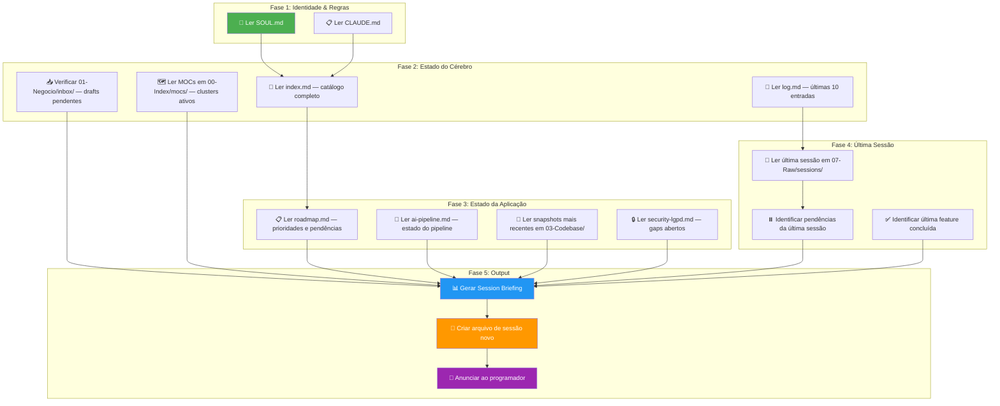

# Skill: Session Boot

## Context

Esta skill é o **primeiro passo obrigatório** de qualquer sessão de programação. Sem ela, o agente opera às cegas — sem saber o que foi feito na última sessão, o que está pendente, qual o estado real da aplicação, ou quais são as prioridades atuais.

O boot é o momento em que o agente "acorda" e reconstrói seu contexto completo a partir do cérebro. O programador deve receber um briefing claro e acionável antes de escrever qualquer linha de código.

> 🎯 **Princípio**: O agente nunca deve perguntar "o que estávamos fazendo?" — ele deve SABER, porque o cérebro registra tudo.

---

## Arquitetura do Boot



---

## Steps

### Fase 1: Identidade & Regras (Silencioso)

O agente carrega sua identidade e regras operacionais. Esta fase é **silenciosa** — não anuncia ao programador.

1. **Ler `00-Index/SOUL.md`** — Internalizar identidade, non-negotiables, e relação com o brain.
2. **Ler `CLAUDE.md`** — Carregar todas as regras operacionais (§1 a §6), checklists, convenções de código, e constraints.

### Fase 2: Estado do Cérebro

O agente reconstrói seu mapa mental do que existe no cérebro.

3. **Ler `index.md`** — Catalogar:
   - Número total de permanent notes
   - Número total de patterns
   - Número total de snapshots
   - Número total de ADRs
   - Número total de MOCs
   - Número total de skills
   - Versão da arquitetura

4. **Ler `log.md`** (últimas 10 entradas) — Identificar:
   - A **última ação** registrada (data, tipo, descrição)
   - A **última feature** capturada
   - A **última ingestão** realizada
   - Quaisquer **padrões temporais** (ex: "muita atividade em security esta semana")

5. **Verificar `01-Negocio/inbox/`** — Listar qualquer DRAFT pendente de validação (notas aguardando gate).

6. **Ler MOCs em `00-Index/mocs/`** — Identificar os clusters de conhecimento ativos e suas interconexões.

### Fase 3: Estado da Aplicação

O agente reconstrói o entendimento do estado real do código.

7. **Ler `01-Negocio/contexto/roadmap.md`** — Identificar:
   - Tasks `[ ]` pendentes (próximas a fazer)
   - Tasks `[x]` completadas recentemente
   - A **próxima prioridade** sugerida
   - Blockers conhecidos

8. **Ler `01-Negocio/contexto/ai-pipeline.md`** — Status do pipeline de IA:
   - % de completude
   - Beans configurados vs. faltantes
   - Próximo passo do pipeline

9. **Ler snapshots mais recentes em `03-Codebase/snapshots/`** — Resumo rápido:
   - Quantas entidades backend
   - Quantos endpoints
   - Quantos componentes frontend
   - Gaps de segurança abertos

10. **Ler `01-Negocio/contexto/security-lgpd.md`** — Gaps de segurança abertos que precisam de atenção.

### Fase 4: Última Sessão

O agente busca a continuidade da última sessão de trabalho.

11. **Buscar última sessão em `07-Raw/sessions/`** — Ordenar por data, ler a mais recente.

12. **Extrair pendências da última sessão**:
    - Itens marcados como `⏸️ Pendente` ou `🔜 Próximo`
    - Features que foram discutidas mas não implementadas
    - Bugs que foram encontrados mas não corrigidos
    - Ideias que surgiram mas não foram exploradas

13. **Identificar última feature concluída** — O que foi a última coisa que o programador terminou? Em que estado o código ficou?

### Fase 5: Output — Session Briefing

14. **Gerar o Session Briefing** no formato abaixo.

15. **Criar arquivo de sessão novo** em `07-Raw/sessions/YYYY-MM-DD-HH-MM-session.md` com header:

```markdown
---
title: "Sessão de Desenvolvimento — YYYY-MM-DD"
date: YYYY-MM-DD
start_time: "HH:MM"
end_time: "" # preenchido pelo skill-session-close
developer: "[nome do programador]"
type: session
status: active
---

# Sessão de Desenvolvimento — YYYY-MM-DD

## Briefing Inicial
[Colar o Session Briefing gerado]

## Timeline de Eventos
<!-- Preenchido automaticamente pelo skill-session-recorder -->

## Resumo Final
<!-- Preenchido pelo skill-session-close -->
```

16. **Anunciar ao programador** com o Session Briefing formatado.

---

## Output Format — Session Briefing

```markdown
## 🧠 Tila_Brain — Session Briefing

📅 **Data**: YYYY-MM-DD HH:MM
🏗️ **Arquitetura**: v[N] (Breno + Okamoto + Karpathy)

---

### 📊 Métricas do Cérebro
| Métrica | Valor |
|---|---|
| Permanent Notes | [N] |
| Patterns | [N] |
| Snapshots | [N] |
| ADRs | [N] |
| MOCs | [N] |
| Skills | [N] |
| Sessões registradas | [N] |

### 🏥 Status da Aplicação
- **Backend**: [N] entidades, [N] endpoints, [N] services
- **Frontend**: [N] pages, [N] componentes
- **Pipeline IA**: [N]% completo — [status curto]
- **Segurança**: [N] gaps abertos ([N] críticos, [N] médios)

### ⏮️ Última Sessão ([data])
- **Última feature**: [nome e descrição curta]
- **Última ação no log**: [descrição]
- **Status**: [concluída | pendente parcial]

### ⏸️ Pendências
- [ ] [Pendência 1 — de onde veio]
- [ ] [Pendência 2 — de onde veio]
- [ ] [Pendência N — de onde veio]

### 📥 Inbox (Drafts aguardando validação)
- [N] drafts em `01-Negocio/inbox/`
  - [lista dos drafts se houver]

### 🎯 Prioridade Sugerida
Com base no roadmap e nas pendências, sugiro começar por:
1. [Prioridade 1 — justificativa curta]
2. [Prioridade 2 — justificativa curta]

---

> 🟢 **Sessão iniciada**. Arquivo de sessão criado em `07-Raw/sessions/[arquivo]`.
> Tudo que discutirmos será registrado automaticamente.
```

---

## Rules

### Obrigatoriedade
- Esta skill é **OBRIGATÓRIA** no início de toda sessão de programação. Sem exceção.
- Se o programador pular o boot e pedir para codificar direto, o agente DEVE executar o boot silenciosamente antes de qualquer ação.
- O boot é o primeiro skill acionado — NENHUMA outra skill pode rodar antes dele.

### Consistência
- O Session Briefing deve refletir EXATAMENTE o que está no cérebro. Não inventar métricas.
- Se um arquivo esperado não existir (ex: `roadmap.md` vazio), reportar claramente: "⚠️ [arquivo] não encontrado ou vazio."
- Se a última sessão não tiver pendências, reportar: "✅ Última sessão concluída sem pendências."

### Performance
- O boot deve ser rápido. Ler apenas os arquivos listados — não varrer o cérebro inteiro.
- Se o cérebro tiver mais de 100 arquivos, listar apenas os top 5 mais recentemente modificados.

### Segurança
- NUNCA exibir dados sensíveis (CPFs, secrets, API keys) no Session Briefing.
- Se encontrar dados sensíveis durante o boot, alertar imediatamente.

### Continuidade
- Se a última sessão foi interrompida sem `skill-session-close`, alertar:
  "⚠️ A última sessão não foi fechada corretamente. Pendências podem não estar registradas. Recomendo revisar `07-Raw/sessions/[último arquivo]`."
- Se o arquivo de sessão anterior tem `status: active`, significa que não foi fechado.

---

## Integrations

### Skills Acionadas pelo Boot
- Nenhuma skill é acionada automaticamente pelo boot — ele apenas carrega contexto.
- Após o boot, o agente aguarda o programador decidir o que fazer.

### Skills que Dependem do Boot
- `skill-session-recorder` — Depende do arquivo de sessão criado pelo boot.
- `skill-dev-assistant` — Depende do contexto carregado pelo boot (coding-conventions, security-lgpd, etc.).
- `skill-arch-review` — Depende do contexto de ADRs e roadmap carregados pelo boot.

### Referências
- [[00-Index/SOUL.md]] — Identidade do agente
- [[CLAUDE.md]] — Regras operacionais
- [[index.md]] — Catálogo do cérebro
- [[log.md]] — Histórico de ações
- [[01-Negocio/contexto/roadmap.md]] — Prioridades
- [[01-Negocio/contexto/ai-pipeline.md]] — Pipeline de IA
- [[01-Negocio/contexto/security-lgpd.md]] — Segurança
- [[03-Codebase/snapshots/]] — Snapshots do código
- [[07-Raw/sessions/]] — Sessões de programação

## Backlinks
- [[CLAUDE.md]] — Fluxo do programador (§4)
- [[05-Skills_Agentes/skill-session-recorder]] — Consome o arquivo de sessão
- [[05-Skills_Agentes/skill-session-close]] — Fecha o que o boot abriu
