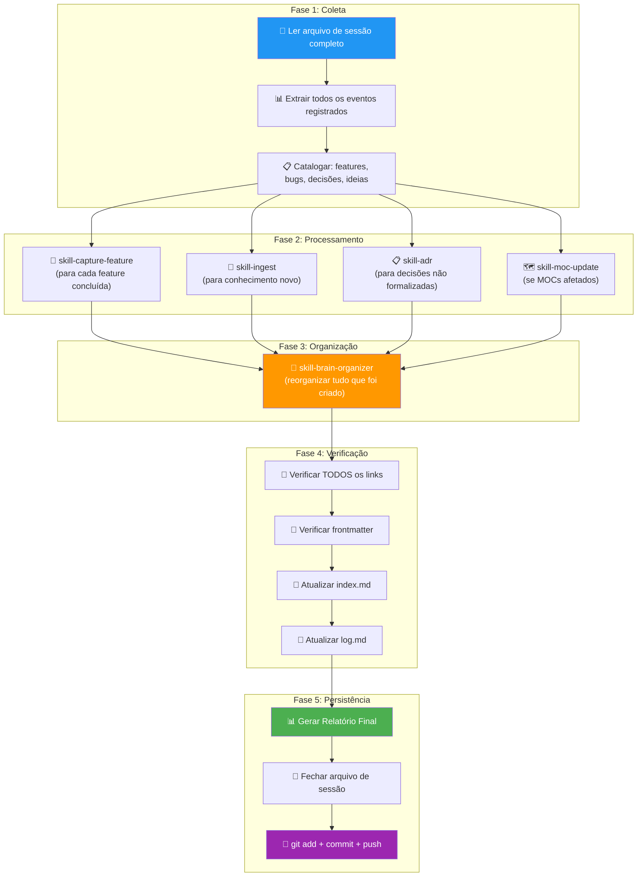

# Skill: Session Close

## Context

Esta skill é o **guardião do encerramento**. Quando o programador decide parar de trabalhar, o cérebro não pode simplesmente "desligar" — ele precisa consolidar, organizar, verificar e persistir TUDO o que foi gerado durante a sessão.

Uma sessão que não é fechada corretamente é como um livro sem último capítulo: o conhecimento existe em rascunhos espalhados, links podem estar quebrados, o índice não reflete o novo estado, e a próxima sessão começa com informação incompleta.

> 🎯 **Princípio**: O `skill-session-close` garante que quando o programador abrir o projeto amanhã, o `skill-session-boot` terá um estado completo, organizado e preciso para carregar.

> ⚠️ **Regra**: NUNCA fazer commit sem antes ter executado todo o pipeline de encerramento. O commit é o ÚLTIMO passo, não o primeiro.

---

## Pipeline de Encerramento



---

## Steps

### Fase 1: Coleta — Processar o Arquivo de Sessão

1. **Ler o arquivo de sessão ativo** em `07-Raw/sessions/YYYY-MM-DD-*.md`.

2. **Extrair e catalogar todos os eventos** da timeline:

   ```markdown
   ## Catálogo de Eventos da Sessão
   
   | # | Hora | Tipo | Descrição | Status |
   |---|---|---|---|---|
   | 1 | 14:23 | 💡 Ideia | Cache Redis para laudos | ⏳ Draft criado |
   | 2 | 14:35 | 🔧 Alteração | Refatoração LaudoController | ✅ Concluído |
   | 3 | 15:10 | 🐛 Bug | NPE ao gerar pré-laudo sem imagem | ✅ Corrigido |
   | 4 | 15:45 | 🏗️ Feature | Listagem de laudos com paginação | ✅ Implementado |
   | 5 | 16:20 | 📋 Decisão | Usar Redis para cache | ⏸️ Pendente análise |
   ```

3. **Separar por categoria**:
   - **Features concluídas** → Processar com `skill-capture-feature`
   - **Conhecimento novo** (conceitos, padrões, lições) → Processar com `skill-ingest`
   - **Decisões tomadas** → Verificar se tem ADR, criar se necessário
   - **Ideias registradas** → Verificar se estão em `01-Negocio/inbox/` como drafts
   - **Bugs corrigidos** → Verificar se estão no catálogo de erros
   - **Pendências** → Listar para o próximo boot

### Fase 2: Processamento — Executar Skills de Consolidação

4. **Para cada feature concluída** — Executar `skill-capture-feature`:
   - Verificar se o changelog foi criado em `07-Raw/codebase/changelog/`
   - Verificar se as pages da wiki foram atualizadas
   - Verificar se padrões novos foram extraídos para `03-Codebase/patterns/`

5. **Para cada bloco de conhecimento novo** — Executar `skill-ingest`:
   - Conceitos técnicos discutidos que não existiam na wiki
   - Lições aprendidas de bugs resolvidos
   - Padrões de código descobertos
   - Informações sobre dependências/upgrades

6. **Para cada decisão não formalizada** — Verificar se precisa de ADR:
   - A decisão afeta a arquitetura do sistema?
   - A decisão muda um padrão existente?
   - A decisão afeta segurança ou LGPD?
   - Se sim a qualquer um → `skill-adr`

7. **Atualizar MOCs** — Se qualquer cluster de conhecimento foi afetado:
   - Executar `skill-moc-update` para os MOCs tocados
   - Verificar se novos conceitos precisam ser incluídos nos MOCs

### Fase 3: Organização — Garantir Integridade

8. **Executar `skill-brain-organizer`** — Antes de qualquer commit:
   - Verificar que todos os novos arquivos estão na pasta correta
   - Verificar frontmatter de todos os arquivos novos/modificados
   - Verificar e corrigir links quebrados
   - Remover arquivos órfãos (se houver)
   - Atualizar automaticamente o `index.md`

### Fase 4: Verificação — Checklist Final

9. **Verificação de Links** — Varrer TODOS os arquivos modificados na sessão:
   - Cada `[[link]]` aponta para um arquivo que existe?
   - Cada arquivo novo tem backlinks de pelo menos 1 outro arquivo?
   - O `index.md` tem links para todos os novos arquivos?
   
   ```
   🔗 Verificação de Links
   - Links verificados: [N]
   - Links OK: [N]
   - Links quebrados: [N] → [lista e correção]
   - Arquivos órfãos: [N] → [lista e ação]
   ```

10. **Verificação de Frontmatter** — Cada arquivo novo/modificado tem:
    - `title` preenchido?
    - `type` correto?
    - `tags` presentes (1-5)?
    - `last_updated` com a data de hoje?
    - `sources` linkado (se aplicável)?

11. **Atualizar `index.md`**:
    - Adicionar linhas para novos ADRs, patterns, snapshots, skills
    - Atualizar contadores na seção Stats
    - Verificar que todos os links no index apontam para paths corretos

12. **Atualizar `log.md`** — Append com resumo da sessão:
    ```markdown
    ## [YYYY-MM-DD HH:MM] session-close | Sessão de [N]h[MM]min
    Features: [lista]. Bugs: [N]. Decisões: [N]. Ideias: [N] drafts.
    Arquivos criados: [N]. Atualizados: [N]. Cross-refs: [N].
    ```

### Fase 5: Persistência — Relatório e Commit

13. **Gerar Relatório Final da Sessão** (ver formato abaixo).

14. **Fechar o arquivo de sessão** — Atualizar o header:
    ```yaml
    end_time: "HH:MM"
    status: closed
    duration: "Xh YYmin"
    ```
    
    Adicionar seção `## Resumo Final`:
    ```markdown
    ## Resumo Final
    
    ### O que foi feito
    [Lista das features, bugs, e mudanças]
    
    ### O que ficou pendente
    [Lista de pendências para a próxima sessão]
    
    ### Métricas
    | Métrica | Valor |
    |---|---|
    | Duração | [Xh YYmin] |
    | Eventos registrados | [N] |
    | Features concluídas | [N] |
    | Bugs corrigidos | [N] |
    | Arquivos do cérebro criados | [N] |
    | Arquivos do cérebro atualizados | [N] |
    | ADRs criados | [N] |
    | Cross-references adicionados | [N] |
    ```

15. **Preparar Git Commit & Push**:

    **Passo 15.1 — Apresentar resumo e pedir confirmação**:
    Apresente ao usuário um breve resumo do que será commitado e PERGUNTE se ele deseja prosseguir com o commit e push.
    **PARE AQUI E ESPERE A RESPOSTA DO USUÁRIO**.

    **Passo 15.2 — Após aprovação do usuário, fazer o stage**:
    ```bash
    cd c:\Projetos\Tila\Tila_Brain
    git add .
    ```

    **Passo 15.3 — Commit com mensagem semântica**:
    ```bash
    git commit -m "brain: session [YYYY-MM-DD] — [resumo em 1 linha]

    Features: [lista curta]
    Bugs: [lista curta]
    ADRs: [lista curta]

    Arquivos: [N] criados, [N] atualizados
    Sessão: [duração] | [N] eventos registrados"
    ```

    **Passo 15.4 — Push para o remoto**:
    ```bash
    git push origin main
    ```

    **Passo 15.5 — Reportar resultado ao programador**:
    ```
    🔀 Git: commit [hash curto] pushed to origin/main ✅
    ```

    **Se o push falhar** (conflito, rede, etc.):
    - Registrar o erro no log
    - Alertar o programador com a mensagem de erro
    - Manter o commit local (já feito) — o push pode ser refeito manualmente
    - NÃO tentar resolver conflitos de merge automaticamente — requer atenção humana

---

## Output Format — Relatório Final

```markdown
## 📊 Relatório de Sessão — YYYY-MM-DD

### ⏱️ Duração: [X]h [YY]min ([HH:MM] → [HH:MM])

---

### ✅ Features Concluídas
1. **[Feature 1]** — [descrição curta] → Changelog: `07-Raw/codebase/changelog/[arquivo]`
2. **[Feature 2]** — [descrição curta] → Wiki: `04-Wiki_Conceitos/conceitos/[arquivo]`

### 🐛 Bugs Corrigidos
1. **[Bug 1]** — [causa raiz] → Catálogo atualizado em skill-dev-assistant

### 📋 Decisões Tomadas
1. **[Decisão 1]** — [veredicto] → ADR: `02-Arquitetura_ADRs/[arquivo]`

### 💡 Ideias Registradas
1. **[Ideia 1]** — Draft em `01-Negocio/inbox/[arquivo]`

### ⏸️ Pendências para Próxima Sessão
- [ ] [Pendência 1]
- [ ] [Pendência 2]

---

### 🧠 Impacto no Cérebro
| Métrica | Antes | Depois | Delta |
|---|---|---|---|
| Permanent Notes | [N] | [N] | +[N] |
| Patterns | [N] | [N] | +[N] |
| ADRs | [N] | [N] | +[N] |
| Wiki Pages | [N] | [N] | +[N] |
| Cross-references | [N] | [N] | +[N] |

### 🔗 Integridade
- Links verificados: [N] ✅
- Frontmatter completo: [N]/[N] ✅
- Arquivos órfãos: [N]

### 🔀 Git
- Commit: `[hash curto]`
- Mensagem: `[mensagem]`
- Push: ✅ OK / ❌ Falhou — [motivo]

---

> 🔴 **Sessão encerrada**. Próximo boot carregará este estado automaticamente.
```

---

## Rules

### Obrigatoriedade
- Esta skill é **OBRIGATÓRIA** ao final de toda sessão de programação.
- Se o programador fechar o IDE sem `/close`, o agente DEVE alertar na próxima sessão (via `skill-session-boot`).
- O programador pode pedir `/close` a qualquer momento — não precisa ter implementado nada.

### Ordenação
- O pipeline de encerramento DEVE ser executado na ordem exata: Coleta → Processamento → Organização → Verificação → Persistência.
- NUNCA fazer commit antes da organização e verificação.
- NUNCA pular a verificação de links.

### Commit
- A mensagem de commit DEVE ser semântica e descritiva.
- Prefixo: `brain:` para mudanças no Tila_Brain.
- O commit só inclui arquivos do `Tila_Brain/` — código do backend/frontend tem seu próprio fluxo de commit.
- Se o programador também alterou código (backend/frontend), sugerir commits separados.

### Sessões Vazias
- Se a sessão não produziu nenhuma mudança no cérebro (apenas leitura/consulta):
  - Ainda assim fechar o arquivo de sessão com `status: closed`
  - Log: `## [YYYY-MM-DD HH:MM] session-close | Sessão de leitura — sem mudanças no cérebro`
  - Não fazer commit (nada mudou)

### Segurança
- ANTES do commit, verificar que nenhum secret, API key, ou dado sensível está nos arquivos.
- Se encontrar, ALERTAR e NÃO commitar até que o programador remova.

---

## Referências

### Skills Executadas pelo Close
- [[05-Skills_Agentes/skill-capture-feature]] — Para cada feature concluída
- [[05-Skills_Agentes/skill-ingest]] — Para conhecimento novo
- [[05-Skills_Agentes/skill-adr]] — Para decisões não formalizadas
- [[05-Skills_Agentes/skill-moc-update]] — Para MOCs afetados
- [[05-Skills_Agentes/skill-brain-organizer]] — Organização final
- [[05-Skills_Agentes/skill-lint]] — Verificação de integridade

### Arquivos Atualizados
- [[index.md]] — Catálogo atualizado
- [[log.md]] — Entrada de encerramento
- [[07-Raw/sessions/]] — Arquivo de sessão fechado

## Backlinks
- [[CLAUDE.md]] — Fluxo do programador (§4)
- [[05-Skills_Agentes/skill-session-boot]] — Carrega o que o close persistiu
- [[05-Skills_Agentes/skill-session-recorder]] — Produz o que o close processa
