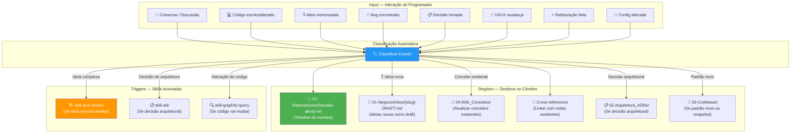
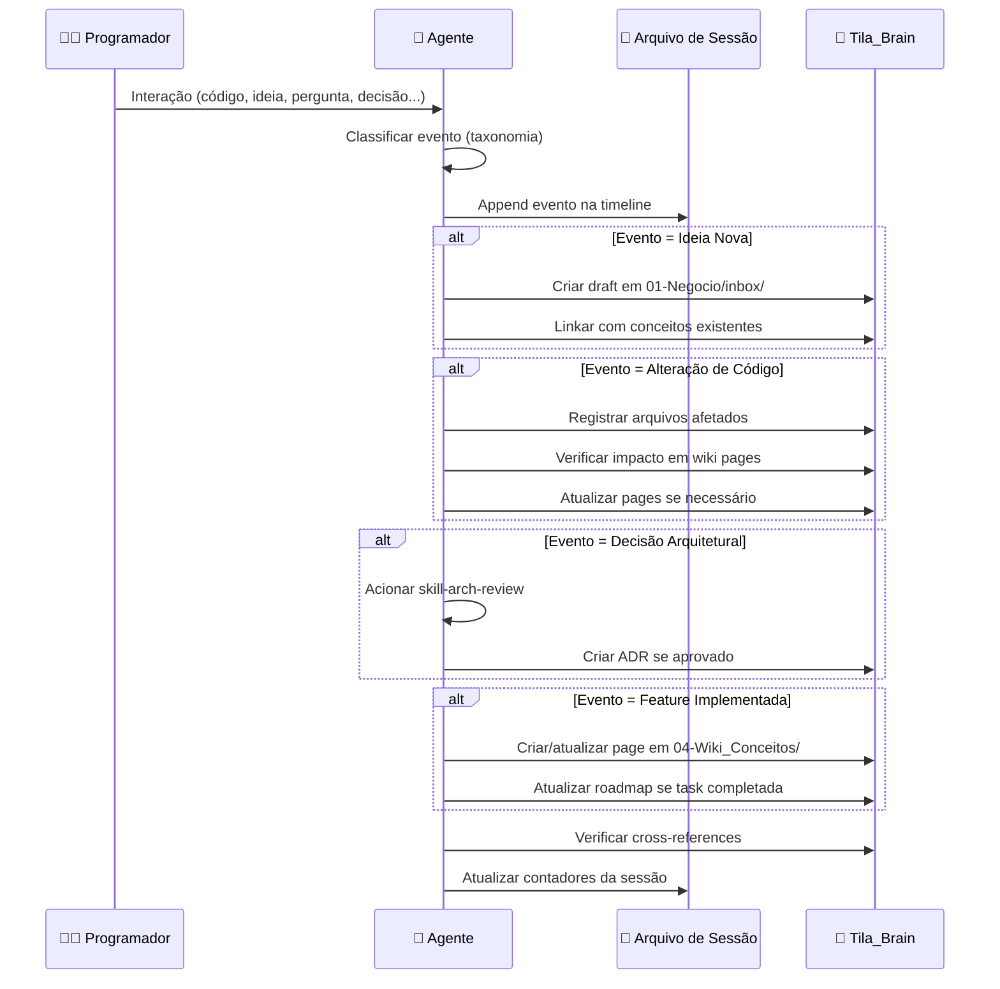

# Skill: Session Recorder

## Context

O Session Recorder é a **memória de trabalho** do Tila_Brain. Ele é o skill que garante que o cérebro nunca "esquece" nada. Cada interação entre o programador e o agente é analisada, classificada e registrada de forma estruturada.

Sem este skill, o cérebro seria apenas uma coleção estática de documentos. Com ele, o cérebro se torna um **sistema vivo** que cresce organicamente com cada sessão de trabalho.

> 🎯 **Princípio Fundamental**: Se aconteceu durante a sessão e não foi registrado, é como se nunca tivesse acontecido. O recorder é a garantia de que o contexto NUNCA se perde.

> ⚠️ **Regra de Ouro**: O recorder NUNCA deve perguntar "devo registrar isso?" — ele registra TUDO. A filtragem e organização é responsabilidade do `skill-brain-organizer` no final da sessão.

---

## Arquitetura do Recorder



---

## Taxonomia de Eventos

O recorder classifica cada interação em uma das seguintes categorias. Cada categoria tem um emoji, um formato de registro, e ações específicas que devem ser executadas no cérebro.

### Tabela de Classificação

| Emoji | Categoria | Descrição | Ações no Cérebro |
|---|---|---|---|
| 💡 | **Ideia** | Ideia nova mencionada pelo programador ou gerada pelo agente | 1. Registrar na timeline de sessão. 2. Criar draft em `01-Negocio/inbox/` com slug descritivo. 3. Linkar com conceitos existentes. |
| 🏗️ | **Feature** | Feature discutida, planejada ou implementada | 1. Registrar na timeline. 2. Criar/atualizar página em `04-Wiki_Conceitos/`. 3. Se implementada, acionar `skill-capture-feature`. |
| 🔧 | **Alteração** | Arquivo de código criado, modificado ou deletado | 1. Registrar na timeline com lista de arquivos. 2. Atualizar snapshot se mudança significativa. 3. Verificar se afeta páginas existentes na wiki. |
| 🐛 | **Bug** | Bug encontrado, diagnosticado ou corrigido | 1. Registrar na timeline com sintoma, causa e solução. 2. Atualizar catálogo de erros no `skill-dev-assistant`. 3. Se bug resolvido, documentar lição aprendida. |
| 📋 | **Decisão** | Decisão técnica ou de produto tomada durante a sessão | 1. Registrar na timeline. 2. Se arquitetural, acionar `skill-adr`. 3. Se viola ADR existente, ALERTAR. |
| 💭 | **Discussão** | Debate, brainstorm, ou análise que não resulta em ação imediata | 1. Registrar na timeline com pontos-chave. 2. Se gerar ideias, criar drafts. 3. Linkar com conceitos discutidos. |
| ⚡ | **Refatoração** | Melhoria de código sem mudança funcional | 1. Registrar na timeline com antes/depois. 2. Atualizar patterns em `03-Codebase/patterns/` se padrão novo. 3. Atualizar snapshot se estrutura mudou. |
| 🎨 | **UI/UX** | Mudança visual: ícones, cores, layout, componentes, estilos | 1. Registrar na timeline com descrição visual. 2. Atualizar `04-Wiki_Conceitos/conceitos/frontend-architecture.md`. 3. Se novo componente, criar/atualizar page. |
| 🔒 | **Segurança** | Mudança que afeta segurança, LGPD, autenticação | 1. Registrar na timeline com flag CRÍTICO. 2. OBRIGATÓRIO atualizar `01-Negocio/contexto/security-lgpd.md`. 3. Acionar `skill-adr` se decisão de segurança. |
| 📦 | **Dependência** | Pacote adicionado, atualizado ou removido | 1. Registrar na timeline. 2. Atualizar entity page da stack (spring-boot-backend ou angular-frontend). 3. Se breaking change, acionar `skill-adr`. |
| 🔄 | **Config** | Mudança em configuração (application.properties, environment, docker, etc.) | 1. Registrar na timeline. 2. Verificar se secret foi exposto (ALERTAR se sim). 3. Atualizar page de infra se necessário. |
| 📝 | **Documentação** | Documentação escrita, atualizada ou corrigida | 1. Registrar na timeline. 2. Verificar links e frontmatter. |

---

## Steps — Fluxo Contínuo

O recorder **NÃO tem steps sequenciais** como outras skills. Ele opera como um **loop contínuo** durante toda a sessão. A cada interação significativa, ele executa o ciclo abaixo:

### Ciclo por Evento



### Detalhamento do Ciclo

#### 1. Detectar Evento
A cada mensagem do programador ou ação do agente, analisar:
- O programador mencionou algo novo que não existe no cérebro?
- O agente alterou algum arquivo de código?
- Uma decisão foi tomada (explícita ou implícita)?
- Um bug foi encontrado ou corrigido?
- Uma feature foi discutida, planejada ou implementada?
- Houve mudança visual (ícone, cor, layout)?
- Uma nova dependência foi adicionada?
- Uma configuração foi alterada?

#### 2. Classificar com Taxonomia
Atribuir o emoji e a categoria correta da tabela acima.
Se um evento se encaixa em mais de uma categoria, registrar com a categoria PRIMÁRIA e mencionar as secundárias.

#### 3. Registrar na Timeline de Sessão
Append no arquivo de sessão ativo (`07-Raw/sessions/YYYY-MM-DD-*.md`) com o formato:

```markdown
### [HH:MM] [EMOJI] [Título curto do evento]

**Categoria**: [categoria]
**Descrição**: [descrição detalhada do que aconteceu]
**Arquivos afetados**: [lista de arquivos se aplicável]
**Decisão tomada**: [sim/não — se sim, qual]
**Conexões**: [[link-para-conceito-existente]], [[link-para-ADR]]

> [Contexto adicional, citações do programador, raciocínio do agente]
```

#### 4. Executar Ações no Cérebro
Conforme a tabela de classificação, executar as ações correspondentes:

**Para Ideias Novas**:
```markdown
# Arquivo: 01-Negocio/inbox/[slug]-DRAFT.md

---
title: "[Título como tese/afirmação]"
type: draft
date: YYYY-MM-DD
origin: session-[data]-[hora]
status: pending-gate
tags: [tags relevantes]
---

# [Título]

## Contexto
[De onde surgiu esta ideia — qual discussão, qual problema sendo resolvido]

## Ideia
[Descrição detalhada da ideia]

## Implicações
[O que muda se implementarmos isso]

## Conexões
- [[conceito-relacionado-1]]
- [[conceito-relacionado-2]]

## Status
⏳ Pendente — aguardando validação via skill-gate-validacao
```

**Para Alterações de Código**:
- Listar todos os arquivos criados/modificados/deletados
- Para cada arquivo, registrar:
  - Path completo
  - O que foi alterado (resumo em 1-2 linhas)
  - Por que foi alterado (justificativa técnica)
- Verificar se alguma page da wiki referencia esse arquivo e precisa ser atualizada
- Se uma nova entity/endpoint/component foi criada, criar/atualizar a page correspondente

**Para Features**:
- Se a feature é nova e não existe no cérebro:
  - Criar page em `04-Wiki_Conceitos/conceitos/[feature-slug].md`
  - Linkar com entidades, endpoints e patterns relacionados
- Se a feature já existe:
  - Atualizar a page existente com o novo status
  - Adicionar qualquer informação nova descoberta
- Se a feature completa um item do roadmap:
  - Atualizar `01-Negocio/contexto/roadmap.md` marcando `[x]`

**Para Bugs**:
```markdown
### Bug: [Título]
- **Sintoma**: [O que o programador viu]
- **Causa Raiz**: [Por que aconteceu]
- **Solução**: [O que foi feito para corrigir]
- **Arquivos afetados**: [lista]
- **Lição aprendida**: [O que este bug ensina]
```
- Atualizar o catálogo de erros em `skill-dev-assistant.md`

#### 5. Manter Cross-References
A cada novo registro, verificar:
- O conceito mencionado tem page na wiki? Se sim, linkar com `[[caminho]]`.
- A page existente precisa de backlink para o novo registro? Se sim, adicionar.
- Algum MOC precisa ser atualizado? Se sim, anotar para o `skill-brain-organizer`.

#### 6. Atualizar Contadores da Sessão
No header do arquivo de sessão, manter contadores atualizados:

```markdown
## Contadores da Sessão
| Métrica | Valor |
|---|---|
| Total de eventos | [N] |
| Ideias registradas | [N] |
| Alterações de código | [N] |
| Bugs encontrados | [N] |
| Decisões tomadas | [N] |
| Features discutidas | [N] |
| Arquivos do cérebro criados | [N] |
| Arquivos do cérebro atualizados | [N] |
| Cross-references adicionados | [N] |
```

---

## Regras de Captura — O Que NÃO Deixar Passar

### Captura Obrigatória (NUNCA ignorar)
- ✅ **Toda ideia mencionada** — mesmo que pareça pequena ou casual
- ✅ **Todo arquivo de código alterado** — cada create, modify, delete
- ✅ **Toda decisão tomada** — explícita ("vamos usar X") ou implícita (agente escolheu X sem discutir)
- ✅ **Todo bug encontrado** — mesmo que seja corrigido imediatamente
- ✅ **Toda feature discutida** — mesmo que não seja implementada nesta sessão
- ✅ **Toda mudança visual** — ícone, cor, fonte, layout, posição de elemento
- ✅ **Toda nova dependência** — pacote npm, dependência Maven, plugin
- ✅ **Toda alteração de configuração** — properties, environment, docker, nginx
- ✅ **Todo desvio de convenção** — se o agente ou programador fez algo diferente do padrão

### Captura Opcional (Registrar se relevante)
- 🔵 Perguntas do programador que revelam gaps de conhecimento
- 🔵 Sugestões do agente que foram rejeitadas (registrar com motivo da rejeição)
- 🔵 Links externos consultados durante a sessão
- 🔵 Erros de compilação e como foram resolvidos

### NUNCA Registrar
- ❌ Dados reais de pacientes (CPF, nome, diagnóstico)
- ❌ Secrets, API keys, senhas (nem parcialmente)
- ❌ Conversas pessoais não relacionadas ao projeto

---

## Exemplos Reais de Registro

### Exemplo 1: Ideia surge durante discussão

```markdown
### [14:23] 💡 Implementar cache Redis para consultas frequentes de laudos

**Categoria**: Ideia
**Descrição**: Durante a discussão sobre performance da listagem de laudos, o Ryan mencionou que a query de laudos recentes é executada a cada acesso ao dashboard. Surgiu a ideia de usar Redis para cachear os laudos dos últimos 30 minutos.
**Conexões**: [[04-Wiki_Conceitos/conceitos/redis-cache-patterns]], [[02-Arquitetura_ADRs/ADR-005-redis-cache-strategy]]
**Ação**: Draft criado em `01-Negocio/inbox/redis-cache-laudos-recentes-DRAFT.md`

> Ryan: "Toda vez que abro o dashboard, demora uns 3 segundos pra carregar. Será que dá pra cachear isso?"
> Agente: "Sim, podemos usar Redis com TTL de 30 minutos para a query de laudos recentes. Vou registrar como ideia e analisar o blast radius antes de implementar."
```

### Exemplo 2: Alteração de código

```markdown
### [14:35] 🔧 Refatoração do LaudoController para usar GenericResult

**Categoria**: Alteração
**Descrição**: O endpoint GET /laudos retornava List<Laudo> diretamente. Refatorado para retornar ResponseEntity<GenericResult<List<LaudoResponseDTO>>>.
**Arquivos afetados**:
- `Tila_BackEnd/tila/src/main/java/br/com/tila/controller/LaudoController.java` — modificado
- `Tila_BackEnd/tila/src/main/java/br/com/tila/dto/LaudoResponseDTO.java` — criado
**Decisão tomada**: Sim — seguir ADR-002 para padronização de responses
**Conexões**: [[02-Arquitetura_ADRs/ADR-002-genericresult-envelope-universal]], [[03-Codebase/patterns/padrão-genericresult]]

> Antes: `return laudoService.findAll();`
> Depois: `return ResponseEntity.ok(GenericResult.success(laudoService.findAll().stream().map(LaudoResponseDTO::fromEntity).toList()));`
```

### Exemplo 3: Bug encontrado e corrigido

```markdown
### [15:10] 🐛 NPE ao gerar pré-laudo sem imagem de exame

**Categoria**: Bug
**Descrição**: O endpoint POST /laudos/gerar lançava NullPointerException quando o exame não tinha imagem associada. O LaudoService não verificava se `exame.getUrlImagem()` era null antes de tentar carregar a imagem.
**Sintoma**: HTTP 500 no Postman ao enviar request com exameId válido mas sem imagem
**Causa Raiz**: `carregarImagemExame(exame.getUrlImagem())` chamado sem null check
**Solução**: Adicionado verificação `if (exame.getUrlImagem() == null || exame.getUrlImagem().isBlank())` com mensagem de erro clara
**Arquivos afetados**:
- `LaudoService.java` — adicionado null check na linha 87
**Lição aprendida**: Sempre validar inputs nullable antes de operações que dependem deles. Exames podem existir sem imagem em estágios iniciais do workflow.
**Conexões**: [[03-Codebase/patterns/padrão-genericresult]] (erro retornado via GenericResult.error)

> Atualizado: Catálogo de erros em skill-dev-assistant.md com esta nova entrada.
```

---

## Integração com Outras Skills

### Skills Acionadas Automaticamente pelo Recorder

| Condição | Skill Acionada | Motivo |
|---|---|---|
| Ideia complexa que afeta arquitetura | `skill-arch-review` | Analisar viabilidade e impacto antes de codificar |
| Decisão arquitetural tomada | `skill-adr` | Formalizar a decisão como ADR |
| Código vai ser alterado | `skill-graphify-query` | Verificar blast radius |
| Feature implementada | `skill-capture-feature` | Registrar a feature no brain |
| Desvio de convenção detectado | `skill-dev-assistant` | Alertar sobre violação |
| Novo conceito técnico | `skill-ingest` | Ingerir o conceito na wiki |

### Skills que Alimentam o Recorder

| Skill | O que fornece |
|---|---|
| `skill-session-boot` | O arquivo de sessão ativo (path) |
| `skill-dev-assistant` | Alertas de violação para registrar |
| `skill-arch-review` | Resultado da análise (approve/reject) para registrar |

---

## Referências

- [[05-Skills_Agentes/skill-session-boot]] — Cria o arquivo de sessão
- [[05-Skills_Agentes/skill-session-close]] — Fecha o arquivo de sessão
- [[05-Skills_Agentes/skill-brain-organizer]] — Organiza tudo que foi criado
- [[05-Skills_Agentes/skill-dev-assistant]] — Governança de código
- [[05-Skills_Agentes/skill-capture-feature]] — Captura de features
- [[05-Skills_Agentes/skill-ingest]] — Ingestão de conhecimento
- [[CLAUDE.md]] — Regras operacionais

## Backlinks
- [[CLAUDE.md]] — Fluxo do programador (§4)
- [[05-Skills_Agentes/skill-session-boot]] — Cria o que o recorder consome
- [[05-Skills_Agentes/skill-session-close]] — Consome o que o recorder produziu
