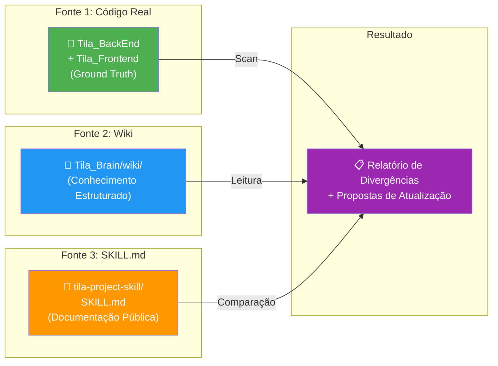
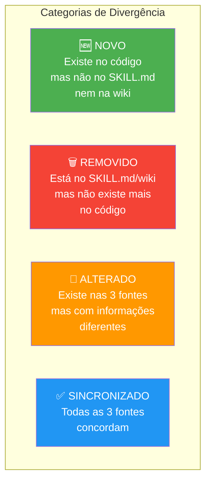

# Skill: Update TILA Skill

## Context

O arquivo `SKILL.md` (localizado em `c:\Projetos\Tila\tila-project-skill\SKILL.md`) é o **cartão de visita técnico** do projeto TILA. Ele deve refletir o estado real do codebase a qualquer momento. Quando um agente externo (ou o próprio time) lê o SKILL.md, ele deve ter uma foto fiel da aplicação.

Esta skill faz uma **auditoria tri-way** comparando três fontes de verdade:



> ⚠️ **O código é a fonte de verdade** — se o SKILL.md ou a wiki dizem algo diferente do código real, o código vence. A wiki e o SKILL.md são ajustados para refletir o código, nunca o contrário.

---

## Quando Executar

Esta skill é acionada em 3 cenários:

| Cenário | Quem Aciona | Trigger |
|---|---|---|
| Após feature completada | [[skills/skill-capture-feature]] (automático) | Chamada encadeada |
| Humano pede explicitamente | Humano | `"update tila skill"` / `"atualizar skill"` |
| Auditoria periódica | [[skills/skill-lint]] (durante lint) | Verificação de stale |

---

## Pre-flight Checklist

- [ ] O arquivo SKILL.md existe em `c:\Projetos\Tila\tila-project-skill\SKILL.md`?
  - Se não existir: criar novo usando o Template (ver seção abaixo).
- [ ] O agente tem acesso de leitura aos repositórios `Tila_BackEnd` e `Tila_Frontend`?
- [ ] As páginas da wiki estão atualizadas? (Se a última ingestão foi há mais de 1 semana, considerar rodar [[skills/skill-ingest]] primeiro.)

---

## Steps — Procedimento Completo

### Step 1: Scan do Backend

Ler o estado real do repositório `c:\Projetos\Tila\Tila_BackEnd\tila\`:

#### 1.1 Inventário de Controllers e Endpoints

**Procedimento de scan**:
```
1. Listar todos os arquivos em src/main/java/**/controller/
2. Para cada Controller:
   - Identificar @RestController e @RequestMapping (base path)
   - Listar cada método anotado com @GetMapping, @PostMapping, @PutMapping, @DeleteMapping, @PatchMapping
   - Anotar: HTTP method, path completo, parâmetros, DTO de request/response
   - Verificar se tem controle de acesso (@PreAuthorize, check de role)
```

**Formato de registro**:
```markdown
| Método | Path | Request DTO | Response DTO | Auth | Status |
|---|---|---|---|---|---|
| POST | /auth/login | LoginDTO | TokenDTO | Público | ✅ Ativo |
| POST | /laudo/gerar | LaudoGeracaoRequestDTO | LaudoResponseDTO | ROLE_MEDICO | ✅ Ativo |
```

#### 1.2 Inventário de Entidades JPA

**Procedimento de scan**:
```
1. Buscar todas as classes anotadas com @Entity
2. Para cada entidade:
   - Nome da classe e nome da tabela (@Table)
   - Campos com tipos e anotações de validação
   - Relações (ManyToOne, OneToMany, etc.)
   - Lifecycle callbacks (@PrePersist, @PreUpdate)
   - Enums associados
```

#### 1.3 Inventário de Services

**Procedimento de scan**:
```
1. Buscar todas as classes anotadas com @Service
2. Para cada service:
   - Dependências injetadas (constructor params)
   - Métodos públicos (interface do serviço)
   - Tipo de injeção usado (constructor vs @Autowired)
```

#### 1.4 Configuração de Segurança

**Itens a verificar**:
```
- SecurityFilterChain: paths públicos, paths protegidos, roles
- JWT: algoritmo, expiração, transporte (cookie vs header)
- CORS: origens permitidas
- Secrets: todos via ${ENV_VAR}? Algum hardcoded?
```

#### 1.5 Configuração do Pipeline de IA

**Itens a verificar**:
```
- TilaRagConfig: beans configurados e versões dos modelos
- ChatModel: nome do modelo, temperatura
- EmbeddingModel: nome do modelo, dimensões
- EmbeddingStore: host, porta, tabela, dimensões
- ContentRetriever: maxResults, minScore
- Agentes/interfaces @AiService: existem? Quais métodos?
- Prompts: onde estão armazenados?
```

#### 1.6 Dependências Maven

**Itens a verificar**:
```
- Spring Boot: versão
- Java: versão
- LangChain4j: versão (BOM)
- PostgreSQL driver: versão
- Outras dependências significativas: auth0-jwt, lombok, etc.
```

---

### Step 2: Scan do Frontend

Ler o estado real do repositório `c:\Projetos\Tila\Tila_Frontend\`:

#### 2.1 Inventário de Componentes

**Procedimento de scan**:
```
1. Listar todos os arquivos *.component.ts
2. Para cada componente:
   - Nome e tipo (página vs compartilhado)
   - É standalone?
   - Usa Signals?
   - Usa modern control flow (@if, @for)?
```

#### 2.2 Inventário de Rotas

**Procedimento de scan**:
```
1. Ler app.routes.ts
2. Mapear: path, componente, guard, lazy loading
```

#### 2.3 Inventário de Services Angular

**Procedimento de scan**:
```
1. Listar todos os arquivos *.service.ts
2. Para cada service:
   - Endpoints consumidos (URLs de API)
   - Usa inject() ou constructor injection?
   - URLs hardcoded ou environment?
```

#### 2.4 Padrões de Estado

**Itens a verificar**:
```
- Quantos componentes usam signal()?
- Quantos usam propriedades plain?
- Existe algum Subject/BehaviorSubject (RxJS legacy)?
```

---

### Step 3: Leitura da Wiki

Ler as páginas relevantes do Tila_Brain para a comparação tri-way:

| Página Wiki | O que contém | Para que comparar |
|---|---|---|
| [[wiki/concepts/api-endpoints]] | Endpoints documentados na wiki | vs endpoints reais no código |
| [[wiki/concepts/backend-services]] | Services documentados | vs services reais |
| [[wiki/concepts/frontend-architecture]] | Componentes e rotas documentados | vs componentes reais |
| [[wiki/concepts/data-model]] | Entidades documentadas | vs entities reais |
| [[wiki/entities/spring-boot-backend]] | Stack e versões documentadas | vs pom.xml real |
| [[context/ai-pipeline]] | Pipeline de IA documentado | vs TilaRagConfig real |

---

### Step 4: Comparação Tri-Way e Detecção de Divergências

Para cada item escaneado, comparar as 3 fontes e categorizar:



**Template de relatório de divergência**:

```markdown
## Relatório de Divergências

### 🆕 Novos (no código, ausentes na documentação)
| Item | Tipo | Localização no Código | Ação Proposta |
|---|---|---|---|
| POST /laudo/gerar | Endpoint | LaudoController.java:27 | Adicionar ao SKILL.md §3 e wiki/api-endpoints |
| LaudoService.gerarPreLaudo() | Service | LaudoService.java:58 | Adicionar ao SKILL.md §5 e wiki/backend-services |

### 🗑️ Removidos (na documentação, ausentes no código)
| Item | Tipo | Onde está documentado | Ação Proposta |
|---|---|---|---|
| text-embedding-004 | Config | ai-pipeline.md:54 | Atualizar para gemini-embedding-001 |

### 🔄 Alterados (informação desatualizada)
| Item | Código Diz | SKILL.md Diz | Wiki Diz | Ação Proposta |
|---|---|---|---|---|
| LangChain4j versão | 1.0.1 | 0.36.2 | 0.36.2 | Atualizar SKILL.md e wiki |
| Embedding model | gemini-embedding-001 | text-embedding-004 | text-embedding-004 | Atualizar ambos |
| ChatModel class | ChatModel | ChatLanguageModel | ChatLanguageModel | Atualizar ambos |

### ✅ Sincronizados (sem ação necessária)
- JWT: HMAC256, 1h, HttpOnly cookie ✅
- Spring Boot: 4.0.3 ✅
- Java: 21 ✅
```

---

### Step 5: Propor Atualizações por Seção

Organizar as propostas de atualização nas seções do SKILL.md. **Cada seção é apresentada individualmente ao humano para aprovação**.

#### Seções do SKILL.md

| Seção | Conteúdo | Fonte Primária |
|---|---|---|
| §1 — Identidade | Nome, missão, stack | [[context/project-identity]] |
| §2 — Stack Técnico | Versões, dependências | `pom.xml` + `package.json` |
| §3 — Endpoints REST | Tabela completa de endpoints | Scan do Backend §1.1 |
| §4 — Frontend | Componentes, rotas, padrões | Scan do Frontend |
| §5 — Services & Business Logic | Services, métodos, dependências | Scan do Backend §1.3 |
| §6 — Data Model | Entidades, relações, enums | Scan do Backend §1.2 |
| §7 — Divergências de Convenção | Anti-patterns encontrados | [[context/coding-conventions]] |
| §8 — Pipeline de IA | Agentes, modelos, RAG, prompts | Scan do Backend §1.5 |
| §9 — Sugestões de Melhoria | Bugs, refactors, tech debt | Comparação tri-way |
| §10 — Segurança | JWT, roles, LGPD, vulnerabilidades | [[context/security-lgpd]] |

**Formato da proposta para cada seção**:
```markdown
### §N — [Nome da Seção]

**Status**: 🆕 Nova / 🔄 Atualização / ✅ Sem mudanças

#### Mudanças Propostas:
1. [Mudança específica 1]
2. [Mudança específica 2]

#### Texto Proposto:
[Bloco de markdown pronto para ser colado no SKILL.md]

**Aprovar esta seção? (sim/não/ajustar)**
```

---

### Step 6: Aplicar Seções Aprovadas

1. Para cada seção aprovada pelo humano → aplicar no SKILL.md.
2. **NUNCA** aplicar uma seção sem aprovação explícita.
3. Se o humano pedir ajustes → fazer os ajustes e reapresentar.

---

### Step 7: Sincronizar Wiki

Após atualizar o SKILL.md, garantir que as páginas da wiki estejam sincronizadas:

| Se SKILL.md atualizou... | Atualizar na Wiki... |
|---|---|
| §3 (Endpoints) | [[wiki/concepts/api-endpoints]] |
| §4 (Frontend) | [[wiki/concepts/frontend-architecture]], [[wiki/concepts/angular-patterns]] |
| §5 (Services) | [[wiki/concepts/backend-services]] |
| §6 (Data Model) | [[wiki/concepts/data-model]], entity pages em `wiki/entities/` |
| §7 (Divergências) | [[context/coding-conventions]] (adicionar novas violações) |
| §8 (Pipeline IA) | [[context/ai-pipeline]] |
| §9 (Melhorias) | [[context/roadmap]] |
| §10 (Segurança) | [[context/security-lgpd]] |

---

### Step 8: Atualizar Índices e Log

1. Atualizar **`index.md`** se novas páginas wiki foram criadas.
2. Append em **`log.md`**:
   ```markdown
   ## [YYYY-MM-DD HH:MM] update-skill | TILA Skill Updated
   Comparação tri-way executada. Divergências encontradas: N.
   Seções atualizadas: §3, §4, §8, etc.
   Páginas wiki sincronizadas: api-endpoints, backend-services, ai-pipeline.
   ```

---

## Exemplo Real: Divergências Encontradas em 2026-06-03

Após a sessão de desenvolvimento de 2026-06-03, as seguintes divergências existiam entre o código e a documentação:

| Item | Código Real (2026-06-03) | Wiki/SKILL.md (2026-05-16) | Tipo |
|---|---|---|---|
| LangChain4j BOM | `1.0.1` | `0.36.2` | 🔄 Alterado |
| Embedding Model | `gemini-embedding-001` | `text-embedding-004` | 🔄 Alterado |
| ChatModel class name | `ChatModel` | `ChatLanguageModel` | 🔄 Alterado |
| `LaudoService` injeta | `ChatModel` (direto) | `TilaRadiologistaAgent` (AiService) | 🔄 Alterado |
| `PacienteResponseDTO.exames` | `List<ExameResponseDTO>` | `List<Exame>` | 🔄 Alterado |
| ADR-004 | Existe | Não existia | 🆕 Novo |
| Conceito multimodal-workaround | Existe | Não existia | 🆕 Novo |
| EmbeddingStore porta | `5434` | `5433` | 🔄 Alterado |
| ContentRetriever maxResults | `8` | `7` | 🔄 Alterado |
| ContentRetriever minScore | `0.7` | Não existia | 🆕 Novo |

> ⚠️ **Estas divergências demonstram por que esta skill é essencial** — sem ela, a documentação fica stale em dias.

---

## Template do SKILL.md

Se o SKILL.md não existir, criar usando este template:

```markdown
# TILA — Tecnologia Integradora de Laudos Automatizados

## §1 — Identidade
| Campo | Valor |
|---|---|
| **Projeto** | TILA — Tecnologia Integradora de Laudos Automatizados |
| **Tipo** | Projeto Integrador ADS — 2026 |
| **Integrantes** | Ryan Cantareli de Aguiar, Pedro Henrique Oliveira Pereira |
| **Missão** | Plataforma assistida por IA para geração de pré-laudos radiológicos |

## §2 — Stack Técnico
| Camada | Tecnologia | Versão |
|---|---|---|
| Backend | Java + Spring Boot | 21 / 4.0.3 |
| Frontend | Angular + TypeScript | 19.2.x / 5.7.2 |
| Banco | PostgreSQL + pgvector | 16+ |
| IA | Google Gemini + LangChain4j | 2.5-flash / 1.0.1 |

## §3 — Endpoints REST
[Tabela gerada pelo scan]

## §4 — Frontend
[Componentes e rotas gerados pelo scan]

## §5 — Services & Business Logic
[Services e métodos gerados pelo scan]

## §6 — Data Model
[Entidades e relações geradas pelo scan]

## §7 — Divergências de Convenção
[Anti-patterns encontrados vs coding-conventions]

## §8 — Pipeline de IA
[Configuração de beans, agentes, prompts]

## §9 — Sugestões de Melhoria
[Bugs, refactors, tech debt identificados]

## §10 — Segurança
[JWT, roles, LGPD, vulnerabilidades]
```

---

## Rules

### Aprovação
- **NUNCA** escrever no SKILL.md sem aprovação explícita do humano para cada seção.
- Apresentar cada seção individualmente — não enviar tudo de uma vez.
- Se o humano rejeitar uma seção, perguntar o motivo e oferecer alternativa.

### Consistência
- Manter **consistência tripla** entre código real, wiki, e SKILL.md.
- Se encontrar divergências entre wiki e SKILL.md (sem que o código tenha mudado), atualizar a fonte desatualizada.
- Se o SKILL.md estiver mais atualizado que a wiki → atualizar a wiki.
- Se a wiki estiver mais atualizada que o SKILL.md → propor atualização do SKILL.md.

### Divergências
- Se encontrar divergências de convenção → reportar em §7 mas **NÃO corrigir** automaticamente o código.
- Verificar se endpoints novos têm auth requirements documentados — se não, **flaggar como gap de segurança**.
- Se uma entidade JPA não tem entity page na wiki → flaggar para criação.

### Integridade
- Se o SKILL.md do projeto não existir → criar novo usando o Template.
- O scan deve ser **completo** — não pular nenhum controller, service, ou componente.
- Sempre comparar versões de dependências (Maven BOM, npm packages) com o que está documentado.

---

## Referências Internas

### Skills que Acionam Esta
- [[skills/skill-capture-feature]] — Aciona após feature completada
- [[skills/skill-dev-assistant]] — Aciona no pós-desenvolvimento
- [[skills/skill-lint]] — Aciona durante verificação de saúde

### Skills que Esta Aciona
- [[skills/skill-ingest]] — Se divergências revelam fontes novas de conhecimento
- [[skills/skill-adr]] — Se o scan revela decisões não documentadas

### Context Files
- [[context/project-identity]] — Para §1 (Identidade)
- [[context/coding-conventions]] — Para §7 (Divergências)
- [[context/security-lgpd]] — Para §10 (Segurança)
- [[context/ai-pipeline]] — Para §8 (Pipeline de IA)
- [[context/roadmap]] — Para §9 (Sugestões de Melhoria)

### Wiki Pages Sincronizadas
- [[wiki/concepts/api-endpoints]] — Espelho do §3
- [[wiki/concepts/backend-services]] — Espelho do §5
- [[wiki/concepts/frontend-architecture]] — Espelho do §4
- [[wiki/concepts/angular-patterns]] — Espelho do §4
- [[wiki/concepts/data-model]] — Espelho do §6
- [[wiki/entities/spring-boot-backend]] — Espelho do §2

## Backlinks
- [[CLAUDE.md]] — Operating manual
- [[skills/skill-capture-feature]] — Chamada encadeada
- [[skills/skill-dev-assistant]] — Chamada pós-desenvolvimento
- [[index]] — Índice geral
- [[log]] — Log de atividades
