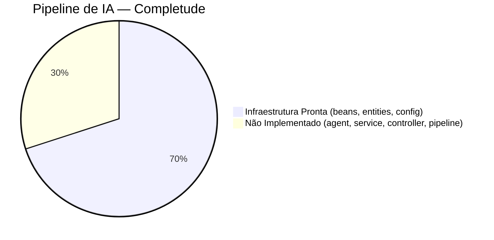
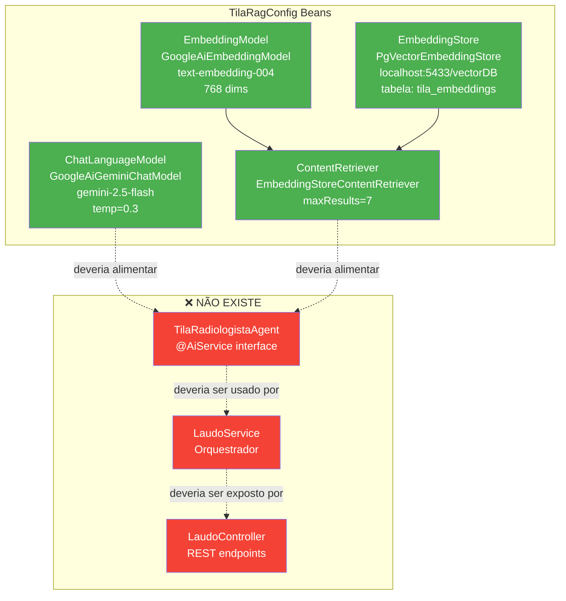
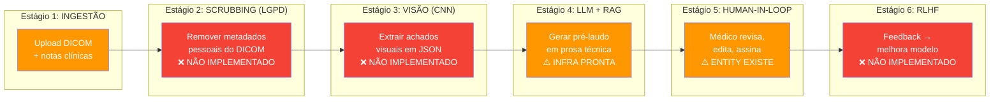

# AI Pipeline — TILA

> Auditoria exaustiva do estado real da implementação de IA em 2026-05-07.
> Cada bean, entidade e configuração foi lido diretamente do código-fonte.

---

## Status Geral



**Veredito**: A **infraestrutura** está 70% configurada (beans Spring, entidades JPA, dependências Maven), mas a **orquestração** está 0% implementada (nenhum agent, service, controller, ou pipeline conecta essas peças).

---

## O que EXISTE no Código

### 1. Configuração LangChain4j — TilaRagConfig.java

**Localização**: `tecnologi.tila.tila.ai.config.TilaRagConfig`

```java
@Configuration
public class TilaRagConfig {

    @Value("${GEMINI_API_KEY}")
    private String geminiApiKey;

    @Bean
    public ChatLanguageModel chatLanguageModel(){
        return GoogleAiGeminiChatModel.builder()
                .apiKey(geminiApiKey)
                .modelName("gemini-2.5-flash")     // ⚠️ Diferente do .properties (gemini-1.5-flash)
                .temperature(0.3)                   // Baixa criatividade — bom para laudos médicos
                .build();
    }

    @Bean
    public EmbeddingModel embeddingModel(){
        return GoogleAiEmbeddingModel.builder()
                .apiKey(geminiApiKey)
                .modelName("text-embedding-004")    // 768 dimensões
                .build();
    }

    @Bean
    public EmbeddingStore<TextSegment> embeddingStore(){
        return PgVectorEmbeddingStore.builder()
                .host("localhost")
                .port(5433)                          // ⚠️ Porta 5433 — diferente do datasource (5434)
                .database("vectorDB")
                .user(dbUser)
                .password(dbPassword)
                .table("tila_embeddings")           // Tabela específica para embeddings
                .dimension(768)                      // 768 dimensões do text-embedding-004
                .build();
    }

    @Bean
    public ContentRetriever contentRetriever(
            EmbeddingModel embeddingModel,
            EmbeddingStore<TextSegment> embeddingStore){
        return EmbeddingStoreContentRetriever.builder()
                .embeddingStore(embeddingStore)
                .embeddingModel(embeddingModel)
                .maxResults(7)                       // Top 7 resultados mais relevantes
                .build();
    }
}
```

### Diagrama de Beans Configurados



### Análise dos Beans

| Bean | Status | Modelo | Configuração | Issues |
|---|---|---|---|---|
| `ChatLanguageModel` | ✅ Configurado | gemini-2.5-flash | temperature=0.3 | ⚠️ Diverge do .properties (1.5-flash) |
| `EmbeddingModel` | ✅ Configurado | text-embedding-004 | 768 dimensões (padrão) | ✅ OK |
| `EmbeddingStore` | ✅ Configurado | PgVector | localhost:5433/vectorDB | ⚠️ Porta 5433 ≠ datasource 5434 |
| `ContentRetriever` | ✅ Configurado | EmbeddingStoreContentRetriever | maxResults=7 | ✅ OK |

### Divergência de Portas

```
application.properties:
  spring.datasource.url = jdbc:postgresql://localhost:5434/vectorDB  ← porta 5434

TilaRagConfig.java:
  PgVectorEmbeddingStore → port(5433)  ← porta 5433

Hipótese: Podem ser dois containers Docker diferentes:
  - Container 1 (porta 5433): PostgreSQL + pgvector (embeddings)
  - Container 2 (porta 5434): PostgreSQL (dados da aplicação)
  
Ou pode ser um ERRO de configuração.
```

---

### 2. Entidades JPA para IA

#### Laudo — Armazena Output da IA

```java
@Entity
@Getter @Setter @AllArgsConstructor
public class Laudo {
    @Id @GeneratedValue(strategy = GenerationType.IDENTITY)
    private Long id;

    // ===== CAMPOS PREENCHIDOS PELA IA =====
    @Column(columnDefinition = "TEXT")
    private String rascunhoIA;        // Texto bruto gerado pelo LLM

    @Column(columnDefinition = "TEXT")
    private String achadosJson;       // Achados estruturados em JSON

    @Column(columnDefinition = "TEXT")
    private String impressaoJson;     // Impressão diagnóstica em JSON

    @Column(columnDefinition = "TEXT")
    private String notaIA;            // Justificativa/reasoning da IA

    private Integer confidenceScore;   // 0-100, confiança do modelo

    // ===== CAMPOS PREENCHIDOS PELO MÉDICO =====
    @Column(columnDefinition = "TEXT")
    private String textoFinal;        // Texto revisado e aprovado

    // ===== WORKFLOW =====
    @Enumerated(EnumType.STRING)
    @Column(nullable = false)
    private StatusLaudo status = StatusLaudo.RASCUNHO;

    private String hashIntegridade;   // SHA-256 do textoFinal (não implementado)

    // ===== TIMESTAMPS =====
    private LocalDateTime dataCriacao;     // @PrePersist
    private LocalDateTime dataRevisao;     // Quando médico editou
    private LocalDateTime dataAssinatura;  // Quando médico assinou

    // ===== RELAÇÕES =====
    @ManyToOne(fetch = FetchType.LAZY)
    @JoinColumn(name = "exame_id", nullable = false)
    private Exame exame;

    @ManyToOne(fetch = FetchType.LAZY)
    @JoinColumn(name = "medico_id", nullable = false)
    private Medico medico;

    // ===== LIFECYCLE CALLBACKS =====
    @PrePersist
    protected void onPrePersist(){
        this.dataCriacao = LocalDateTime.now();
    }

    @PreUpdate
    protected void onPreUpdate(){
        if(this.status == StatusLaudo.ASSINADO && this.dataAssinatura == null){
            this.dataAssinatura = LocalDateTime.now();
        }else{
            this.dataAssinatura = LocalDateTime.now();  // ⚠️ BUG!
        }
    }
}
```

#### Fluxo de Vida de um Laudo

```mermaid
sequenceDiagram
    participant M as Médico (Frontend)
    participant LC as LaudoController ❌
    participant LS as LaudoService ❌
    participant AG as TilaRadiologistaAgent ❌
    participant CR as ContentRetriever ✅
    participant CLM as ChatLanguageModel ✅
    participant ES as EmbeddingStore ✅
    participant DB as PostgreSQL

    M->>LC: POST /api/laudos/generate/{exameId}
    LC->>LS: gerarPreLaudo(exameId, medicoId)
    LS->>DB: findById(exameId) → Exame
    LS->>AG: analisarExame(imagem, notasClinicas)
    AG->>CR: retrieve(context)
    CR->>ES: findRelevant(embedding, maxResults=7)
    ES->>DB: SELECT FROM tila_embeddings (pgvector similarity)
    DB-->>ES: Top 7 segments
    ES-->>CR: TextSegments[]
    CR-->>AG: ContentRetriever results
    AG->>CLM: generate(systemPrompt + context + query)
    CLM-->>AG: Generated text (rascunhoIA)
    AG-->>LS: AnaliseResult { achados, impressao, nota, score }
    LS->>LS: new Laudo(rascunhoIA, achadosJson, ...)
    LS->>DB: save(laudo)
    LS-->>LC: LaudoResponseDTO
    LC-->>M: GenericResult<LaudoResponseDTO>

    Note over LC,LS,AG: ❌ Estes 3 componentes NÃO EXISTEM
    Note over CR,CLM,ES: ✅ Estes 3 beans EXISTEM (configurados)
```

#### ConhecimentoMedico — Base de Conhecimento RAG

```java
@Entity
@Table(name = "conhecimento_medico")
@Getter @Setter @NoArgsConstructor @AllArgsConstructor
public class ConhecimentoMedico {
    @Id @GeneratedValue(strategy = GenerationType.IDENTITY)
    private Long id;

    @Column(nullable = false)
    private String titulo;              // Ex: "Protocolo de RX Tórax PA"

    @Column(columnDefinition = "TEXT", nullable = false)
    private String conteudo;            // Texto completo do conhecimento

    @Enumerated(EnumType.STRING)
    @Column(nullable = false)
    private CategoriaConhecimento categoriaConhecimento;

    private String tipoExameRelacionado; // Ex: "RX_TORAX", "TC_CRANIO"
    private String regiaoAnatomica;      // Ex: "TORAX", "CRANIO", "ABDOMEN"

    @Column(nullable = false, updatable = false)
    private LocalDateTime dataCriacao;

    private LocalDateTime dataAtualizacao;

    @PrePersist
    protected void onPrePersist(){
        this.dataCriacao = LocalDateTime.now();
    }

    @PreUpdate
    protected void onPreUpdate(){
        this.dataAtualizacao = LocalDateTime.now();
    }
}
```

---

### 3. Dependências Maven para IA

```xml
<!-- pom.xml — seção AI -->
<dependencyManagement>
    <dependencies>
        <dependency>
            <groupId>dev.langchain4j</groupId>
            <artifactId>langchain4j-bom</artifactId>
            <version>0.36.2</version>
            <type>pom</type>
            <scope>import</scope>
        </dependency>
    </dependencies>
</dependencyManagement>

<dependencies>
    <!-- LangChain4j Core -->
    <dependency>
        <groupId>dev.langchain4j</groupId>
        <artifactId>langchain4j-spring-boot-starter</artifactId>
    </dependency>

    <!-- Google Gemini Models -->
    <dependency>
        <groupId>dev.langchain4j</groupId>
        <artifactId>langchain4j-google-ai-gemini</artifactId>
    </dependency>

    <!-- PgVector Embedding Store -->
    <dependency>
        <groupId>dev.langchain4j</groupId>
        <artifactId>langchain4j-pgvector</artifactId>
    </dependency>
</dependencies>
```

### 4. Configuração em application.properties

```properties
# AI Configuration
GEMINI_API_KEY=AIzaSyBkM8J29x9...  # ⚠️ HARDCODED! Deveria ser variável de ambiente

# LangChain4j Spring Boot Starter auto-config (ADICIONAL ao TilaRagConfig)
langchain4j.google-ai-gemini.chat-model.api-key=${GEMINI_API_KEY}
langchain4j.google-ai-gemini.chat-model.model-name=gemini-1.5-flash  # ⚠️ 1.5 aqui, 2.5 no Java
langchain4j.google-ai-gemini.chat-model.temperature=0.3
langchain4j.google-ai-gemini.chat-model.max-output-tokens=4096

# Upload config (para imagens de exames)
tila.upload.path=./uploads/exames
spring.servlet.multipart.max-file-size=50MB
spring.servlet.multipart.max-request-size=50MB
```

> ⚠️ **Conflito**: O `application.properties` configura via auto-config do Spring Boot Starter (gemini-1.5-flash), mas o `TilaRagConfig.java` cria o bean manualmente (gemini-2.5-flash). **O bean Java tem precedência** — o auto-config é ignorado porque o bean já existe.

---

## O que NÃO EXISTE — Gap Analysis

```mermaid
graph TD
    subgraph "✅ Existe"
        A[TilaRagConfig]
        B[ChatLanguageModel Bean]
        C[EmbeddingModel Bean]
        D[EmbeddingStore Bean]
        E[ContentRetriever Bean]
        F[Laudo Entity]
        G[ConhecimentoMedico Entity]
        H[StatusLaudo Enum]
        I[CategoriaConhecimento Enum]
        J[LaudoRepository]
        K[ConhecimentoMedicoRepository]
    end

    subgraph "❌ NÃO Existe"
        L["TilaRadiologistaAgent (@AiService)"]
        M[System Prompt]
        N[LaudoService]
        O[LaudoController]
        P[Pipeline de Ingestão]
        Q["DICOM Reader"]
        R["DICOM Scrubber (LGPD)"]
        S["CNN/Vision Model"]
        T["RLHF Feedback Loop"]
        U["Knowledge Seeder"]
        V["Testes de Qualidade"]
    end

    A --> B
    A --> C
    A --> D
    A --> E

    L -.->|"precisa de"| B
    L -.->|"precisa de"| E
    N -.->|"precisa de"| L
    N -.->|"precisa de"| F
    O -.->|"precisa de"| N
    P -.->|"precisa de"| G
    P -.->|"precisa de"| C
    P -.->|"precisa de"| D

    style L fill:#f44336,color:#fff
    style M fill:#f44336,color:#fff
    style N fill:#f44336,color:#fff
    style O fill:#f44336,color:#fff
    style P fill:#f44336,color:#fff
    style Q fill:#f44336,color:#fff
    style R fill:#f44336,color:#fff
    style S fill:#f44336,color:#fff
    style T fill:#f44336,color:#fff
    style U fill:#f44336,color:#fff
    style V fill:#f44336,color:#fff
```



---

## Pipeline Pretendido — 6 Estágios



---

## Próximos Passos para Ativar o Pipeline

### Passo 1: Criar TilaRadiologistaAgent

```java
// PROPOSTA — arquivo ainda não existe
package tecnologi.tila.tila.ai.agent;

import dev.langchain4j.service.AiService;
import dev.langchain4j.service.SystemMessage;
import dev.langchain4j.service.UserMessage;

@AiService
public interface TilaRadiologistaAgent {

    @SystemMessage("""
        Você é um radiologista assistente especializado em laudos médicos brasileiros, com **foco exclusivo em Raio-X de Tórax**.
        Você recebe achados de radiografias torácicas e gera pré-laudos estruturados.
        
        REGRAS:
        1. Use terminologia ACR/CBR padronizada para radiologia torácica
        2. Estruture: TÉCNICA → ACHADOS → IMPRESSÃO
        3. Sempre inclua grau de confiança (0-100)
        4. Nunca faça diagnóstico definitivo — apenas sugira
        5. Sempre mencione "Correlação clínica recomendada"
        
        FORMATO DE RESPOSTA:
        {
          "rascunho": "texto do pré-laudo em prosa",
          "achados": [ { "achado": "...", "severidade": "..." } ],
          "impressao": "impressão diagnóstica",
          "nota": "justificativa do raciocínio",
          "confidenceScore": 85
        }
    """)
    String analisarExame(@UserMessage String contexto);
}
```

### Passo 2: Criar LaudoService

```java
// PROPOSTA — arquivo ainda não existe
@Service
public class LaudoService {
    private final TilaRadiologistaAgent agent;
    private final LaudoRepository laudoRepository;
    private final ExameRepository exameRepository;

    @Transactional
    public LaudoResponseDTO gerarPreLaudo(Long exameId, Long medicoId) {
        var exame = exameRepository.findById(exameId)
            .orElseThrow(() -> new EntityNotFoundException("Exame não encontrado"));
        
        // Montar contexto para o LLM
        String contexto = String.format(
            "Tipo de exame: %s\nRegião: %s\nNotas clínicas: %s",
            exame.getTipoExame(), /* região */, /* notas */
        );
        
        // Chamar o agente
        String resultadoJson = agent.analisarExame(contexto);
        
        // Parsear resultado e salvar Laudo
        var laudo = new Laudo(/* ... */);
        laudo.setStatus(StatusLaudo.RASCUNHO);
        laudoRepository.save(laudo);
        
        return LaudoResponseDTO.fromEntity(laudo);
    }
}
```

### Passo 3: Criar Pipeline de Ingestão de Conhecimento

```java
// PROPOSTA — arquivo ainda não existe
@Service
public class KnowledgeIngestionService {
    private final ConhecimentoMedicoRepository repository;
    private final EmbeddingModel embeddingModel;
    private final EmbeddingStore<TextSegment> embeddingStore;

    public void ingestAll() {
        var conhecimentos = repository.findAll();
        for (var cm : conhecimentos) {
            var segment = TextSegment.from(cm.getConteudo(),
                Metadata.from("titulo", cm.getTitulo())
                    .put("categoria", cm.getCategoriaConhecimento().name())
                    .put("tipoExame", cm.getTipoExameRelacionado())
            );
            var embedding = embeddingModel.embed(segment).content();
            embeddingStore.add(embedding, segment);
        }
    }
}
```

## Referências
- [[wiki/entities/entity-laudo]] — Entidade Laudo completa
- [[wiki/entities/entity-conhecimento-medico]] — Entidade ConhecimentoMedico
- [[wiki/concepts/laudo-patterns]] — Padrões de laudos médicos
- [[wiki/concepts/dicom]] — Padrão DICOM
- [[context/roadmap]] — Roadmap com prioridades

## Backlinks
- [[wiki/overview]]
- [[context/roadmap]]
