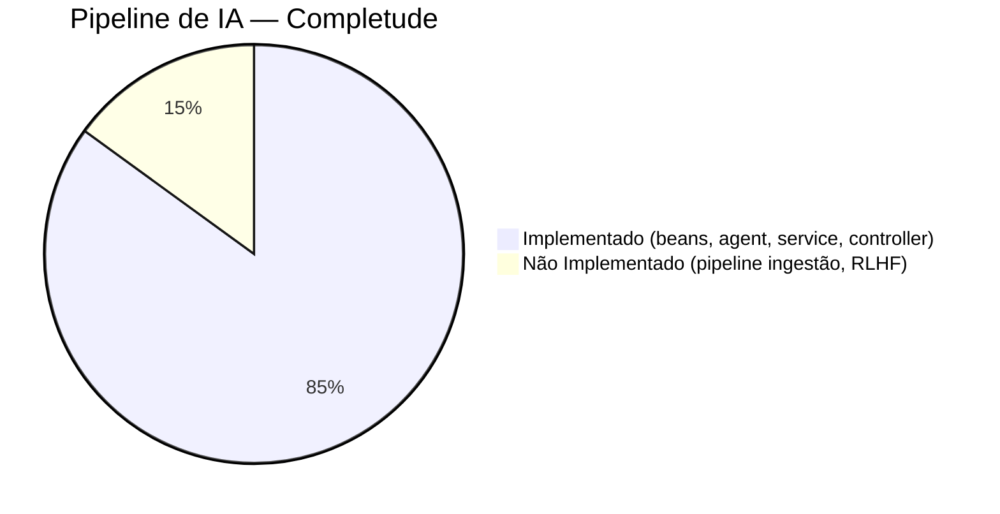
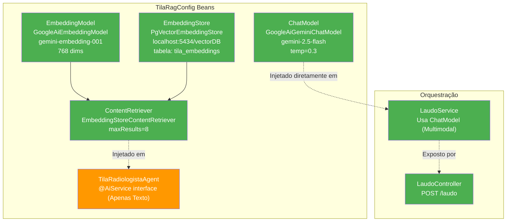
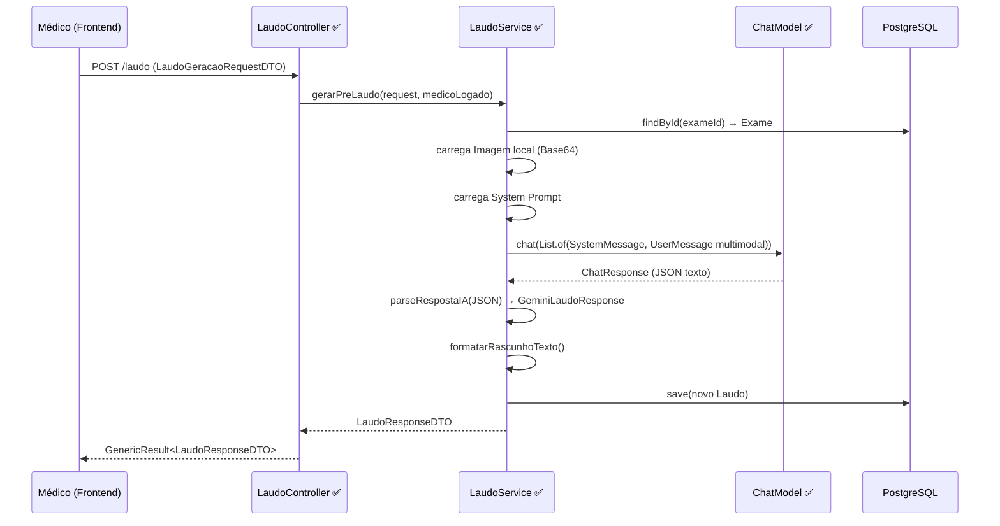
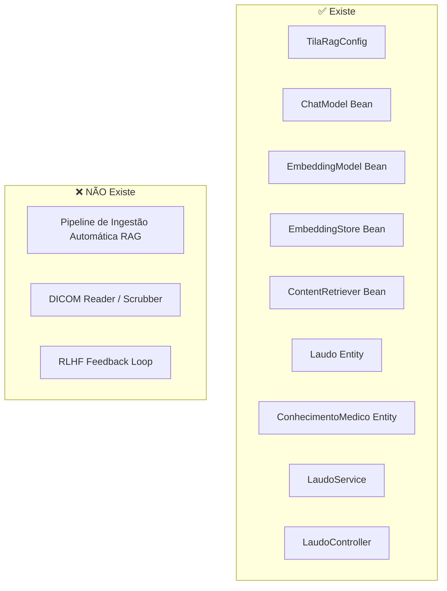

# AI Pipeline — TILA

> Auditoria exaustiva do estado real da implementação de IA em 2026-06-03.
> A infraestrutura e orquestração do pipeline de Laudos foram implementadas e conectadas ao frontend.

---

## Status Geral



**Veredito**: A **infraestrutura e orquestração** estão 85% configuradas. O `LaudoService` se comunica diretamente com o `ChatModel` via workaround multimodal, o `LaudoController` expõe o endpoint e o pipeline de geração funciona ponta-a-ponta, embora o RAG e a base de conhecimento `ConhecimentoMedico` ainda não estejam populados dinamicamente com pipeline de ingestão.

---

## O que EXISTE no Código

### 1. Configuração LangChain4j — TilaRagConfig.java

**Localização**: `tecnologi.tila.tila.ai.config.TilaRagConfig`

```java
@Configuration
public class TilaRagConfig {

    @Value("${GEMINI_API_KEY}")
    private String geminiApiKey;

    @Bean
    public ChatModel chatLanguageModel(){
        return GoogleAiGeminiChatModel.builder()
                .apiKey(geminiApiKey)
                .modelName("gemini-2.5-flash")     
                .temperature(0.3)                   // Baixa criatividade — bom para laudos médicos
                .build();
    }

    @Bean
    public EmbeddingModel embeddingModel(){
        return GoogleAiEmbeddingModel.builder()
                .apiKey(geminiApiKey)
                .modelName("gemini-embedding-001")  // Atualizado após deprecation da v1beta
                .outputDimensionality(768)
                .build();
    }

    @Bean
    public EmbeddingStore<TextSegment> embeddingStore(){
        return PgVectorEmbeddingStore.builder()
                .host("localhost")
                .port(5434)                          
                .database("vectorDB")
                .user(dbUser)
                .password(dbPassword)
                .table("tila_embeddings")           
                .dimension(768)                      
                .build();
    }

    @Bean
    public ContentRetriever contentRetriever(
            EmbeddingModel embeddingModel,
            EmbeddingStore<TextSegment> embeddingStore){
        return EmbeddingStoreContentRetriever.builder()
                .embeddingStore(embeddingStore)
                .embeddingModel(embeddingModel)
                .maxResults(8)                       
                .minScore(0.8)
                .build();
    }
}
```

### Diagrama de Beans Configurados



### Análise dos Beans

| Bean | Status | Modelo | Configuração | Issues |
|---|---|---|---|---|
| `ChatModel` | ✅ Configurado | gemini-2.5-flash | temperature=0.3 | Usado diretamente pelo LaudoService |
| `EmbeddingModel` | ✅ Configurado | gemini-embedding-001 | 768 dimensões | ✅ OK |
| `EmbeddingStore` | ✅ Configurado | PgVector | localhost:5434/vectorDB | ✅ OK |
| `ContentRetriever` | ✅ Configurado | EmbeddingStoreContentRetriever | maxResults=8, minScore=0.8 | ✅ OK |

---

### 2. Entidades JPA para IA

#### Laudo — Armazena Output da IA

```java
@Entity
@Getter @Setter @AllArgsConstructor
public class Laudo {
    @Id @GeneratedValue(strategy = GenerationType.IDENTITY)
    private Long id;

    // ===== CAMPOS PREENCHIDOS PELA IA =====
    @Column(columnDefinition = "TEXT")
    private String rascunhoIA;        // Texto bruto gerado pelo LLM

    @Column(columnDefinition = "TEXT")
    private String achadosJson;       // Achados estruturados em JSON

    @Column(columnDefinition = "TEXT")
    private String impressaoJson;     // Impressão diagnóstica em JSON

    @Column(columnDefinition = "TEXT")
    private String notaIA;            // Justificativa/reasoning da IA

    private Integer confidenceScore;   // 0-100, confiança do modelo

    // ===== CAMPOS PREENCHIDOS PELO MÉDICO =====
    @Column(columnDefinition = "TEXT")
    private String textoFinal;        // Texto revisado e aprovado

    // ===== WORKFLOW =====
    @Enumerated(EnumType.STRING)
    @Column(nullable = false)
    private StatusLaudo status = StatusLaudo.RASCUNHO;
}
```

#### Fluxo de Vida de um Laudo (Implementado)



#### ConhecimentoMedico — Base de Conhecimento RAG

Entidade criada (`ConhecimentoMedico`), porém ainda sem CRUD/Pipeline de Ingestão de embeddings em lote.

---

### 3. Configuração em application.properties

```properties
# AI Configuration
GEMINI_API_KEY=AIzaSyBkM8J29x9...  # ⚠️ HARDCODED! Deveria ser variável de ambiente

# LangChain4j Spring Boot Starter auto-config
langchain4j.google-ai-gemini.chat-model.api-key=${GEMINI_API_KEY}
langchain4j.google-ai-gemini.chat-model.model-name=gemini-1.5-flash
langchain4j.google-ai-gemini.chat-model.temperature=0.3
langchain4j.google-ai-gemini.chat-model.max-output-tokens=4096

langchain4j.google-ai-gemini.embedding-model.api-key=${GEMINI_API_KEY}
langchain4j.google-ai-gemini.embedding-model.model-name=gemini-embedding-001
```

---

## O que NÃO EXISTE — Gap Analysis



---

## Pipeline Pretendido — 6 Estágios

```mermaid
graph LR
    subgraph "Estágio 1: INGESTÃO"
        A1["Upload Imagem<br/>+ notas clínicas<br/>✅ IMPLEMENTADO"]
    end

    subgraph "Estágio 2: SCRUBBING (LGPD)"
        A2["Remover metadados<br/>pessoais<br/>❌ NÃO IMPLEMENTADO"]
    end

    subgraph "Estágio 3: VISÃO (CNN)"
        A3["Extrair achados<br/>visuais em JSON<br/>❌ NÃO IMPLEMENTADO"]
    end

    subgraph "Estágio 4: LLM + RAG"
        A4["Gerar pré-laudo<br/>em prosa técnica<br/>✅ LLM FEITO (Sem RAG)"]
    end

    subgraph "Estágio 5: HUMAN-IN-LOOP"
        A5["Médico revisa,<br/>edita, assina<br/>⚠️ APENAS ENTITY"]
    end

    subgraph "Estágio 6: RLHF"
        A6["Feedback →<br/>melhora modelo<br/>❌ NÃO IMPLEMENTADO"]
    end

    A1 --> A2 --> A3 --> A4 --> A5 --> A6

    style A1 fill:#4CAF50,color:#fff
    style A2 fill:#f44336,color:#fff
    style A3 fill:#f44336,color:#fff
    style A4 fill:#4CAF50,color:#fff
    style A5 fill:#FF9800,color:#fff
    style A6 fill:#f44336,color:#fff
```



## Referências
- [[wiki/entities/entity-laudo]] — Entidade Laudo completa
- [[wiki/decisions/ADR-004-langchain4j-multimodal]] — Decisão do uso do `ChatModel`
- [[wiki/concepts/langchain4j-multimodal-workaround]] — Workaround de imagens
- [[context/roadmap]] — Roadmap com prioridades

## Backlinks
- [[wiki/overview]]
- [[context/roadmap]]
