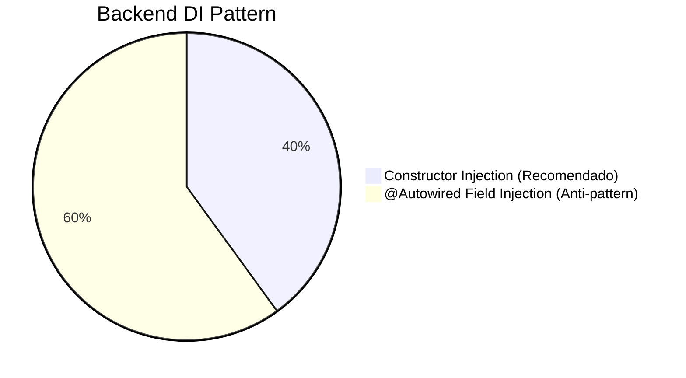

# Coding Conventions & Anti-Patterns — TILA

> Análise profunda dos padrões de codificação adotados (intencionalmente ou acidentalmente) no projeto TILA, extraídos diretamente do código real em 2026-05-07.

Este documento serve como um guia do "O que o time fez" versus "O que o time deveria ter feito". As 14 violações registradas na ingestão inicial estão detalhadas aqui.

---

## 1. Dependency Injection (DI)

### Padrão Esperado: Constructor Injection
No Spring moderno (Boot 4.x), a injeção via construtor é o padrão-ouro. Facilita testes unitários (não requer Mockito `InjectMocks`), garante imutabilidade (campos `final`) e detecta dependências circulares em tempo de startup. No Angular 19, a função `inject()` substituiu o construtor.

### A Realidade Encontrada (Backend)
O código tem uma "crise de identidade" entre `@Autowired` e Construtores.



🔴 **Anti-pattern encontrado (`AutenticacaoController.java` e `PacienteController.java`)**:
```java
@RestController
public class AutenticacaoController {
    @Autowired private AuthenticationManager manager;
    @Autowired private TokenService tokenService;
    // ... 5 campos injetados via field
}
```

✅ **Padrão Correto encontrado (`PacienteService.java`)**:
```java
@Service
public class PacienteService {
    private final PacienteRepository pacienteRepository;
    
    // Spring Boot resolve automaticamente (não precisa de @Autowired)
    public PacienteService(PacienteRepository pacienteRepository) {
        this.pacienteRepository = pacienteRepository;
    }
}
```

### A Realidade Encontrada (Frontend)
O frontend foi refatorado impecavelmente para os padrões do Angular 19.

✅ **Padrão 100% Consistente (`AuthStore`, `LoginComponent`, etc)**:
```typescript
@Injectable()
export class AuthStore {
    private authApi = inject(AuthApiService); // Clean, moderno
}
```

---

## 2. API Response Wrapper

### Padrão Esperado: GenericResult\<T\> Uniforme
Toda API deveria retornar `GenericResult<T>`, tanto em sucesso (2xx) quanto em erros (4xx, 5xx), garantindo que o frontend faça o *parse* da resposta de apenas uma forma.

### A Realidade Encontrada
O frontend Angular sofre porque o Backend quebra seu próprio contrato no ExceptionHandler.

🔴 **Anti-pattern: O Exception Handler Rebelde**:
```java
// GlobalExceptionHandler.java
private record ErrorDetalhe(String mensagem){}

@ExceptionHandler(EntityNotFoundException.class)
public ResponseEntity handle404(EntityNotFoundException ex){
    // 🔴 Retorna { "mensagem": "..." }
    return ResponseEntity.status(HttpStatus.NOT_FOUND)
        .body(new ErrorDetalhe(ex.getMessage()));
}
```

✅ **O Padrão Correto (usado nos Controllers de sucesso)**:
```java
// Retorna { "success": false, "message": "...", "data": null }
return ResponseEntity.badRequest()
    .body(GenericResult.error("CPF já cadastrado!"));
```

**Impacto**: O `PacienteApiService.ts` (Frontend) tipa o retorno como `GenericResult<T>`, mas se o backend der 404, o Angular recebe `{ mensagem: "..." }` e não `{ message: "..." }`.

---

## 3. Data Transfer Objects (DTOs)

### Padrão Esperado: Java Records
Java 14 introduziu `record`, perfeito para DTOs por ser imutável, requerer zero boilerplate, e suportar anotações de validação (`@Valid`).

### A Realidade Encontrada
O TILA adotou `records` perfeitamente em 100% dos DTOs do backend! 🎉

✅ **Bom exemplo (`PacienteRequestDTO.java`)**:
```java
public record PacienteRequestDTO(
    @NotBlank String nomeCompleto,
    @NotBlank @CPF String cpf,
    @NotNull LocalDate dataNascimento,
    String telefone
) {}
```

🔴 **Anti-pattern fatal: "Vazamento de Entidade"**:
Embora o DTO seja um record, um deles incluiu uma Entidade do Hibernate dentro de si, anulando o propósito do DTO (que é isolar a camada de banco da camada HTTP).

```java
public record PacienteResponseDTO(
    Long id,
    String nomeCompleto,
    List<Exame> exames // 🔴 ERROR: Exame é uma Entidade JPA!
) {}
```
Isso causa o infame `LazyInitializationException` e potencial exposição recursiva de dados (Paciente tem Exames, Exame tem Paciente, serialização JSON infinita).

---

## 4. Tratamento de Optionals no Java

### Padrão Esperado: `.orElseThrow()`
Ao buscar algo no repositório, o Spring retorna um `Optional<T>`. Tentar usar os dados sem confirmar se eles existem é a receita do NullPointerException.

### A Realidade Encontrada
Há instâncias do `Optional.get()` chamadas de forma irresponsável, sem `isPresent()`.

🔴 **O "Voo Cego" (`SecurityFilter.java`)**:
```java
// Se este usuário foi removido do banco 1 segundo atrás, isto gerará um NoSuchElementException
// que derruba o request sem tratamento.
var usuario = usuarioRepository.findByEmail(subject).get(); 
```

✅ **O Padrão Seguro (`PacienteService.java`)**:
```java
var paciente = pacienteRepository.findByCpf(cpf)
    .orElseThrow(() -> new EntityNotFoundException("Paciente não encontrado"));
```

---

## 5. Naming Conventions (Nomenclatura)

### Padrão Esperado
- Classes/Interfaces: `PascalCase`
- Pacotes: `lowercase` (uma palavra, no máximo hífens se essencial)
- Métodos/Variáveis: `camelCase`

### A Realidade Encontrada (Gaps Mapeados)

1. **Classes com camelCase** (Violação do Standard Java):
   - 🔴 `logAuditoriaService.java` (deveria ser `LogAuditoriaService.java`)
   - 🔴 `logAuditoriaController.java` (deveria ser `LogAuditoriaController.java`)

2. **Typos (Erros de Digitação)**:
   - 🔴 Pacote `athenticate` (deveria ser `authenticate`)
   - 🔴 Método `bucasPorId` (deveria ser `buscarPorId`) no PacienteService
   - 🔴 Enum `StatuExame` (deveria ser `StatusExame`)

---

## 6. Frontend: State Management (Angular)

### Padrão Esperado: Signals (`signal()`, `computed()`)
Angular 16+ introduziu Signals como o reativo primitivo padrão. Eles são síncronos, limpos e evitam memory leaks sem precisar de `.unsubscribe()` (diferente do RxJS `Subject`).

### A Realidade Encontrada
Uma mistura interessante de modernidade (`AuthStore`) e código legado (`LoginComponent`).

✅ **Padrão Moderno (`PacientesComponent.ts`)**:
```typescript
pacientes = signal<Paciente[]>([]);
searchTerm = signal('');

// Automático e reativo!
filteredPacientes = computed(() => {
    return this.pacientes().filter(p => p.nome.includes(this.searchTerm()));
});
```

🔴 **Padrão Antigo / Plain Properties (`LoginComponent.ts`)**:
```typescript
email = '';     // 🔴 Propriedade simples (não-reativa no Angular 19)
senha = '';
errorMessage = '';
```

---

## Tabela Resumo de Padronização para Refatorações

| Componente | Padrão Oficial TILA | Exceções Permitidas? |
|---|---|---|
| Injeção Backend | Constructor (final fields) | `SecurityConfig` se tiver circular ref |
| Injeção Frontend | `inject()` inline | Nenhuma. Constructor `private` não permitido |
| API Response | `GenericResult<T>` | Exceptions devem usar GenericResult.error() |
| DTOs | Java Records + Bean Validation | Não permitir Entity dentro de DTO |
| Optionals | `.orElseThrow()` | `.orElse(null)` aceito em loops defensivos |
| Angular UI State | `signal()` | Template-driven forms com `[(ngModel)]` no signal |
| CSS | Vanilla, sem Tailwind | O template original é limpo, manter Inter font |
| Routing Angular | `loadComponent` (Lazy) | Nenhuma. Parar de usar imports eager |

## Backlinks
- [[wiki/concepts/backend-patterns]]
- [[wiki/concepts/angular-patterns]]
- [[wiki/decisions/ADR-002-api-response-pattern]]
