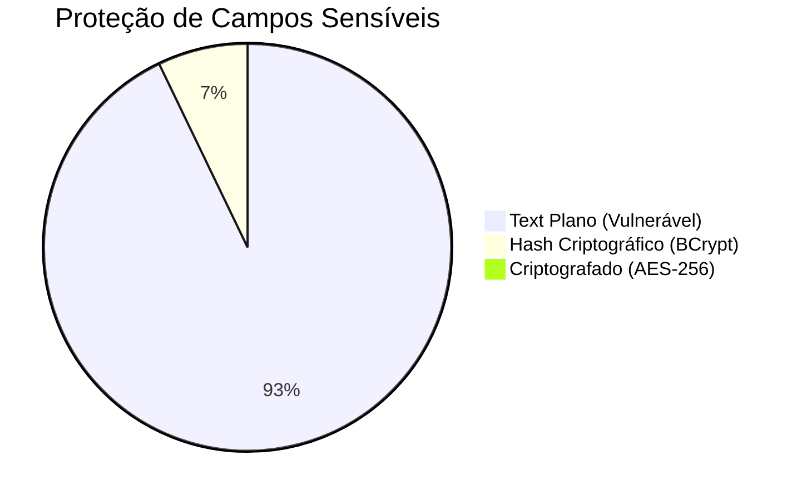

# Security & LGPD Audit — TILA

> Auditoria arqueológica e análise estática de segurança extraída do código real em 2026-05-07.
> Este documento cataloga todas as vulnerabilidades, mapeamento OWASP, e status de conformidade LGPD.

---

## 🔴 Vulnerabilidades Críticas (Top 6)

### 1. CWE-798: Use of Hard-coded Credentials (JWT)
O segredo usado para assinar todos os tokens JWT da aplicação está hardcoded no `application.properties`. Qualquer pessoa com acesso ao código-fonte ou ao arquivo compilado pode forjar tokens como "ADMIN" com validade arbitrária.
**Arquivo**: `application.properties`
```properties
api.security.token.secret=Cucamole@123  # 🔴 VULNERABILIDADE CRÍTICA
```
**Solução Recomendada**:
```properties
api.security.token.secret=${JWT_SECRET}
```

### 2. CWE-798: Use of Hard-coded Credentials (Database)
A senha do banco de dados de produção/vectorDB está exposta no código.
**Arquivo**: `application.properties`
```properties
spring.datasource.password=Cucamole@123  # 🔴 VULNERABILIDADE CRÍTICA
```

### 3. CWE-798: Use of Hard-coded Credentials (Gemini API)
A chave da API de inteligência artificial (Google Gemini) está chumbada no código. Se vazada, permite uso indevido e cobrança financeira na conta do projeto.
**Arquivo**: `application.properties`
```properties
GEMINI_API_KEY=AIzaSyBkM8J29x9...  # 🔴 VULNERABILIDADE CRÍTICA
```

### 4. CWE-476: NULL Pointer Dereference Risk (Auth Controller)
Ao realizar login, o sistema busca o Médico associado ao Usuário. Se um paciente tentar logar, ou um admin sem médico associado, o sistema chamará `.get()` num Optional vazio, crashando a aplicação com HTTP 500.
**Arquivo**: `AutenticacaoController.java`
```java
var medico = medicoRepository.findByUsuario(usuario);
// 🔴 CRASH SE MEDICO == EMPTY
var usuarioPerfil = new UserProfileDTO(
    medico.get().getNomeCompleto(),
    medico.get().getCrm(),
    medico.get().getEspecialidade()
);
```

### 5. CWE-476: NULL Pointer Dereference Risk (Security Filter)
No filtro de segurança que executa em *todas* as requisições autenticadas, o sistema busca o usuário pelo email do JWT. Se o usuário tiver sido apagado do banco após emitir o token, isso causa um crash catastrófico não-tratado.
**Arquivo**: `SecurityFilter.java`
```java
var subject = tokenService.getSubject(tokenJWT);
// 🔴 CRASH SE USUÁRIO FOI DELETADO
var usuario = usuarioRepository.findByEmail(subject).get(); 
```

### 6. Exposição Excessiva de Dados (Data Exposure)
O endpoint `GET /logs` retorna a entidade completa de `Usuario`, expondo o hash BCrypt da senha de todos os usuários para qualquer pessoa autenticada.
**Arquivo**: `logAuditoriaService.java`
```java
// 🔴 Retorna List<LogAuditoria>, que inclui a Entity Usuario
public List<LogAuditoria> buscarTodosOsLogs(){
    return logAuditoriaRepository.findAll();
}
```

---

## Diagrama de Vetor de Ataque (Attack Surface)

```mermaid
graph TD
    subgraph "Ameaças Externas"
        A[Atacante anônimo]
        B[Atacante autenticado]
        C[Funcionário interno]
    end

    subgraph "Superfície de Ataque"
        D[Endpoint /logs]
        E[Cookies / LocalStorage]
        F[Repositório Git]
        G[Endpoint /auth/login]
    end

    subgraph "Vulnerabilidades Exploradas"
        H[Exposição de BCrypt Hash]
        I[XSS roubando LocalStorage]
        J[Secrets Hardcoded]
        K[NPE Crash / DoS]
    end

    A -->|Descobre repositório| F
    F -->|Lê application.properties| J
    J -->|Forja JWT de ADMIN| D

    B -->|Chama GET /logs| D
    D -->|Retorna entidades| H
    H -->|Crack de senha offline| C

    A -->|Envia payload inválido| G
    G -->|Dispara Optional.get()| K
    K -->|Derruba o container| A

    style J fill:#f44336,color:#fff
    style H fill:#f44336,color:#fff
    style K fill:#f44336,color:#fff
```

---

## 🟢 Conformidade LGPD (Lei Geral de Proteção de Dados)

O TILA lida com **Dados Pessoais Sensíveis** (Art. 5º, II da LGPD) devido à natureza médica da aplicação.

### Mapeamento de Princípios LGPD vs Realidade

| Princípio LGPD | Status no TILA | Explicação / Falha |
|---|---|---|
| **Finalidade** (Art 6, I) | 🟡 | O propósito é claro, mas não há registro formal de consentimento do paciente. |
| **Adequação** (Art 6, II) | ✅ | Dados coletados são pertinentes ao serviço de radiologia. |
| **Necessidade/Minimização** (Art 6, III) | 🔴 | O log de auditoria coleta a Entity `Usuario` inteira (incluindo senhas hashadas) quando deveria logar apenas ID/Email. |
| **Livre Acesso** (Art 6, IV) | 🔴 | Não há funcionalidade para o paciente exportar seus laudos ou ver seu prontuário (DSAR não implementado). |
| **Qualidade** (Art 6, V) | 🟡 | Há validação de formato (ex: `@CPF`, `@Email`), mas o paciente não consegue retificar seus dados (falta PUT). |
| **Transparência** (Art 6, VI) | 🔴 | Não há política de privacidade visível no frontend. |
| **Segurança** (Art 6, VII) | 🔴 | Dados sensíveis (CPF, laudos médicos, achados) armazenados em plaintext sem encriptação (Data at Rest). |
| **Prevenção** (Art 6, VIII) | 🔴 | LogAuditoria não coleta o `ipOrigem` em ações críticas, impossibilitando auditoria forense. |

### Inventário de Dados Sensíveis e Proteção



| Tabela | Campo | Tipo LGPD | Risco | Mitigação Atual | Mitigação Necessária |
|---|---|---|---|---|---|
| `usuarios` | `senha` | Dado Sensível | 🔴 | ✅ Hash BCrypt | Nenhuma |
| `usuarios` | `email` | Dado Pessoal | 🟡 | ❌ Nenhuma | Mascaramento de dados em logs |
| `pacientes` | `cpf` | Dado Sensível | 🔴 | ❌ Nenhuma | Criptografia na base (AttributeConverter) |
| `pacientes` | `nome` | Dado Pessoal | 🟡 | ❌ Nenhuma | Criptografia na base |
| `laudo` | `achadosJson` | Dado Saúde | 🔴 | ❌ Nenhuma | Criptografia AES-256 na coluna |
| `laudo` | `textoFinal`| Dado Saúde | 🔴 | ❌ Nenhuma | Criptografia AES-256 na coluna |
| `medicos` | `assinatura` | Dado Biométrico| 🔴 | ❌ Nenhuma (Base64)| Tokenização ou Criptografia forte |

---

## 🟡 Vulnerabilidades Médias & Débitos de Segurança

### 1. Ausência de Rate Limiting
- **Problema**: APIs de `/auth/login` e `/api/laudos/generate` podem sofrer força bruta ou esgotamento de cota da API do Gemini (DoS financeiro).
- **Correção**: Implementar `Bucket4j` ou `Resilience4j` no Spring Boot.

### 2. Cookie JWT sem Flag `Secure`
- **Código**: `accessToken.setSecure(false);`
- **Problema**: O cookie pode ser transmitido em texto plano se houver uma requisição HTTP acidental (man-in-the-middle).
- **Correção**: `accessToken.setSecure(true);` (exige HTTPS em produção).

### 3. LogAuditoria Incompleto
- **Problema**: O campo `ipOrigem` existe na entidade, mas nunca é populado. Isso quebra a validade jurídica dos logs de acesso a dados médicos.
- **Correção**: No Service, capturar `HttpServletRequest.getRemoteAddr()`.

### 4. CORS Permissivo
- **Código**: `configuration.setAllowedOrigins(Arrays.asList("http://localhost:4200"));` e `setAllowedHeaders(Arrays.asList("*"));`
- **Problema**: Apesar de restrito ao localhost em dev, não há configuração de ambiente preparada para restringir isso na produção de forma dinâmica.

---

## Plano de Remediação (Roadmap de Segurança)

Para corrigir os 6 problemas críticos, execute as seguintes tarefas:

1. **(Imediato)** Criar arquivo `.env` no root do Backend.
2. **(Imediato)** Modificar `application.properties` para usar `${GEMINI_API_KEY}`, `${DB_PASSWORD}`, `${JWT_SECRET}`.
3. **(Imediato)** Refatorar `SecurityFilter.java`:
   ```java
   var usuarioOpt = usuarioRepository.findByEmail(subject);
   if(usuarioOpt.isEmpty()) { filterChain.doFilter(request, response); return; }
   var usuario = usuarioOpt.get();
   ```
4. **(Imediato)** Refatorar `logAuditoriaService.java` para retornar um DTO (`LogAuditoriaDTO`) que omita a entidade `Usuario` inteira e devolva apenas o ID ou Email.
5. **(Curto Prazo)** Criar AttributeConverter JPA para criptografar o CPF:
   ```java
   @Converter
   public class CryptoConverter implements AttributeConverter<String, String> {
       // Implementar lógica AES-256
   }
   ```
6. **(Curto Prazo)** Modificar `SecurityConfigurations.java` para proteger `/logs`:
   ```java
   req.requestMatchers("/logs/**").hasRole("ADMIN");
   ```

## Backlinks
- [[context/roadmap]] — Para ver as prioridades em perspectiva
- [[wiki/concepts/jwt-authentication]] — Deep dive na falha do token
- [[wiki/concepts/data-model]] — Para referenciar as tabelas LGPD
