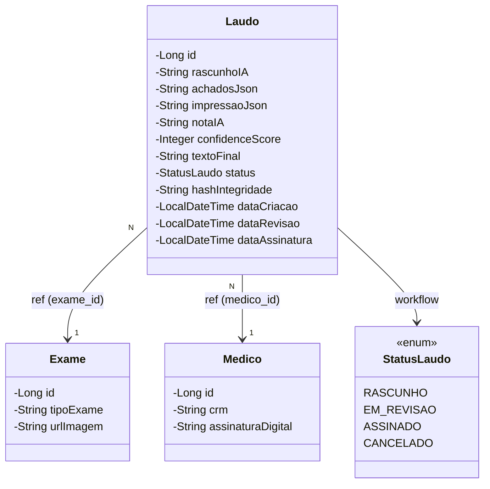
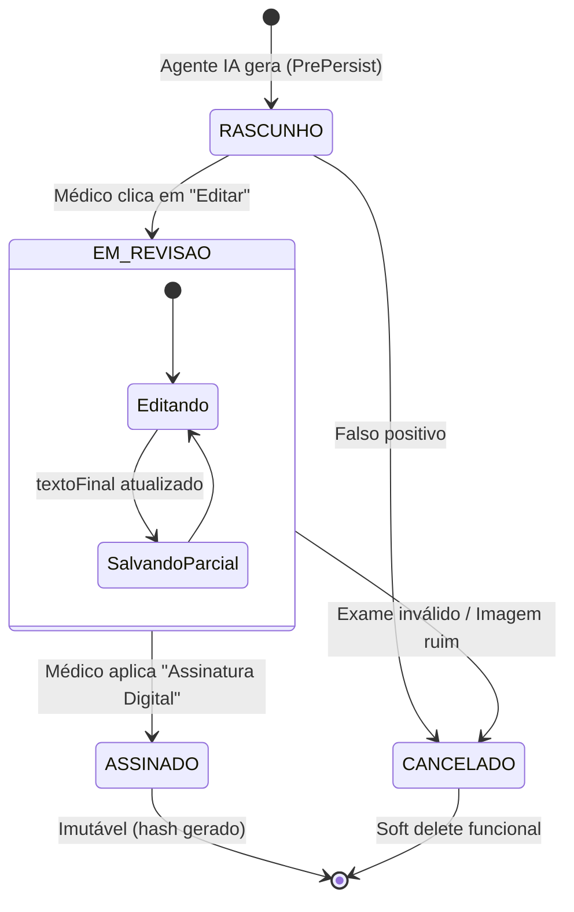

# Entity: Laudo

> Arquivo: `Tila_BackEnd/tila/src/main/java/tecnologi/tila/tila/entity/Laudo.java`
> Tabela: `laudo`
> ID Type: `Long` (GenerationType.IDENTITY)
> Status no Sistema: ⚠️ **Implementação Parcial** (Entity e Repository existem, Controller/Service ausentes).

---

## O Coração do TILA

A entidade `Laudo` é a **razão de ser** de toda a plataforma TILA (Tecnologia Integradora de Laudos Automatizados). Ela representa a ponte entre os achados extraídos de um exame médico, a inteligência artificial que gera o rascunho primário, e o médico que o aprova.

Diferente de sistemas convencionais onde o laudo é apenas um texto, o modelo do TILA separa o conteúdo gerado por IA (imparcial) da palavra final do médico (legalmente vinculativa).

---

## Código Real Completo

```java
@Entity
@Table(name = "laudo")
@Getter
@Setter
@NoArgsConstructor
@AllArgsConstructor
public class Laudo {

    @Id
    @GeneratedValue(strategy = GenerationType.IDENTITY)
    private Long id;

    // --- Dados Gerados pela IA ---
    @Column(columnDefinition = "TEXT")
    private String rascunhoIA;

    @Column(columnDefinition = "TEXT")
    private String achadosJson;

    @Column(columnDefinition = "TEXT")
    private String impressaoJson;

    @Column(columnDefinition = "TEXT")
    private String notaIA;

    private Integer confidenceScore;

    // --- Dados do Médico ---
    @Column(columnDefinition = "TEXT")
    private String textoFinal;

    // --- Controle e Fluxo ---
    @Enumerated(EnumType.STRING)
    @Column(nullable = false)
    private StatusLaudo status = StatusLaudo.RASCUNHO;

    private String hashIntegridade;

    private LocalDateTime dataCriacao;
    private LocalDateTime dataRevisao;
    private LocalDateTime dataAssinatura;

    // --- Relacionamentos ---
    @ManyToOne(fetch = FetchType.LAZY)
    @JoinColumn(name = "exame_id", nullable = false)
    private Exame exame;

    @ManyToOne(fetch = FetchType.LAZY)
    @JoinColumn(name = "medico_id", nullable = false)
    private Medico medico;

    // --- Ciclo de Vida JPA ---
    @PrePersist
    protected void onPrePersist(){
        this.dataCriacao = LocalDateTime.now();
    }

    @PreUpdate
    protected void onPreUpdate(){
        if(this.status == StatusLaudo.ASSINADO && this.dataAssinatura == null){
            this.dataAssinatura = LocalDateTime.now();
        }else{
            this.dataAssinatura = LocalDateTime.now(); // 🔴 BUG de lógica
        }
    }
}
```

---

## Diagrama de Classe e Relacionamentos



---

## Anatomia dos Campos de IA

O TILA não confia num prompt "zero-shot" de LLM para cuspir um texto. Ele usa uma estrutura robusta baseada em propriedades separadas.

### 1. `achadosJson`
Ao invés de pedir que a IA "fale sobre o que viu", o sistema deve (no futuro Pipeline) extrair achados estruturados.
* **Exemplo de Conteúdo**: `[{"regiao": "Pulmão direito", "achado": "Opacidade nodular", "tamanho": "1.2cm"}]`
* **Objetivo**: Fornecer contexto factual inegociável para o LLM.

### 2. `impressaoJson`
A conclusão diagnóstica da IA. Separada do texto para permitir métricas de precisão futuras.

### 3. `rascunhoIA`
O texto completo e formatado do laudo em prosa médica, gerado pelo LangChain4j (Gemini), pronto para leitura do médico.

### 4. `notaIA` e `confidenceScore`
* **notaIA**: O *Chain of Thought* (CoT) da IA. Por que ela concluiu aquilo? Ajuda o médico a decidir se a IA está "alucinando".
* **confidenceScore**: Uma métrica (0 a 100). Se a confiança for menor que 60, o frontend pode exibir uma flag de alerta vermelha `[IA com baixa confiança, revisar com atenção]`.

---

## Máquina de Estados (Lifecycle do Laudo)

O fluxo de negócio do Laudo é regido pelo enum `StatusLaudo`.



### O Bug Crítico no `@PreUpdate`

O método `@PreUpdate` do JPA é executado sempre que qualquer campo do `Laudo` é atualizado no banco.

**O Código Atual:**
```java
@PreUpdate
protected void onPreUpdate(){
    if(this.status == StatusLaudo.ASSINADO && this.dataAssinatura == null){
        this.dataAssinatura = LocalDateTime.now();
    }else{
        this.dataAssinatura = LocalDateTime.now(); // 🔴 ERRO!
    }
}
```

**O Impacto**:
Se o médico apenas entrar para editar o `textoFinal` (Status: `EM_REVISAO`), o sistema cairá no `else` e preencherá a `dataAssinatura`. Isso causa um problema jurídico/legal gravíssimo: dirá que o médico "assinou" um laudo que ainda está em rascunho.

**A Refatoração Necessária:**
```java
@PreUpdate
protected void onPreUpdate(){
    this.dataRevisao = LocalDateTime.now(); // Sempre atualiza revisão
    
    // Assinatura SÓ ocorre se mudar para status ASSINADO e ainda não tiver data
    if(this.status == StatusLaudo.ASSINADO && this.dataAssinatura == null){
        this.dataAssinatura = LocalDateTime.now();
    }
}
```

---

## O Campo Fantasma: `hashIntegridade`

O TILA definiu o campo `hashIntegridade`, mostrando uma preocupação profunda com Segurança e Compliance.

Como um laudo médico é um documento legal (frequentemente usado em processos judiciais, seguros, etc), é necessário provar que o texto final não foi adulterado diretamente no banco de dados por um atacante (ou pelo DBA).

**Como deve ser implementado no futuro LaudoService:**
```java
public void assinarLaudo(Long laudoId, Medico medico) {
    Laudo laudo = repository.findById(laudoId).orElseThrow();
    
    // 1. Médido aplica chave dele
    String signatureString = laudo.getTextoFinal() + laudo.getDataCriacao() + medico.getCrm();
    
    // 2. Hash SHA-256
    String hash = Hashing.sha256()
                    .hashString(signatureString, StandardCharsets.UTF_8)
                    .toString();
                    
    laudo.setHashIntegridade(hash);
    laudo.setStatus(StatusLaudo.ASSINADO);
    repository.save(laudo); // Dispara PreUpdate
}
```

---

## Repositório

```java
public interface LaudoRepository extends JpaRepository<Laudo, Long> {
    
    // Para listar o "Inbox" de laudos pendentes de um médico específico
    List<Laudo> findByMedicoAndStatus(long medicoId, StatusLaudo status);
    
    // Para obter o histórico de rascunhos de um exame específico
    List<Laudo> findByExameId(long exameId);
}
```
> ⚠️ **Problema de Tipagem**: `long` primitivo é usado nas custom queries ao invés de `Long` (wrapper). O JPA pode dar crash (NullPointerException) se por algum motivo uma query derivar de uma chave `null`.

## Backlinks
- [[wiki/concepts/data-model]]
- [[context/ai-pipeline]]
- [[wiki/concepts/laudo-patterns]]
